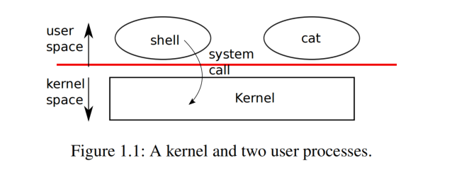
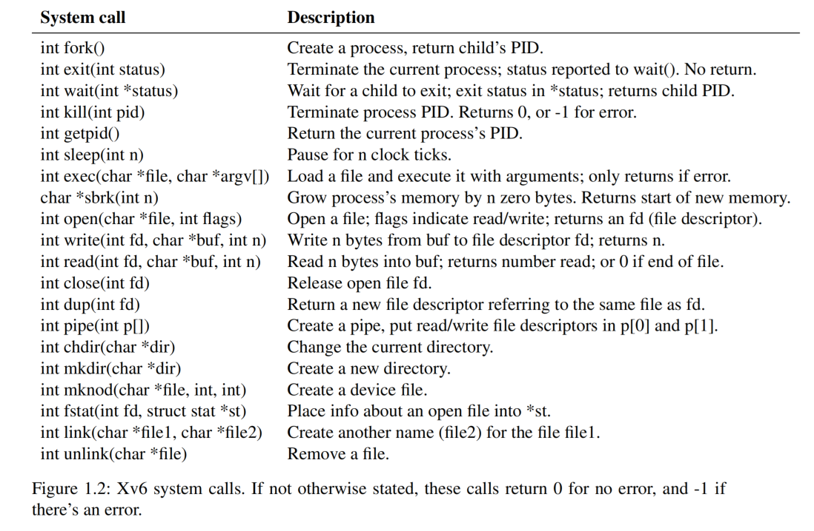

# 第 1 章 操作系统接口（Chapter 1 Operating system interfaces）

> The job of an operating system is to share a computer among multiple programs and to provide a more useful set of services than the hardware alone supports. An operating system manages and abstracts the low-level hardware, so that, for example, a word processor need not concern itself with which type of disk hardware is being used. An operating system shares the hardware among multiple programs so that they run (or appear to run) at the same time. Finally, operating systems provide controlled ways for programs to interact, so that they can share data or work together.

操作系统的任务是让多个程序共享一台计算机，并（通过封装等工作）提供更多有用的服务，而不是让程序直接访问和操作硬件。操作系统管理底层硬件并面向应用抽象这些硬件，这样一些上层应用（譬如文字处理器）就无需关心使用哪种具体类型的磁盘设备。一个操作系统在多个程序之间共享硬件，这样它们就可以(或者至少看起来可以)同时运行。最后，操作系统为程序提供了可控的交互方式，这样它们就可以共享数据或者协同工作。

> An operating system provides services to user programs through an interface. Designing a good interface turns out to be difficult. On the one hand, we would like the interface to be simple and narrow because that makes it easier to get the implementation right. On the other hand, we may be tempted to offer many sophisticated features to applications. The trick in resolving this tension is to design interfaces that rely on a few mechanisms that can be combined to provide much generality.

操作系统通过一套 “接口（interfaces，译者注：一个接口可以理解成一个函数调用，譬如典型的文件操作 `open`，`read` 和 `write`）” 向应用程序提供服务。设计一个良好的接口是很困难的事情。一方面，我们希望一个接口是简单的并且功能单一，因为这样更利于正确地实现。另一方面，我们可能倾向于为应用程序提供许多复杂的功能特性。解决这个矛盾的诀窍在于设计接口时，基于一些良好的机制，保证单个接口简单可靠，同时将它们组合起来又可以实现复杂的功能，从而提供良好的通用性。

> This book uses a single operating system as a concrete example to illustrate operating system concepts. That operating system, xv6, provides the basic interfaces introduced by Ken Thompson and Dennis Ritchie’s Unix operating system [17], as well as mimicking Unix’s internal design. Unix provides a narrow interface whose mechanisms combine well, offering a surprising degree of generality. This interface has been so successful that modern operating systems—BSD, Linux, macOS, Solaris, and even, to a lesser extent, Microsoft Windows—have Unix-like interfaces. Understanding xv6 is a good start toward understanding any of these systems and many others.

本书以一个操作系统作为具体的例子来阐述操作系统的概念。这个操作系统就是 xv6，它提供了 Ken Thompson 和 Dennis Ritchie 在开发 Unix 时引入的一套基本的接口 [17]，同时模仿了 Unix 的内部设计。Unix 提供了一套很精简的接口，通过组合使用这套接口，可以实现令人惊讶的通用性。这个接口非常成功，现代的操作系统，譬如 BSD、Linux、Mac OSX、Solaris，甚至在一定程度上，连 Microsoft 的 Windows 都提供了这些和 Unix 相似的接口（统称为 Unix-like interfaces）。学好 xv6 能为理解这些系统和其他更多的系统打下良好的基础。



> As Figure 1.1 shows, xv6 takes the traditional form of a kernel, a special program that provides services to running programs. Each running program, called a process, has memory containing instructions, data, and a stack. The instructions implement the program’s computation. The data are the variables on which the computation acts. The stack organizes the program’s procedure calls. A given computer typically has many processes but only a single kernel.

如图 1.1 所示，xv6 采用传统的 “内核（kernel）” 实现形式，内核可以看成是一个特殊的 “程序（program）”，为其他正在运行的程序提供服务。每个正在运行的程序，称为 “进程（process）”，都拥有一块自己的内存，进程的 “指令（instructions）”、“数据（data）” 和 “栈（stack）” 都存放在这块内存中。程序的计算功能通过指令实现，数据是计算操作的变量，程序的 “过程调用（procedure calls）” 通过栈进行组织。一台给定的计算机上通常运行有多个进程，但同时只会运行一个内核。

> When a process needs to invoke a kernel service, it invokes a system call, one of the calls in the operating system’s interface. The system call enters the kernel; the kernel performs the service and returns. Thus a process alternates between executing in user space and kernel space.

当一个进程需要请求一个内核服务时，它会调用一个 “系统调用（system call）”，而系统调用就是操作系统所提供的一套接口中的一个实例。内核执行系统调用，完成服务并返回。因此，我们可以认为一个进程在 “用户空间（user space）” 和 “内核空间（kernel space）” 之间交替运行。

> As described in detail in subsequent chapters, the kernel uses the hardware protection mechanisms provided by a CPU to ensure that each process executing in user space can access only its own memory. The kernel executes with the hardware privileges required to implement these protections; user programs execute without those privileges. When a user program invokes a system call, the hardware raises the privilege level and starts executing a pre-arranged function in the kernel.

正如在接下里的章节中所介绍的那样，内核使用 CPU 提供的硬件保护机制来确保每个在用户空间执行的进程只能访问它自己的内存。内核运行时拥有访问硬件的权限，这实现了对硬件的保护；而用户程序执行时没有这些权限。当用户程序调用系统调用时，硬件会提升权限级别，并开始执行内核中预先安排好的函数。

> The collection of system calls that a kernel provides is the interface that user programs see. The xv6 kernel provides a subset of the services and system calls that Unix kernels traditionally offer.

内核提供的系统调用集合正是用户程序看到的接口。xv6 作为一个内核实现了传统 Unix 内核提供的服务和系统调用的子集。

> The rest of this chapter outlines xv6’s services—processes, memory, file descriptors, pipes, and a file system—and illustrates them with code snippets and discussions of how the shell, Unix’s command-line user interface, uses them. The shell’s use of system calls illustrates how carefully they have been designed.

本章的其余部分概述了 xv6 中有关进程、内存、文件描述符、管道和文件系统的服务，并给出了相关的代码片段，同时还讨论了 shell（Unix 的命令行用户界面）以及如何使用它们。通过学习 shell 是如何使用这些系统调用的可以帮助我们理解这些接口是如何被精心设计的。

> The shell is an ordinary program that reads commands from the user and executes them. The fact that the shell is a user program, and not part of the kernel, illustrates the power of the system call interface: there is nothing special about the shell. It also means that the shell is easy to replace; as a result, modern Unix systems have a variety of shells to choose from, each with its own user interface and scripting features. The xv6 shell is a simple implementation of the essence of the Unix Bourne shell. Its implementation can be found at (user/sh.c:1).

Shell 是一个普通的程序，它从用户那里读取命令并执行它们。Shell 是一个用户态程序，而不是内核的一部分，这一事实说明了系统调用接口的强大之处：shell 没有什么特别之处。这也意味着 shell 很容易被替换；因此，现代 Unix 系统有多种 shell 可供选择，每种 shell 的操作界面和对脚本的支持都各有各的特色。xv6 的 shell 是 Unix Bourne shell 的简单实现。具体实现可以阅读代码 (user/sh.c:1)。

## 1.1 进程和内存（Processes and memory）

> An xv6 process consists of user-space memory (instructions, data, and stack) and per-process state private to the kernel. Xv6 *time-shares* processes: it transparently switches the available CPUs among the set of processes waiting to execute. When a process is not executing, xv6 saves the process’s CPU registers, restoring them when it next runs the process. The kernel associates a process identifier, or `PID`, with each process.

一个 xv6 进程由用户空间内存（用于存放指令、数据和实现栈）以及内核私有的每个进程的状态组成。xv6 对进程进行 *分时共享（time-shares）*：它透明地在等待执行的多个进程之间切换 CPU。当某个进程未执行时，xv6 会保存该进程的 CPU 寄存器值，并在下次运行该进程时恢复它们。内核为每个进程指定一个 “进程标识符（process identifier）”，即 `PID`。

> A process may create a new process using the `fork` system call. `fork` gives the new process an exact copy of the calling process’s memory: it copies the instructions, data, and stack of the calling process into the new process’s memory. `fork` returns in both the original and new processes. In the original process, `fork` returns the new process’s PID. In the new process, `fork` returns zero. The original and new processes are often called the *parent* and *child*.

一个进程可以调用系统调用 `fork` 创建一个新的进程。`fork` 会将调用进程的内存中的内容完整地复制一份到新建进程的内存中：复制的内容包括调用进程的指令、数据和栈。`fork` 在原进程和新进程中都会返回。在原进程中，`fork` 返回新进程的 PID。在新进程中，`fork` 返回零。原进程和新进程通常被称为 *父进程（parent）* 和 *子进程（child）*。



> For example, consider the following program fragment written in the C programming language [7]:

例如，参考下面用 C 语言编写的程序片段 [7]：

```c
int pid = fork();
if(pid > 0){
  printf("parent: child=%d\n", pid);
  pid = wait((int *) 0);
  printf("child %d is done\n", pid);
} else if(pid == 0){
  printf("child: exiting\n");
  exit(0);
} else {
  printf("fork error\n");
}
```

> The `exit` system call causes the calling process to stop executing and to release resources such as memory and open files. Exit takes an integer status argument, conventionally 0 to indicate success and 1 to indicate failure. The `wait` system call returns the PID of an exited (or killed) child of the current process and copies the exit status of the child to the address passed to wait; if none of the caller’s children has exited, `wait` waits for one to do so. If the caller has no children, `wait` immediately returns -1. If the parent doesn’t care about the exit status of a child, it can pass a 0 address to `wait`.

`exit` 系统调用会导致调用进程停止执行并释放资源，例如内存和打开的文件。`exit` 接受一个整数类型的参数，通常 0 表示成功，1 表示失败。`wait` 系统调用返回当前进程的已退出（或被杀死）的子进程的 PID，并将子进程的退出状态值复制到传递给 wait 的地址；如果调用者的子进程均未退出，`wait` 会等待，直到其中任一个子进程退出。如果调用者没有子进程，`wait` 会立即返回 `-1`。如果父进程不关心子进程的退出状态，则可以将空地址（值为 0）传递给 `wait`。

> In the example, the output lines

上面这个例子中，假设输出如下内容：

```shell
parent: child=1234
child: exiting
```

> might come out in either order (or even intermixed), depending on whether the parent or child gets to its `printf` call first. After the child exits, the parent’s `wait` returns, causing the parent to print

以上打印可能会以任意顺序（甚至混杂方式）输出，具体取决于父进程还是子进程先执行 `printf` 调用。子进程退出后，父进程的 `wait` 返回，导致父进程打印:

```shell
parent: child 1234 is done
```

> Although the child has the same memory contents as the parent initially, the parent and child are executing with separate memory and separate registers: changing a variable in one does not affect the other. For example, when the return value of `wait` is stored into `pid` in the parent process, it doesn’t change the variable `pid` in the child. The value of `pid` in the child will still be zero.

尽管子进程最初与父进程拥有相同的内存内容，但父进程和子进程在不同的内存和寄存器中执行：更改其中一个进程的变量不会影响另一个进程。例如，当 `wait` 的返回值存储到父进程的 `pid` 中时，它不会更改子进程中的变量 `pid`。子进程中的 `pid` 值仍然为零。

> The `exec` system call replaces the calling process’s memory with a new memory image loaded from a file stored in the file system. The file must have a particular format, which specifies which part of the file holds instructions, which part is data, at which instruction to start, etc. Xv6 uses the ELF format, which Chapter 3 discusses in more detail. Usually the file is the result of compiling a program’s source code. When `exec` succeeds, it does not return to the calling program; instead, the instructions loaded from the file start executing at the entry point declared in the ELF header. `exec` takes two arguments: the name of the file containing the executable and an array of string arguments. For example:

`exec` 系统调用将调用进程的内存替换为从文件系统中存储的文件中加载的新内容。该文件必须具有特定的格式，该格式指定了文件的哪部分包含指令、哪部分包含数据、从哪条指令开始执行等等。xv6 使用 ELF 格式，第 3 章将对此进行更详细的讨论。通常，该文件是编译程序源代码的输出结果。当 `exec` 成功执行时，调用它的程序不会返回；而是加载文件中的指令，并从文件的 ELF 头中声明的入口点开始执行加载后的指令。`exec` 接受两个参数：包含可执行文件的文件名和一个字符串形式的参数数组。例如：

```c
char *argv[3];

argv[0] = "echo";
argv[1] = "hello";
argv[2] = 0;
exec("/bin/echo", argv);
printf("exec error\n");
```

> This fragment replaces the calling program with an instance of the program `/bin/echo` running with the argument list `echo hello`. Most programs ignore the first element of the argument array, which is conventionally the name of the program.

此代码片段将调用程序替换为程序 `/bin/echo` 的实例，该实例运行时使用参数列表 `echo hello`。大多数程序会忽略参数数组的第一个元素，通常情况下，该元素是程序的名称。

> The xv6 shell uses the above calls to run programs on behalf of users. The main structure of the shell is simple; see `main` (user/sh.c:146). The main loop reads a line of input from the user with `getcmd`. Then it calls fork, which creates a copy of the shell process. The parent calls `wait`, while the child runs the command. For example, if the user had typed “`echo hello`” to the shell, `runcmd` would have been called with “`echo hello`” as the argument. `runcmd` (user/sh.c:55) runs the actual command. For “`echo hello`”, it would call `exec` (user/sh.c:79). If `exec` succeeds then the child will execute instructions from `echo` instead of `runcmd`. At some point `echo` will call `exit`, which will cause the parent to return from `wait` in `main` (user/sh.c:146).

xv6 的 shell 使用上述调用来代表用户运行程序。shell 的主要结构很简单；参见 `main` (user/sh.c:146)。主循环使用 `getcmd` 从用户那里读取一行输入。然后它调用 fork，创建 shell 进程的副本。父进程调用 `wait`，而子进程运行命令。例如，如果用户在 shell 中输入了“echo hello”，则会以 “`echo hello`” 作为参数调用 `runcmd`。`runcmd` (user/sh.c:55) 运行实际命令。对于 “`echo hello`”，它将调用 `exec` (user/sh.c:79)。如果 `exec` 成功，则子进程将执行来自 `echo` 而不是 `runcmd` 的指令。在某些时候，`echo` 将调用 `exit`，这将导致父进程从 `main` 中的 `wait` 返回（user/sh.c:146）。

> You might wonder why `fork` and `exec` are not combined in a single call; we will see later that the shell exploits the separation in its implementation of I/O redirection. To avoid the wastefulness of creating a duplicate process and then immediately replacing it (with `exec`), operating kernels optimize the implementation of `fork` for this use case by using virtual memory techniques such as copy-on-write (see Section 4.6).

你可能想知道为什么 `fork` 和 `exec` 不合并实现为一个系统调用；稍后我们将看到，shell 在实现 “输入/输出重定向（I/O redirection）” 中利用了这种分离设计。为了避免创建并复制进程后立即调用 `exec` 导致进程内存又被替换所导致的浪费，操作系统内核针对这种情况会优化 `fork` 的实现，并使用了虚拟内存技术，例如 “写时复制（copy-on-write）”（具体参见 4.6 节）。

> Xv6 allocates most user-space memory implicitly: `fork` allocates the memory required for the child’s copy of the parent’s memory, and `exec` allocates enough memory to hold the executable file. A process that needs more memory at run-time (perhaps for `malloc`) can call `sbrk(n)` to grow its data memory by `n` zero bytes; `sbrk` returns the location of the new memory.

xv6 会隐式分配大部分用户空间内存：`fork` 会分配子进程复制父进程内存所需的内存，`exec` 则会分配足够的内存来保存可执行文件。如果进程在运行时需要更多内存（例如用于 `malloc`），可以调用 `sbrk(n)` 来增加 `n` 个零字节的数据内存；`sbrk` 会返回新内存的位置。

## 1.2 输入/输出和文件描述符（I/O and File descriptors）

> A *file descriptor* is a small integer representing a kernel-managed object that a process may read from or write to. A process may obtain a file descriptor by opening a file, directory, or device, or by creating a pipe, or by duplicating an existing descriptor. For simplicity we’ll often refer to the object a file descriptor refers to as a “file”; the file descriptor interface abstracts away the differences between files, pipes, and devices, making them all look like streams of bytes. We’ll refer to input and output as *I/O*.

*文件描述符（file descriptor）* 是一个小整数，用来代表一个进程可以对其读取或写入的由内核管理的对象。进程可以通过打开文件、目录或设备，创建管道或复制现有描述符来获取文件描述符。为了简单起见，我们通常将文件描述符所引用的对象称为 “文件（file）”；文件描述符通过抽象隐藏了文件、管道和设备之间的差异，使它们看起来都像字节流。我们将 “输入（input）” 和 “输出（output）” 简称为 *I/O*。

> Internally, the xv6 kernel uses the file descriptor as an index into a per-process table, so that every process has a private space of file descriptors starting at zero. By convention, a process reads from file descriptor 0 (standard input), writes output to file descriptor 1 (standard output), and writes error messages to file descriptor 2 (standard error). As we will see, the shell exploits the convention to implement I/O redirection and pipelines. The shell ensures that it always has three file descriptors open (user/sh.c:152), which are by default file descriptors for the console.

在内部实现中，xv6 内核使用文件描述符作为一个表的索引（这个表每个进程都有一个），因此每个进程都有一个私有的从零开始的文件描述符空间。按照惯例，进程从文件描述符 0（“标准输入（standard input）”）读取输入，将输出写入文件描述符 1（“标准输出（standard output）”），并将错误信息写入文件描述符 2（“标准出错（standard error）”）。正如我们将看到的，shell 利用这个惯例来实现 I/O 重定向和管道。shell 确保始终打开了这三个文件描述符（user/sh.c:152），默认情况下，它们是控制台的文件描述符。

> The `read` and `write` system calls read bytes from and write bytes to open files named by file descriptors. The call `read(fd, buf, n)` reads at most `n` bytes from the file descriptor `fd``, copies them into `buf`, and returns the number of bytes read. Each file descriptor that refers to a file has an offset associated with it. `read` reads data from the current file offset and then advances that offset by the number of bytes read: a subsequent `read` will return the bytes following the ones returned by the first read. When there are no more bytes to read, `read` returns zero to indicate the end of the file.

`read` 和 `write` 这两个系统调用分别从通过文件描述符参数指定的已打开的文件中读取和写入字节。`read(fd, buf, n)` 调用从文件描述符 `fd` 读取最多 `n` 个字节，将它们复制到 `buf` 中，并返回读取的字节数。每个引用文件的文件描述符都有一个与其关联的偏移量。`read` 从当前文件偏移量读取数据，然后将该偏移量向文件末尾移动读取的字节数：下一次 `read` 将返回上一次读取返回的字节数之后的字节。当没有更多字节可读取时，`read` 返回零以指示遇到了文件结尾。

> The call `write(fd, buf, n)` writes `n` bytes from `buf` to the file descriptor `fd` and returns the number of bytes written. Fewer than n bytes are written only when an error occurs. Like `read`, `write` writes data at the current file offset and then advances that offset by the number of bytes written: each `write` picks up where the previous one left off.

调用 `write(fd, buf, n)` 会将 `buf` 中的 `n` 个字节写入文件描述符 `fd`，并返回写入的字节数。只有发生错误时才会写入少于 n 个字节。与 `read` 类似，`write` 会从当前文件偏移量位置往后写入数据，然后将该偏移量向文件末尾移动写入的字节数：每次 `write` 都会从上一次停止的地方继续。

> The following program fragment (which forms the essence of the program `cat`) copies data from its standard input to its standard output. If an error occurs, it writes a message to the standard error.

以下程序片段（构成了程序 `cat` 的核心逻辑）将数据从其标准输入复制到其标准输出。如果发生错误，它会将一条消息写入标准出错。

```c
char buf[512];
int n;

for(;;){
  n = read(0, buf, sizeof buf);
  if(n == 0)
    break;
  if(n < 0){
    fprintf(2, "read error\n");
    exit(1);
  }
  if(write(1, buf, n) != n){
    fprintf(2, "write error\n");
    exit(1);
  }
}
```

> The important thing to note in the code fragment is that `cat` doesn’t know whether it is reading from a file, console, or a pipe. Similarly `cat` doesn’t know whether it is printing to a console, a file, or whatever. The use of file descriptors and the convention that file descriptor 0 is input and file descriptor 1 is output allows a simple implementation of `cat`.

需要注意的是，这段代码片段中，`cat` 并不知道它是从文件、控制台还是管道读取数据。同样，`cat` 也不知道它是打印到控制台、文件还是其他什么地方。使用文件描述符以及文件描述符 0 为输入、文件描述符 1 为输出的约定，可以简化 `cat` 的实现。

> The `close` system call releases a file descriptor, making it free for reuse by a future `open`, `pipe`, or `dup` system call (see below). A newly allocated file descriptor is always the lowest-numbered unused descriptor of the current process.

`close` 系统调用会释放文件描述符，使其可供将来的 `open`、`pipe` 或 `dup` 系统调用（见下文）重用。新分配的文件描述符始终是当前进程中编号最小的未使用的描述符。

> File descriptors and `fork` interact to make I/O redirection easy to implement. `fork` copies the parent’s file descriptor table along with its memory, so that the child starts with exactly the same open files as the parent. The system call `exec` replaces the calling process’s memory but preserves its file table. This behavior allows the shell to implement *I/O redirection* by forking, reopening chosen file descriptors in the child, and then calling `exec` to run the new program. Here is a simplified version of the code a shell runs for the command `cat < input.txt`:

利用文件描述符和 `fork` 可以简化 I/O 重定向的实现。`fork` 会复制父进程的文件描述符表及其内存，这样子进程从一开始就打开了与父进程完全相同的文件。系统调用 `exec` 会替换调用它的进程的内存，但保留了其原先的文件表。此行为允许 shell 在执行完 `fork` 后在子进程中重新打开指定的文件描述符，然后调用 `exec` 运行新程序来实现 *I/O 重定向 (redirection)*。以下是对应在 Shell 中运行命令 `cat < input.txt` 的代码的简化版本：

```c
char *argv[2];

argv[0] = "cat";
argv[1] = 0;
if(fork() == 0) {
  close(0);
  open("input.txt", O_RDONLY);
  exec("cat", argv);
}
```

> After the child closes file descriptor 0, `open` is guaranteed to use that file descriptor for the newly opened `input.txt`: 0 will be the smallest available file descriptor. `cat` then executes with file descriptor 0 (standard input) referring to `input.txt`. The parent process’s file descriptors are not changed by this sequence, since it modifies only the child’s descriptors.

子进程关闭文件描述符 0 后，因为 0 将是最小的可用文件描述符，所以内核会保证 `open` 重新打开 `input.txt` 时得到的文件描述符还是 0。随后调用 `exec` 执行 `cat` 时所使用的文件描述符 0（标准输入）将对应 `input.txt`。这些代码不会影响父进程打开的文件描述符，因为它只修改了子进程的描述符。

> The code for I/O redirection in the xv6 shell works in exactly this way (user/sh.c:83). Recall that at this point in the code the shell has already forked the child shell and that `runcmd` will call `exec` to load the new program.

xv6 中 shell 的 I/O 重定向代码正是如此工作的 (user/sh.c:83)。回想一下，此时 shell 已经 fork 了子 shell，并且 `runcmd` 将调用 `exec` 来加载新程序。

> The second argument to `open` consists of a set of flags, expressed as bits, that control what `open` does. The possible values are defined in the file control (fcntl) header (kernel/fcntl.h:1-5): `O_RDONLY`, `O_WRONLY`, `O_RDWR`, `O_CREATE`, and `O_TRUNC`, which instruct `open` to open the file for reading, or for writing, or for both reading and writing, to create the file if it doesn’t exist, and to truncate the file to zero length.

`open` 的第二个参数由一组以比特位表示的标志组成，用于控制 `open` 的操作。可用的值在 “文件控制 (file control，简称 fcntl)” 头文件 (kernel/fcntl.h:1-5) 中定义：`O_RDONLY`、`O_WRONLY`、`O_RDWR`、`O_CREATE` 和 `O_TRUNC`，这些选项对应指示 `open` 打开文件进行读取、写入或读写操作、如果文件不存在则创建文件，以及将文件长度截断为零。

> Now it should be clear why it is helpful that `fork` and `exec` are separate calls: between the two, the shell has a chance to redirect the child’s I/O without disturbing the I/O setup of the main shell. One could instead imagine a hypothetical combined `forkexec` system call, but the options for doing I/O redirection with such a call seem awkward. The shell could modify its own I/O setup before calling `forkexec` (and then un-do those modifications); or `forkexec` could take instructions for I/O redirection as arguments; or (least attractively) every program like `cat` could be taught to do its own I/O redirection.

介绍到这里读者应该清楚为什么我们要将 `fork` 和 `exec` 分开，因为在这两个调用之间，shell 有机会在不干扰父进程 的 I/O 设置的情况下重定向子 shell 的 I/O。也可以设想假设存在一个将 `fork` 和 `exec` 组合在一起的 `forkexec` 系统调用，但使用这样的调用实现 I/O 重定向似乎有点麻烦。（为了实现 I/O 重定向的效果）shell 可以在调用 `forkexec` 之前修改自身的 I/O 设置（在调用 `forkexec` 后再撤消这些修改）；或者 `forkexec` 可以将是否需要 I/O 重定向指令作为参数传入；或者（最不推荐的实现方案）让每个像 `cat` 这样的程序根据命令行选项来决定是否由自己来实现 I/O 重定向。

> Although `fork` copies the file descriptor table, each underlying file offset is shared between parent and child. Consider this example:

虽然 `fork` 会复制文件描述符表，但这些文件描述符对应的文件实际只有一份，这个文件的偏移量在父进程和子进程之间共享。请考虑以下示例：

```c
if(fork() == 0) {
  write(1, "hello ", 6);
  exit(0);
} else {
  wait(0);
  write(1, "world\n", 6);
}
```

> At the end of this fragment, the file attached to file descriptor 1 will contain the data `hello world`. The `write` in the parent (which, thanks to `wait`, runs only after the child is done) picks up where the child’s `write` left off. This behavior helps produce sequential output from sequences of shell commands, like `(echo hello; echo world) >output.txt`.

在此代码片段的最后，文件描述符 1 的对应的文件将包含数据 `hello world`。父进程中的 `write` 操作（由于 `wait` 的作用，仅会在子进程完成后才能运行）将从子进程 `write` 操作停止的地方继续执行。此行为有助于确保一系列 shell 命令（例如 `(echo hello; echo world) >output.txt` ）生成顺序输出。

> The `dup` system call duplicates an existing file descriptor, returning a new one that refers to the same underlying I/O object. Both file descriptors share an offset, just as the file descriptors duplicated by `fork` do. This is another way to write `hello world` into a file:

`dup` 系统调用复制一个现有的文件描述符，并返回一个指向同一底层 I/O 对象的新文件描述符。两个文件描述符共享一个偏移量，就像 `fork` 复制的文件描述符一样。以下是将 `hello world` 写入文件的另一种方法：

```c
fd = dup(1);
write(1, "hello ", 6);
write(fd, "world\n", 6);
```

> Two file descriptors share an offset if they were derived from the same original file descriptor by a sequence of `fork` and `dup` calls. Otherwise file descriptors do not share offsets, even if they resulted from `open` calls for the same file. `dup` allows shells to implement commands like this: `ls existing-file non-existing-file > tmp1 2>&1`. The `2>&1` tells the shell to give the command a file descriptor 2 that is a duplicate of descriptor 1. Both the name of the existing file and the error message for the non-existing file will show up in the file `tmp1`. The xv6 shell doesn’t support I/O redirection for the error file descriptor, but now you know how to implement it.

如果两个文件描述符是通过一系列 `fork` 和 `dup` 调用从同一个原始文件描述符派生而来的，则它们共享一个偏移量。否则，文件描述符不共享偏移量，即使它们是由对同一个文件的 `open` 调用生成的。`dup` 允许 shell 实现如下命令：`ls existing-file non-existing-file > tmp1 2>&1`。`2>&1` 告诉 shell 为该命令提供一个复制自描述符 1 的文件描述符 2。`ls` 对 `existing-file` 的输出结果和对 `non-existing-file` 的错误提示都将显示在文件 `tmp1` 中。xv6 的 shell 不支持标准出错文件描述符的 I/O 重定向，但现在你应该知道如何实现它。

> File descriptors are a powerful abstraction, because they hide the details of what they are connected to: a process writing to file descriptor 1 may be writing to a file, to a device like the console, or to a pipe.

文件描述符是一种很高级的抽象，因为该接口隐藏了它们实际连接对象的细节：对文件描述符 1 执行写入操作的进程可能对应着写入文件、或者写入控制台等设备，也可能对应着写入管道。

## 1.3 管道（Pipes）

> A *pipe* is a small kernel buffer exposed to processes as a pair of file descriptors, one for reading and one for writing. Writing data to one end of the pipe makes that data available for reading from the other end of the pipe. Pipes provide a way for processes to communicate.

*管道(pipe)* 是一个小型内核缓冲区，进程通过打开一对文件描述符来访问它，一个文件描述符用于读取，一个文件描述符用于写入。将数据从管道的一端写入后，可以从管道的另一端将数据读取出来。管道为进程提供了一种通讯方式。

> The following example code runs the program `wc` with standard input connected to the read end of a pipe.

下面的示例代码运行程序 `wc`，并将标准输入连接到管道的读取端。

```c
int p[2];
char *argv[2];

argv[0] = "wc";
argv[1] = 0;

pipe(p);
if(fork() == 0) {
  close(0);
  dup(p[0]);
  close(p[0]);
  close(p[1]);
  exec("/bin/wc", argv);
} else {
  close(p[0]);
  write(p[1], "hello world\n", 12);
  close(p[1]);
}
```

> The program calls `pipe`, which creates a new pipe and records the read and write file descriptors in the array `p`. After `fork`, both parent and child have file descriptors referring to the pipe. The child calls `close` and `dup` to make file descriptor zero refer to the read end of the pipe, closes the file descriptors in `p`, and calls `exec` to run `wc`. When `wc` reads from its standard input, it reads from the pipe. The parent closes the read side of the pipe, writes to the pipe, and then closes the write side.

程序首先调用 `pipe` 函数，创建一个新的管道，传入的参数 `p` 是一个整型数组，用于记录管道两端的读写文件描述符。`fork` 之后，父进程和子进程都拥有指向该管道的文件描述符。子进程调用 `close` 和 `dup` 函数，使文件描述符 `p[0]` 指向管道的读取端，关闭文件描述符 `p[1]`，并调用 `exec` 函数运行 `wc` 程序。当 `wc` 从其标准输入读取时，它实际上也从管道读取数据。父进程关闭管道的读取端，向管道写入数据，然后关闭写入端。

> If no data is available, a `read` on a pipe waits for either data to be written or for all file descriptors referring to the write end to be closed; in the latter case, `read` will return 0, just as if the end of a data file had been reached. The fact that `read` blocks until it is impossible for new data to arrive is one reason that it’s important for the child to close the write end of the pipe before executing `wc` above: if one of `wc` ’s file descriptors referred to the write end of the pipe, `wc` would never see end-of-file.

如果管道中没有数据，读端的 `read` 会等待数据写入，或者等待所有指向写入端的文件描述符关闭；在后一种情况下，`read` 将返回 0，就像读到了数据文件的末尾。`read` 会阻塞直到不可能有新数据到达，这也是为什么子进程在执行上述 `wc` 之前需要关闭管道写入端的非常重要的原因之一：如果 `wc` 的某个文件描述符指向管道的写入端，`wc` 将永远退出等待。

> The xv6 shell implements pipelines such as `grep fork sh.c | wc -l` in a manner similar to the above code (user/sh.c:101). The child process creates a pipe to connect the left end of the pipeline with the right end. Then it calls `fork` and `runcmd` for the left end of the pipeline and `fork` and `runcmd` for the right end, and waits for both to finish. The right end of the pipeline may be a command that itself includes a pipe (e.g., `a | b | c`), which itself forks two new child processes (one for `b` and one for `c`). Thus, the shell may create a tree of processes. The leaves of this tree are commands and the interior nodes are processes that wait until the left and right children complete.

xv6 中的 shell 对管道（例如 `grep fork sh.c | wc -l`）的实现方式（user/sh.c:101）与上述代码类似。子进程创建一个管道，连接管道的两边（译者注：这里的子进程指的是（user/sh.c:169），两边是指上面命令行例子中 “|” 的两边的子命令）。然后，它为管道的两边均调用 `fork` 和 `runcmd`，并等待两者完成。管道的右边可以继续嵌套一个包含管道的命令（例如 `a | b | c`），如果是这样，则该命令自身又会 `fork` 两个新的子进程（一个用于 `b`，一个用于 `c`）。因此，shell 可以构建一个进程树。这棵树的叶子对应的是命令（译者注：每个命令对应创建一个进程），内部节点是等待左右子进程完成的进程。

> Pipes may seem no more powerful than temporary files: the pipeline

管道似乎并不比临时文件更强大：下面这个管道写法

```shell
echo hello world | wc
```

> could be implemented without pipes as

可以不用管道来实现，如下所示。

```shell
echo hello world >/tmp/xyz; wc </tmp/xyz
```

> Pipes have at least three advantages over temporary files in this situation. First, pipes automatically clean themselves up; with the file redirection, a shell would have to be careful to remove `/tmp/xyz` when done. Second, pipes can pass arbitrarily long streams of data, while file redirection requires enough free space on disk to store all the data. Third, pipes allow for parallel execution of pipeline stages, while the file approach requires the first program to finish before the second starts.

在这种情况下，管道至少比临时文件有三个优势。首先，管道会自动清理；而使用文件重定向时，shell 必须小心地在清理完成后删除 `/tmp/xyz`。其次，管道可以传递任意长度的数据流，而文件重定向需要磁盘上有足够的可用空间来存储所有数据。第三，管道允许并行执行各个用 “|” 分隔的部分，而文件方法要求第一个程序在第二个程序启动之前完成。

## 1.4 文件系统（File system）

> The xv6 file system provides data files, which contain uninterpreted byte arrays, and directories, which contain named references to data files and other directories. The directories form a tree, starting at a special directory called the *root*. A path like `/a/b/c` refers to the file or directory named `c` inside the directory named `b` inside the directory named `a` in the root directory `/`. Paths that don’t begin with `/` are evaluated relative to the calling process’s *current directory*, which can be changed with the `chdir` system call. Both these code fragments open the same file (assuming all the directories involved exist):

xv6 文件系统提供 “数据文件（data files）”（数据内容是原始的，未经解释的二进制字节数组）和 “目录（directory）”（包含对数据文件和其他目录的名字引用）。这些目录构成一棵树状结构，这棵树的根是一个我们称之为 *根目录（root）* 的特殊目录。形式为 `/a/b/c` 的字符串表达的是一个路径名，在这个路径中，`/` 为起始目录，其子目录名字叫 `b`，而 `b` 目录中还有一个子目录或者文件叫做 `c`。不以 `/` 开头的路径的起始目录位置则是相对于调用进程的 *当前目录（current directory）*，我们可以使用 `chdir` 系统调用更改当前目录。以下两个代码片段都可用于打开同一个文件（假设所有涉及的目录都存在）：

```c
chdir("/a");
chdir("b");
open("c", O_RDONLY);

open("/a/b/c", O_RDONLY);
```

> The first fragment changes the process’s current directory to `/a/b`; the second neither refers to nor changes the process’s current directory.

第一个代码片段将进程的当前目录更改为 `/a/b`；第二个片段没有用到进程的当前目录（译者注：`/a/b/c` 的形式采用的是绝对路径的概念），也没有改变进程的当前目录。

> There are system calls to create new files and directories: `mkdir` creates a new directory, `open` with the `O_CREATE` flag creates a new data file, and `mknod` creates a new device file. This example illustrates all three:

有一些系统调用可以创建新文件和目录：`mkdir` 创建一个新目录，`open` 带上 `O_CREATE` 标志用于新建一个数据文件，`mknod` 用于创建一个新的设备文件。下面的示例演示了这三种调用：

```c
mkdir("/dir");
fd = open("/dir/file", O_CREATE|O_WRONLY);
close(fd);
mknod("/console", 1, 1);
```

> `mknod` creates a special file that refers to a device. Associated with a device file are the major and minor device numbers (the two arguments to `mknod`), which uniquely identify a kernel device. When a process later opens a device file, the kernel diverts `read` and `write` system calls to the kernel device implementation instead of passing them to the file system.

`mknod` 会创建一个代表设备的特殊文件。与设备文件关联的是主设备号和次设备号（分别对应传入 `mknod` 的后面两个参数），它们唯一地标识了一个内核设备。当进程稍后打开设备文件时，内核会将 `read` 和 `write` 系统调用分发给内核中针对设备的实现（译者注：即设备驱动部分），而不是将它们传递给文件系统。

> A file’s name is distinct from the file itself; the same underlying file, called an `inode`, can have multiple names, called `links`. Each link consists of an entry in a directory; the entry contains a file name and a reference to an inode. An inode holds `metadata` about a file, including its type (file or directory or device), its length, the location of the file’s content on disk, and the number of links to a file.

一个文件的名字与文件本身不是同一个概念；同一个底层的文件（我们称之为 “索引节点（inode）”）可以有多个文件名（我们称之为 “链接（link）”）。每个链接对应目录中的一个 “目录项（entry）” ；该目录项由文件名和对 inode 的引用组成。inode 保存了文件的 “元数据（metadata）”，元数据包括文件的类型（文件、目录或设备）、长度、磁盘上保存文件内容的位置以及指向该文件的链接数量。

> The `fstat` system call retrieves information from the inode that a file descriptor refers to. It fills in a `struct stat`, defined in `stat.h` (kernel/stat.h) as:

`fstat` 系统调用根据指定的文件描述符参数找到其对应的 inode，并返回 inode 中的信息。它将 inode 中的信息填充到类型为 `struct stat` 的变量中，该结构体在 `stat.h` (kernel/stat.h) 中定义如下：

```c
#define T_DIR 1 // Directory
#define T_FILE 2 // File
#define T_DEVICE 3 // Device
struct stat {
  int dev; // File system’s disk device
  uint ino; // Inode number
  short type; // Type of file
  short nlink; // Number of links to file
  uint64 size; // Size of file in bytes
};
```

> The `link` system call creates another file system name referring to the same inode as an existing file. This fragment creates a new file named both `a` and `b`.

`link` 系统调用在文件系统中为一个现存的文件 inode 创建一个新的名称。下面的代码片段创建了一个文件，这个文件有两个名字，一个叫 `a`，另一个叫 `b`。

```c
open("a", O_CREATE|O_WRONLY);
link("a", "b");
```

> Reading from or writing to `a` is the same as reading from or writing to `b`. Each inode is identified by a unique *inode number*. After the code sequence above, it is possible to determine that `a` and `b` refer to the same underlying contents by inspecting the result of `fstat`: both will return the same inode number (`ino`), and the `nlink` count will be set to 2.

对 `a` 的读取或写入等价于对 `b` 的读取或写入。每个 inode 都通过一个唯一的 *索引节点编号（inode number）* 来标识。执行上述代码片段后，可以通过检查 `fstat` 的结果来确定 `a` 和 `b` 指向相同的底层内容：两者都将返回相同的 inode number (参考 `struct stat` 的成员 `ino`)，并且（结构体 `struct stat` 的成员）`nlink` 的值将被设置为 2。

> The `unlink` system call removes a name from the file system. The file’s inode and the disk space holding its content are only freed when the file’s link count is zero and no file descriptors refer to it. Thus adding

`unlink` 系统调用会从文件系统中删除一个名称。只有当一个文件的链接计数值为零且没有文件描述符引用该文件时，文件的 inode 和保存其内容的磁盘空间才会被释放。因此，添加下面这行代码

```c
unlink("a");
```

> to the last code sequence leaves the inode and file content accessible as `b`. Furthermore,

到上面代码片段的末尾将使我们只能用 `b` 来访问这个文件 inode。此外参考以下两行代码，

```c
fd = open("/tmp/xyz", O_CREATE|O_RDWR);
unlink("/tmp/xyz");
```

> is an idiomatic way to create a temporary inode with no name that will be cleaned up when the process closes `fd` or exits.

这两行代码演示了我们创建没有名称的临时 inode 的习惯性方法，当进程关闭 `fd` 或退出时，该 inode 将被自动清理。

> Unix provides file utilities callable from the shell as user-level programs, for example `mkdir`, `ln`, and `rm`. This design allows anyone to extend the command-line interface by adding new user-level programs. In hindsight this plan seems obvious, but other systems designed at the time of Unix often built such commands into the shell (and built the shell into the kernel).

Unix 提供了一些可以在 shell 中执行的操作文件的实用程序，例如 `mkdir`、`ln​​` 和 `rm`，它们都是用户级程序。这种设计允许任何人通过添加新的用户级程序来扩展命令行接口。事后看来，这种设计似乎再自然不过了，但与 Unix 同时代设计的其他系统通常会将此类命令内置到 shell 中（甚至将 shell 内置到内核中）。

> One exception is `cd`, which is built into the shell (user/sh.c:161). `cd` must change the current working directory of the shell itself. If `cd` were run as a regular command, then the shell would fork a child process, the child process would run `cd`, and `cd` would change the *child* ’s working directory. The parent’s (i.e., the shell’s) working directory would not change.

但有一个例外是 `cd` 命令，它是 shell 内置的（user/sh.c:161）。`cd` 必须更改 shell 本身的当前工作目录。如果 `cd` 作为常规命令运行，shell 会 fork 一个子进程，子进程会运行 `cd`，而 `cd` 只会更改子进程的当前工作目录。父进程（即 shell）的工作目录并不会被改变。

## 1.5 现实世界（Real world）

> Unix’s combination of “standard” file descriptors, pipes, and convenient shell syntax for operations on them was a major advance in writing general-purpose reusable programs. The idea sparked a culture of “software tools” that was responsible for much of Unix’s power and popularity, and the shell was the first so-called “scripting language.” The Unix system call interface persists today in systems like BSD, Linux, and macOS.

Unix 将 “标准（standard）” 文件描述符、管道以及便捷的 shell 语法结合在一起，为编写通用的可复用的程序带来了重大进步。这一理念催生了一种 “软件工具” 文化，这在很大程度上成就了 Unix 的强大功能和受欢迎程度，而 shell 则是第一个所谓的 “脚本语言”。Unix 系统调用接口至今仍被 BSD、Linux 和 macOS 等系统沿用。

> The Unix system call interface has been standardized through the Portable Operating System Interface (POSIX) standard. Xv6 is *not* POSIX compliant: it is missing many system calls (including basic ones such as `lseek`), and many of the system calls it does provide differ from the standard. Our main goals for xv6 are simplicity and clarity while providing a simple UNIX-like system-call interface. Several people have extended xv6 with a few more system calls and a simple C library in order to run basic Unix programs. Modern kernels, however, provide many more system calls, and many more kinds of kernel services, than xv6. For example, they support networking, windowing systems, user-level threads, drivers for many devices, and so on. Modern kernels evolve continuously and rapidly, and offer many features beyond POSIX.

Unix 系统调用接口已经通过 “可移植操作系统接口 (Portable Operating System Interface，简称 POSIX)” 标准实现了标准化。但 xv6 并 *不* 符合 POSIX 标准：它缺少许多系统调用（包括 `lseek` 等基本调用），并且它提供的许多系统调用与标准也不一致。xv6 的主要目标是简洁明了，同时提供一个简单的 “类 UNIX（UNIX-like）” 的系统调用接口。有些人扩展了 xv6，为它添加了更多系统调用和一个简单的 C 库，以便运行基本的 Unix 程序。然而，现代内核提供的系统调用和内核服务种类远多于 xv6。例如，它们支持网络、窗口系统、用户级线程、多种设备的驱动程序等等。现代内核持续快速地发展，并提供了许多超越 POSIX 的功能。

> Unix unified access to multiple types of resources (files, directories, and devices) with a single set of file-name and file-descriptor interfaces. This idea can be extended to more kinds of resources; a good example is Plan 9 [16], which applied the “resources are files” concept to networks, graphics, and more. However, most Unix-derived operating systems have not followed this route.

Unix 使用了单一的一组文件名和文件描述符接口统一了对多种资源（包括文件、目录和设备）的访问。这一理念可以扩展到更多类型的资源；Plan 9 [16] 就是一个很好的例子，它将 “资源即文件（resources are files）” 的概念应用于网络、图形等领域。然而，大多数从 Unix 衍生的操作系统并没有遵循这条路线。

> The file system and file descriptors have been powerful abstractions. Even so, there are other models for operating system interfaces. Multics, a predecessor of Unix, abstracted file storage in a way that made it look like memory, producing a very different flavor of interface. The complexity of the Multics design had a direct influence on the designers of Unix, who aimed to build something simpler.

虽然文件系统和文件描述符的抽象能力已经足够强大，但操作系统的接口设计绝非只有这一种方式。Unix 的前身 Multics 以一种类似于内存的方式对文件存储进行了抽象，从而产生了一种截然不同的接口风格。Multics 在设计上的复杂性直接影响了 Unix 的设计者们，而他们的目标则是希望系统设计变得更简单。

> Xv6 does not provide a notion of users or of protecting one user from another; in Unix terms, all xv6 processes run as root.

Xv6 没有提供用户的概念，也不支持对用户的保护（即一个用户的操作不会影响另一个用户）；用 Unix 术语来说，所有 xv6 进程都以 root 身份运行。

> This book examines how xv6 implements its Unix-like interface, but the ideas and concepts apply to more than just Unix. Any operating system must multiplex processes onto the underlying hardware, isolate processes from each other, and provide mechanisms for controlled inter-process communication. After studying xv6, you should be able to look at other, more complex operating systems and see the concepts underlying xv6 in those systems as well.

本书探讨了 xv6 如何实现其 Unix-like 接口，但其理念和概念不局限于 Unix。任何操作系统都必须在底层硬件上实现进程复用，进程隔离，并提供受控的进程间通信的机制。学习 xv6 之后，你应该能够理解其他更复杂的操作系统，并了解这些系统中和 xv6 类似的底层概念。

## 1.6 练习（Exercises）

> 1. Write a program that uses UNIX system calls to “ping-pong” a byte between two processes over a pair of pipes, one for each direction. Measure the program’s performance, in exchanges per second.

1. 编写一个程序，使用 UNIX 系统调用通过一对管道（每个方向一个）在两个进程之间 “来回（ping-pong）” 传输一个字节。测量该程序的性能，以每秒交换次数为单位。

