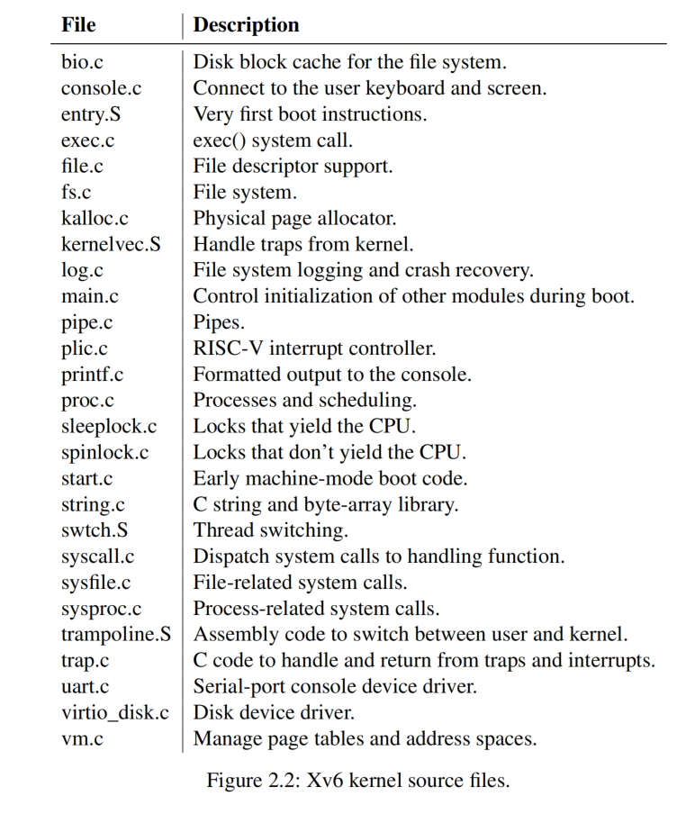

# 第 2 章 操作系统组织（Chapter 2 Operating system organization）

> A key requirement for an operating system is to support several activities at once. For example, using the system call interface described in Chapter 1 a process can start new processes with `fork`. The operating system must time-share the resources of the computer among these processes. For example, even if there are more processes than there are hardware CPUs, the operating system must ensure that all of the processes get a chance to execute. The operating system must also arrange for isolation between the processes. That is, if one process has a bug and malfunctions, it shouldn’t affect processes that don’t depend on the buggy process. Complete isolation, however, is too strong, since it should be possible for processes to intentionally interact; pipelines are an example. Thus an operating system must fulfill three requirements: multiplexing, isolation, and interaction.

对于一个操作系统来说，一个关键的需求是要同时支持多个 “活动（activity）”。例如，使用第 1 章中描述的系统调用接口 `fork`，一个进程可以创建新的进程。操作系统必须让这些进程采用 “分时（time-share）” 的方式共享计算机的资源。例如，考虑到进程的个数一般情况下总是比硬件处理器的个数要多，操作系统必须确保所有进程都有机会被执行。操作系统还必须确保进程之间的隔离性。也就是说，如果一个进程的实现有问题会导致一些非法操作，它也不应该影响那些和它无关的其他进程。当然，也没有必要实现完全的隔离，进程之间有时候也有交互的需要；管道就是一个例子。因此，操作系统必须满足三个需求：“复用（multiplexing）”、“隔离（isolation）” 和 “交互（interaction）”。

> This chapter provides an overview of how operating systems are organized to achieve these three requirements. It turns out there are many ways to do so, but this text focuses on mainstream designs centered around a *monolithic kernel*, which is used by many Unix operating systems. This chapter also provides an overview of an xv6 process, which is the unit of isolation in xv6, and the creation of the first process when xv6 starts.

本章概述了如何设计操作系统来实现这三个要求。事实证明，有很多方法可以做到这一点，但是本文侧重于介绍主流的 “宏内核（monolithic kernel）” 设计理念，许多 Unix 操作系统都采用了这种设计方式。本章还概述了 xv6 中的 “进程（process）”（它是 xv6 中实现隔离的基本单元）以及 xv6 启动时是如何创建第一个进程的。

> Xv6 runs on a *multi-core*[1] RISC-V microprocessor, and much of its low-level functionality (for example, its process implementation) is specific to RISC-V. RISC-V is a 64-bit CPU, and xv6 is written in “LP64” C, which means long (L) and pointers (P) in the C programming language are 64 bits, but an `int` is 32 bits. This book assumes the reader has done a bit of machine-level programming on some architecture, and will introduce RISC-V-specific ideas as they come up. The user-level ISA [2] and privileged architecture [3] documents are the complete specifications. You may also refer to “The RISC-V Reader: An Open Architecture Atlas” [15].

xv6 支持运行 *多核(multi-core)* RISC-V 微处理器，它的许多底层功能（例如，它的进程实现）是特定于 RISC-V 的。运行 xv6 的 RISC-V 处理器是 64 位的，xv6 用基于 “LP64” 的 C 语言编写的，这意味着 C 语言中的 long（L）类型的变量和指针（P）变量都是 64 位长度，但 `int` 类型变量是 32 位的。这本书假设读者已经在一些架构上具备一些机器指令级别（译者注：即采用汇编语言）编程的经验，本文在涉及相关内容时会适当介绍一些 RISC-V 相关的知识。完整的 ISA 规范请参考用户级别（非特权） ISA 手册 [2] 和特权 ISA 手册 [3]。另一个有用的参考文献是 “The RISC-V Reader: An Open Architecture Atlas” [15]。

> The CPU in a complete computer is surrounded by support hardware, much of it in the form of I/O interfaces. Xv6 is written for the support hardware simulated by qemu’s “-machine virt” option. This includes RAM, a ROM containing boot code, a serial connection to the user’s keyboard/screen, and a disk for storage.

作为一个完整的计算机系统，除了 CPU 外还需要有其他外围设备硬件支撑，其中大部分外设可以通过 I/O 接口方式访问。xv6 是针对 qemu 的 virt 机器开发的 (所谓 virt 机器是指运行 qemu 模拟器时用 “-machine virt” 选项启动的一种仿真平台) 。这个仿真平台模拟了内存（RAM）、包含引导代码的 ROM、一个连接了用户键盘和屏幕的串口，以及一个支持持久存储的磁盘。

> [1] By "multi-core" this text means multiple CPUs that share memory but execute in parallel, each with its own set of registers. This text sometimes uses the term multiprocessor as a synonym for multi-core, though multiprocessor can also refer more specifically to a computer with several distinct processor chips.

[注解 1]：本文中的 “多核（multi-core）” 是指多个 CPU 共享内存且并行执行，每个 CPU 都有各自的寄存器组。本文有时使用 “多处理器（multiprocessor）” 作为 “多核” 的同义词，但 “多处理器” 有时更特指一台计算机具有多个不同的处理器芯片。

## 2.1 抽象物理资源（Abstracting physical resources）

> The first question one might ask when encountering an operating system is why have it at all? That is, one could implement the system calls in Figure 1.2 as a library, with which applications link. In this plan, each application could even have its own library tailored to its needs. Applications could directly interact with hardware resources and use those resources in the best way for the application (e.g., to achieve high or predictable performance). Some operating systems for embedded devices or real-time systems are organized in this way.

当人们初次接触操作系统概念时，可能会问的第一个问题是我们为什么需要它？我们完全可以将图 1.2 中的系统调用实现为一个库，应用程序链接这个库就好了。如果按照这个思路更进一步，每个应用程序甚至可以根据自己的需求定制自己的库。应用程序可以直接与硬件资源交互，并从应用角度出发以各自最佳的方式使用这些资源（例如，实现高性能或可预期的性能）。（现实中）一些针对嵌入式设备或实时系统设计的操作系统就是这样组织的。

> The downside of this library approach is that, if there is more than one application running, the applications must be well-behaved. For example, each application must periodically give up the CPU so that other applications can run. Such a *cooperative* time-sharing scheme may be OK if all applications trust each other and have no bugs. It’s more typical for applications to not trust each other, and to have bugs, so one often wants stronger isolation than a cooperative scheme provides.

采用这种库函数方式实现操作系统的缺点是，如果有多个应用程序在运行，这些应用程序必须要仔细设计。例如，每个应用程序必须定期放弃处理器，以便其他应用程序能够有机会运行。如果所有应用程序都相互信任并且没有错误，这种基于 *协同（cooperative）* 的 “分时（time-sharing）” 方案可能是可行的。然而更常见的情况是，应用程序之间互不了解且具体实现中不可避免会出现问题（译者注：所谓问题最简单的例子就是出现诸如死循环导致不能定期放弃处理器），所以人们通常希望采用比 “协同” 更好的方法实现隔离。

> To achieve strong isolation it’s helpful to forbid applications from directly accessing sensitive hardware resources, and instead to abstract the resources into services. For example, Unix applications interact with storage only through the file system’s `open`, `read`, `write`, and `close` system calls, instead of reading and writing the disk directly. This provides the application with the convenience of pathnames, and it allows the operating system (as the implementer of the interface) to manage the disk. Even if isolation is not a concern, programs that interact intentionally (or just wish to keep out of each other’s way) are likely to find a file system a more convenient abstraction than direct use of the disk.

为了实现更好的隔离，最好禁止应用程序直接访问敏感的硬件资源，代之以将对资源的访问抽象为服务。例如，Unix 上的应用程序只能通过文件系统提供的系统调用，诸如 `open`、`read`、`write` 和 `close` 访问存储，而不是直接读写磁盘。这些系统调用为应用程序提供了方便实用的路径名（来访问磁盘上的数据），而将具体对磁盘的管理工作交给了操作系统（作为接口的实现者）。即使不考虑隔离问题，需要交互的程序（如果只是希望它们之间不会互相干扰）可能会发现通过文件系统访问磁盘比直接使用磁盘会更方便。

> Similarly, Unix transparently switches hardware CPUs among processes, saving and restoring register state as necessary, so that applications don’t have to be aware of time-sharing. This transparency allows the operating system to share CPUs even if some applications are in infinite loops.

同样，Unix 在进程之间透明地切换硬件处理器，根据需要保存和恢复寄存器状态，这样应用程序就不必意识到 “分时共享（time-sharing）” 的存在。这种透明性允许操作系统（为进程）公平地分享处理器，即使有些应用程序会处于无限循环中。

> As another example, Unix processes use `exec` to build up their memory image, instead of directly interacting with physical memory. This allows the operating system to decide where to place a process in memory; if memory is tight, the operating system might even store some of a process’s data on disk. `exec` also provides users with the convenience of a file system to store executable program images.

另一个例子是，Unix 进程使用 `exec` 来创建它们的（虚拟）内存空间，而不是让程序直接访问物理内存。最终将由操作系统来决定一个进程所使用的物理内存；如果内存很紧张，操作系统甚至可以将一个进程的部分数据暂存在磁盘上。`exec` 还给用户提供了一种便利，即我们可以通过文件系统将程序保存在磁盘上，只有在需要运行它的时候再将程序从磁盘上加载到内存中。

> Many forms of interaction among Unix processes occur via file descriptors. Not only do file descriptors abstract away many details (e.g., where data in a pipe or file is stored), they are also defined in a way that simplifies interaction. For example, if one application in a pipeline fails, the kernel generates an end-of-file signal for the next process in the pipeline.

Unix 进程之间的许多交互都是通过 “文件描述符（file descriptors）” 实现的。文件描述符不仅抽象了许多细节（例如，管道或文件中的数据实际存储在哪里），还简化了进程之间交互的方式。譬如，当程序中的管道操作失败时，内核会为管道另一端的进程产生 “文件结束（end-of-file）” 信号。

> The system-call interface in Figure 1.2 is carefully designed to provide both programmer convenience and the possibility of strong isolation. The Unix interface is not the only way to abstract resources, but it has proved to be a good one.

图 1.2 中的系统调用接口是精心设计的产物，既为程序员提供了便利，又为实现强有力的隔离提供了可能性。Unix 接口不是抽象资源的唯一方案，但它已经被证明是一个非常好的方案。

## 2.2 用户模式，管理员模式和系统调用（User mode, supervisor mode, and system calls）

> Strong isolation requires a hard boundary between applications and the operating system. If the application makes a mistake, we don’t want the operating system to fail or other applications to fail. Instead, the operating system should be able to clean up the failed application and continue running other applications. To achieve strong isolation, the operating system must arrange that applications cannot modify (or even read) the operating system’s data structures and instructions and that applications cannot access other processes’ memory.

强隔离需要在应用程序和操作系统之间建立一个明显的边界，我们不希望一个应用程序的出错会影响操作系统或其他应用程序。相反，操作系统应该能够对失败的应用程序进行清理，并继续运行其他应用程序。要达到强隔离的目标，操作系统必须保证应用程序不能修改（甚至读取）操作系统的数据结构和指令，以及确保这个应用程序不能访问其他进程的内存。

> CPUs provide hardware support for strong isolation. For example, RISC-V has three modes in which the CPU can execute instructions: *machine mode*, *supervisor mode*, and *user mode*. Instructions executing in machine mode have full privilege; a CPU starts in machine mode. Machine mode is mostly intended for setting up the computer during boot. Xv6 executes a few lines in machine mode and then changes to supervisor mode.

CPU 为实现强隔离从硬件层面提供了支持。例如，RISC-V 的 CPU 有三种执行指令的模式：*机器模式（machine mode）*、*管理员模式（supervisor mode）* 和 *用户模式（user mode）*。在机器模式下执行指令时权限最大；CPU 上电后首先运行在机器模式下。机器模式主要用于在计算机启动过程中执行配置操作。xv6 在机器模式下执行很少的几行代码，随后就将处理器切换为管理员模式。

> In supervisor mode the CPU is allowed to execute *privileged instructions*: for example, enabling and disabling interrupts, reading and writing the register that holds the address of a page table, etc. If an application in user mode attempts to execute a privileged instruction, then the CPU doesn’t execute the instruction, but switches to supervisor mode so that supervisor-mode code can terminate the application, because it did something it shouldn’t be doing. Figure 1.1 in Chapter 1 illustrates this organization. An application can execute only user-mode instructions (e.g., adding numbers, etc.) and is said to be running in *user space*, while the software in supervisor mode can also execute privileged instructions and is said to be running in *kernel space*. The software running in kernel space (or in supervisor mode) is called the *kernel*.

在管理员模式下，CPU 被允许执行 *特权指令（privileged instructions）*：例如，启用和禁用中断、读取和写入保存页表地址的寄存器等。如果在用户模式下应用程序试图执行特权指令，那么 CPU 不仅会拒绝执行，还会将处理器切换到管理员模式并让拥有管理员权限的代码终止应用程序，这么做的原因很简单，因为（用户模式下）的程序做了它不应该做的事情。第一章中的图 1.1 描述了这种设计。一个应用程序只能执行用户模式下允许执行的指令（例如，对数字求和等），这被称为在 *用户空间（user space）* 中运行，而处于管理员模式下程序可以执行特权指令，这被称为在 *内核空间（kernel space）* 中运行。在内核空间（对应 RISC-V 的管理员模式概念）中运行的软件被称为 *内核（kernel）*。

> An application that wants to invoke a kernel function (e.g., the `read` system call in xv6) must transition to the kernel; an application cannot invoke a kernel function directly. CPUs provide a special instruction that switches the CPU from user mode to supervisor mode and enters the kernel at an entry point specified by the kernel. (RISC-V provides the `ecall` instruction for this purpose.) Once the CPU has switched to supervisor mode, the kernel can then validate the arguments of the system call (e.g., check if the address passed to the system call is part of the application’s memory), decide whether the application is allowed to perform the requested operation (e.g., check if the application is allowed to write the specified file), and then deny it or execute it. It is important that the kernel control the entry point for transitions to supervisor mode; if the application could decide the kernel entry point, a malicious application could, for example, enter the kernel at a point where the validation of arguments is skipped.

一个应用程序，如果想要调用内核的函数（例如 xv6 中的 `read` 系统调用）必须将处理器的控制权交给内核。CPU 提供一个特殊的指令（RISC-V 为此提供的指令叫 `ecall`），将 CPU 从用户模式切换到管理员模式，并通过内核指定的 “入口点（entry point）” 进入内核(译者注：所谓 entry point 可以认为是一个指令地址，当处理器从用户模式切换到管理员模式时，处理器的 PC 自动跳转到这个 entry point 开始执行内核定义的函数）)。一旦 CPU 切换到管理员模式，内核就可以验证系统调用的参数（（例如，检查传递给系统调用的地址是否是应用程序内存的一部分），决定是否允许应用程序执行请求的操作（例如，检查是否允许应用程序写入指定的文件），结果无非是拒绝该请求或执行该请求。这个转换到管理员模式后执行的入口点必须由内核来定义，这点非常重要；如果应用程序可以决定内核入口点，那么心存恶意的应用程序就可以跳过参数验证，直接进入内核（执行内核的函数）。

## 2.3 内核的组织（Kernel organization）

> A key design question is what part of the operating system should run in supervisor mode. One possibility is that the entire operating system resides in the kernel, so that the implementations of all system calls run in supervisor mode. This organization is called a *monolithic kernel*.

有一个关键的设计问题是：操作系统的哪些部分应该在管理员模式下运行。一种可能性是整个操作系统驻留在内核中，这样所有系统调用的实现都以管理员模式运行。这种组织方式被称为 *宏内核（monolithic kernel）*。

> In this organization the entire operating system consists of a single program running with full hardware privilege. This organization is convenient because the OS designer doesn’t have to decide which parts of the operating system don’t need full hardware privilege. Furthermore, it is easier for different parts of the operating system to cooperate. For example, an operating system might have a buffer cache that can be shared both by the file system and the virtual memory system.

在这种组织方式下，整个操作系统由单个程序组成，拥有对硬件的完全控制权限。这种组织方式非常方便，因为操作系统设计人员无需决定操作系统的哪些部分不需要完全的硬件访问权限。此外，操作系统的不同部分更容易协作。例如，一个操作系统可能有一个 “缓冲区缓存（buffer cache）”，可以由文件系统和虚拟内存系统共享。

> A downside of the monolithic organization is that the interactions among different parts of the operating system are often complex (as we will see in the rest of this text), and therefore it is easy for an operating system developer to make a mistake. In a monolithic kernel, a mistake is fatal, because an error in supervisor mode will often cause the kernel to fail. If the kernel fails, the computer stops working, and thus all applications fail too. The computer must reboot to start again.

宏内核的组织方式也存在一个缺点，因为操作系统不同部分之间的交互通常很复杂（正如我们将在本文的其余部分中看到的那样），因此操作系统开发人员很容易犯错。在宏内核中，一旦产生错误将是致命的，因为在管理员模式下发生错误通常会导致内核崩溃。如果内核崩溃，计算机就会停止工作，从而导致所有应用程序也崩溃。计算机必须重新启动才能再次运行。

> To reduce the risk of mistakes in the kernel, OS designers can minimize the amount of operating system code that runs in supervisor mode, and execute the bulk of the operating system in user mode. This kernel organization is called a *microkernel*.

为了降低内核出错的风险，操作系统设计人员可以尽量减少在管理员模式下运行的代码，并在用户模式下执行大部分操作系统代码。这种内核组织方式称为 *微内核（microkernel）*。

> Figure 2.1 illustrates this microkernel design. In the figure, the file system runs as a user-level process. OS services running as processes are called servers. To allow applications to interact with the file server, the kernel provides an inter-process communication mechanism to send messages from one user-mode process to another. For example, if an application like the shell wants to read or write a file, it sends a message to the file server and waits for a response.

图 2.1 展示了这种微内核设计。图中，文件系统作为用户态进程运行。以进程形式运行的操作系统服务称为 “服务器（servers）”。为了允许应用程序与文件服务器交互，内核提供了一种进程间通信机制，用于在用户模式进程之间发送消息。例如，像 shell 这样的应用程序如果想要读取或写入文件，它需要向文件服务器发送消息并等待响应。

> In a microkernel, the kernel interface consists of a few low-level functions for starting applications, sending messages, accessing device hardware, etc. This organization allows the kernel to be relatively simple, as most of the operating system resides in user-level servers.

在微内核中，内核接口由一些底层函数组成，包括启动应用程序、发送消息、访问设备硬件等。这种组织方式使内核相对简单，因为操作系统的大部分代码都运行在用户态层面的服务器中。

> In the real world, both monolithic kernels and microkernels are popular. Many Unix kernels are monolithic. For example, Linux has a monolithic kernel, although some OS functions run as user-level servers (e.g., the window system). Linux delivers high performance to OS-intensive applications, partially because the subsystems of the kernel can be tightly integrated.

在现实世界中，宏内核和微内核都很流行。许多 Unix 内核都是宏内核的。例如，Linux 就是采用的宏内核方式，除了一部分操作系统功能作为用户态服务器运行（例如窗口系统）。Linux 能够支持实现高性能的 “操作系统密集型（OS-intensive）” 应用程序，部分原因就是因为其内核中的子系统之间可以紧密集成。

> Operating systems such as Minix, L4, and QNX are organized as a microkernel with servers, and have seen wide deployment in embedded settings. A variant of L4, seL4, is small enough that it has been verified for memory safety and other security properties [8].

Minix、L4 和 QNX 等操作系统则采用微内核架构，大部分功能以服务器形式提供，它们在嵌入式环境中得到了广泛的部署。其中，L4 的一个变体 seL4 的体积足够小，并且已通过内存安全和其他安全特性的验证 [8]。

> There is much debate among developers of operating systems about which organization is better, and there is no conclusive evidence one way or the other. Furthermore, it depends much on what “better” means: faster performance, smaller code size, reliability of the kernel, reliability of the complete operating system (including user-level services), etc.

至于究竟那种组织方式更好，在操作系统开发者之间存在很多争论，目前尚无定论。此外，这很大程度上取决于如何理解什么是 “更好”：这涉及系统更倾向于实现更快的性能、更小的代码大小、更可靠的内核、还是更多考虑整个操作系统（包括用户级别服务）的可靠性等等方面的问题。

> There are also practical considerations that may be more important than the question of which organization. Some operating systems have a microkernel but run some of the user-level services in kernel space for performance reasons. Some operating systems have monolithic kernels because that is how they started and there is little incentive to move to a pure microkernel organization, because new features may be more important than rewriting the existing operating system to fit a microkernel design.

还有一些需要实际考虑的因素可能比单纯选择哪种组织方式更重要。有些操作系统采用微内核，但出于性能考虑，仍然会将部分用户级别服务放在内核空间运行。有些操作系统采用宏内核架构，仅仅是因为它们最初就是这样设计的，而且几乎没有什么动力再转向纯粹的微内核架构，与其重写现有操作系统以适应微内核设计还不如在开发新功能上多花点精力。

> From this book’s perspective, microkernel and monolithic operating systems share many key ideas. They implement system calls, they use page tables, they handle interrupts, they support processes, they use locks for concurrency control, they implement a file system, etc. This book focuses on these core ideas.

从本书的角度来看，微内核和宏内核的操作系统有许多共同的核心思想。它们都实现了系统调用，使用了页表，处理了中断，支持进程，使用锁进行并发控制，并且都实现了文件系统等等。本书将重点介绍这些核心思想。

> Xv6 is implemented as a monolithic kernel, like most Unix operating systems. Thus, the xv6 kernel interface corresponds to the operating system interface, and the kernel implements the complete operating system. Since xv6 doesn’t provide many services, its kernel is smaller than some microkernels, but conceptually xv6 is monolithic.

与大多数 Unix 操作系统一样，xv6 采用了宏内核的组织方式。因此，xv6 内核的接口就是操作系统的接口，内核实现了完整的操作系统。由于 xv6 提供的服务较少，其内核比一些微内核更小，但从概念上讲，xv6 仍然属于宏内核。

## 2.4 代码讲解：xv6 的组织（Code: xv6 organization）

> The xv6 kernel source is in the `kernel/` sub-directory. The source is divided into files, following a rough notion of modularity; Figure 2.2 lists the files. The inter-module interfaces are defined in `defs.h` (kernel/defs.h).

xv6 内核源代码位于 `kernel/` 子目录中。源代码按照模块化的概念被划分为多个文件；图 2.2 列出了这些文件。模块间接口定义在 `defs.h` (kernel/defs.h) 中。

## 2.5 进程概述（Process overview）

> The unit of isolation in xv6 (as in other Unix operating systems) is a *process*. The process abstraction prevents one process from wrecking or spying on another process’s memory, CPU, file descriptors, etc. It also prevents a process from wrecking the kernel itself, so that a process can’t subvert the kernel’s isolation mechanisms. The kernel must implement the process abstraction with care because a buggy or malicious application may trick the kernel or hardware into doing something bad (e.g., circumventing isolation). The mechanisms used by the kernel to implement processes include the user/supervisor mode flag, address spaces, and time-slicing of threads.

（和其他 Unix 操作系统一样）xv6 中实现隔离的基本单元是一个 *进程（process）*。进程是一个抽象的概念，一个进程无法访问（更谈不上破坏）另一个进程所拥有的内存、CPU、文件描述符等。一个进程也无法破坏内核本身，自然这样一个进程就不能突破内核的隔离机制。内核必须小心地实现进程这个抽象设计，因为一个有缺陷或恶意的应用程序可能会欺骗内核或硬件做坏事（例如，绕过隔离机制）。内核用来实现进程的机制包括区分用户模式和管理员模式，引入地址空间的概念以及对线程的运行划分时间片。

> To help enforce isolation, the process abstraction provides the illusion to a program that it has its own private machine. A process provides a program with what appears to be a private memory system, or *address space*, which other processes cannot read or write. A process also provides the program with what appears to be its own CPU to execute the program’s instructions. 

为了加强隔离，进程这种抽象设计给程序提供了一种错觉，即好像它拥有自己专有的机器。一个程序似乎拥有一块私有的内存区域，也叫作 *地址空间（address space）*，其他进程对它不能读取也不能写入。这个程序还拥有自己的 CPU 来执行它的指令。

> Xv6 uses page tables (which are implemented by hardware) to give each process its own address space. The RISC-V page table translates (or “maps”) a *virtual address* (the address that an RISC-V instruction manipulates) to a *physical address* (an address that the CPU sends to main memory).

xv6 使用 “页表（page tables）”（在硬件的帮助下）为每个进程提供自己的地址空间。RISC-V 的页表将 *虚拟地址（virtual address）*（RISC-V 的指令操作的地址）“翻译（translate）”（或 “映射（map）”）为 *物理地址（physical address）*（CPU 芯片发送到主存储器的地址）。（译者注：页表是内存中的一个数据结构，存放了虚拟地址和物理地址之间的对应关系，也就是这里说的映射的概念。当 CPU 执行指令时，由专门的 MMU 硬件单元将指令中的虚拟地址转换成物理地址并进而访问实际的物理内存。）

> Xv6 maintains a separate page table for each process that defines that process’s address space. As illustrated in Figure 2.3, an address space includes the process’s *user memory* starting at virtual address zero. Instructions come first, followed by global variables, then the stack, and finally a “heap” area (for malloc) that the process can expand as needed. There are a number of factors that limit the maximum size of a process’s address space: pointers on the RISC-V are 64 bits wide; the hardware uses only the low 39 bits when looking up virtual addresses in page tables; and xv6 uses only 38 of those 39 bits. Thus, the maximum address is 2^38 − 1 = 0x3fffffffff, which is `MAXVA` (kernel/riscv.h:378). At the top of the address space xv6 places a *trampoline* page (4096 bytes) and a *trapframe* page. Xv6 uses these two pages to transition into the kernel and back; the trampoline page contains the code to transition in and out of the kernel, and the trapframe is where the kernel saves the process’s user registers, as Chapter 4 explains.

xv6 为每个进程维护一个单独的页表，定义了该进程的地址空间。如图 2.3 所示是一个进程的地址空间，它对应了进程的 *用户内存（user memory）*，这块内存以虚拟内存地址 0 作为起始地址。向上（虚拟地址增加的方向），首先存放的是指令，然后是全局变量，接着是栈区，最后是一个 “堆” 区（用于 malloc）供进程根据需要进行扩展。有许多因素限制了进程地址空间的最大范围：RISC-V 的指针宽度是 64 位；硬件在页表中查找虚拟地址时只使用低 39 位；xv6 只使用了这 39 位中的 38 位。因此，最大地址是 2^38 - 1 = 0x3fffffffff，即代码中定义的常量 `MAXVA`（kernel/riscv.h:348）。在地址空间的顶部，xv6 为 *trampoline* 和 *trapframe* 各映射了一个 “页（page）”（大小为 4096 个字节），xv6 利用这两个页实现用户态和内核态之间的切换，trampline 页中包含了用于内核态切换时会执行的指令，trapframe 页会被内核用于保存进程的用户寄存器，有关这部分的详细内容将在第 4 章中进一步解释。

> The xv6 kernel maintains many pieces of state for each process, which it gathers into a `struct proc` (kernel/proc.h:85). A process’s most important pieces of kernel state are its page table, its kernel stack, and its run state. We’ll use the notation `p->xxx` to refer to elements of the `proc` structure; for example, `p->pagetable` is a pointer to the process’s page table.

xv6 内核为每个进程维护许多信息，所有的这些内容都定义在一个结构体 `struct proc` (kernel/proc.h:86) 中。一个进程中最重要的内核信息包括它的页表、内核栈区和运行状态。我们将使用 `p->xxx` 来引用 `proc` 结构体中的属性；例如，`p->pagetable` 是一个指向该进程页表的指针。

> Each process has a thread of control (or *thread* for short) that holds the state needed to execute the process. At any given time, a thread might be executing on a CPU, or suspended (not executing, but capable of resuming executing in the future). To switch a CPU between processes, the kernel suspends the thread currently running on that CPU and saves its state, and restores the state of another process’s previously-suspended thread. Much of the state of a thread (local variables, function call return addresses) is stored on the thread’s stacks. Each process has two stacks: a user stack and a kernel stack (`p->kstack`). When the process is executing user instructions, only its user stack is in use, and its kernel stack is empty. When the process enters the kernel (for a system call or interrupt), the kernel code executes on the process’s kernel stack; while a process is in the kernel, its user stack still contains saved data, but isn’t actively used. A process’s thread alternates between actively using its user stack and its kernel stack. The kernel stack is separate (and protected from user code) so that the kernel can execute even if a process has wrecked its user stack.

每个进程都对应一个 “控制流（thread of control）”（或简称 *线程(thread)*）并维护着进程执行过程中所需的上下文信息。在任意一个时间点上，一个线程要么是在处理器上执行，要么挂起（不执行，但稍后能够恢复继续执行）。为了在处理器上交替执行进程，内核会挂起当前在处理器上运行的线程，保存它的上下文，然后恢复另一个当前被挂起的进程所对应的线程的上下文。线程的大部分状态（包括本地变量、函数调用返回地址）存储在线程的栈上。每个进程有两个栈：一个用户栈和一个内核栈（`p->kstack`）。当进程执行用户指令时，只使用它的用户栈，它的内核栈是空的。当进程进入内核（由于系统调用或中断）时，内核代码使用进程的内核栈；当一个进程进入内核态后，它的用户栈仍然包含保存的数据，只是不被内核指令使用。进程的线程交替使用它的用户栈和内核栈。内核栈是独立的（用户代码不能访问），因此即使一个进程搞坏了它的用户栈，内核依然可以正常运行。

> A process can make a system call by executing the RISC-V `ecall` instruction. This instruction raises the hardware privilege level and changes the program counter to a kernel-defined entry point. The code at the entry point switches to the process’s kernel stack and executes the kernel instructions that implement the system call. When the system call completes, the kernel switches back to the user stack and returns to user space by calling the `sret` instruction, which lowers the hardware privilege level and resumes executing user instructions just after the system call instruction. A process’s thread can “block” in the kernel to wait for I/O, and resume where it left off when the I/O has finished. 

一个进程可以通过执行 RISC-V 的 `ecall` 指令发起系统调用，该指令提升硬件特权级别，并将程序计数器（program counter）更改为内核定义的入口点。入口点的代码切换线程使其转为使用内核栈并开始执行实现系统调用的内核指令，当系统调用完成时，内核切换回用户栈，并通过调用 `sret` 指令返回用户空间，该指令降低了硬件的特权级别，并从发起系统调用指令（即 `ecall`）后的那条用户指令开始继续恢复执行。一个进程的线程可以在内核中以 “阻塞（block）” 方式等待 I/O，并在 I/O 完成后恢复执行。

> `p->state` indicates whether the process is allocated, ready to run, currently running on a CPU, waiting for I/O, or exiting.

`p->state` 用于记录当前进程进程的状态是 “已分配（allocated）”、“就绪（ready to run）”、“运行（running）”、“等待 I/O 中（waiting）” 还是 “正在退出（exiting）”。

> `p->pagetable` holds the process’s page table, in the format that the RISC-V hardware expects. Xv6 causes the paging hardware to use a process’s `p->pagetable` when executing that process in user space. A process’s page table also serves as the record of the addresses of the physical pages allocated to store the process’s memory.

`p->pagetable` 指向进程的页表，页表中的格式必须符合 RISC-V 硬件所期望的格式。当进程在用户空间执行，xv6 会设置分页硬件使用进程的 `p->pagetable`。一个进程的页表记录着哪些物理页已分配给该进程。

> In summary, a process bundles two design ideas: an address space to give a process the illusion of its own memory, and a thread to give the process the illusion of its own CPU. In xv6, a process consists of one address space and one thread. In real operating systems a process may have more than one thread to take advantage of multiple CPUs.

总之，进程的概念包含了两个设计思想：一个是地址空间的概念，它让进程感觉拥有自己专属的内存；另一个是线程的概念，它让进程感觉拥有自己专属的 CPU。在 xv6 中，一个进程由一个地址空间和一个线程组成。在实际操作系统中，一个进程可能含有多个线程，以充分利用处理器中的多个核。

## 2.6 代码讲解：启动 xv6，第一个进程以及系统调用（Code: starting xv6, the first process and system call）

> To make xv6 more concrete, we’ll outline how the kernel starts and runs the first process. The subsequent chapters will describe the mechanisms that show up in this overview in more detail.

为了使读者更具体地了解 xv6，我们将概述内核如何启动和运行第一个进程。后面的章节将更详细地描述这里概述中介绍的机制。

> When the RISC-V computer powers on, it initializes itself and runs a boot loader which is stored in read-only memory. The boot loader loads the xv6 kernel into memory. Then, in machine mode, the CPU executes xv6 starting at `_entry` (kernel/entry.S:7). The RISC-V starts with paging hardware disabled: virtual addresses map directly to physical addresses.

当 RISC-V 计算机上电时，它会初始化自己并运行一个存储在只读内存中的 “引导加载程序（boot loader）”。引导加载程序将 xv6 内核加载到内存中。然后，在机器模式下，中央处理器从 `_entry` (kernel/entry.S:7) 开始运行 xv6。启动阶段中 “分页硬件（paging hardware，即 MMU）” 处于禁用模式，也就是说此时虚拟地址直接映射为等值的物理地址。

> The loader loads the xv6 kernel into memory at physical address `0x80000000`. The reason it places the kernel at `0x80000000` rather than `0x0`` is because the address range `0x0:0x80000000` contains I/O devices.

引导加载程序将 xv6 内核加载到内存中物理地址为 `0x80000000` 处。它将内核放在 `0x80000000` 而不是 `0x0` 的原因是 `0x0:0x80000000` 这段地址范围已经被分配用于访问 I/O 设备。

> The instructions at `_entry` set up a stack so that xv6 can run C code. Xv6 declares space for an initial stack, `stack0`, in the file `start.c` (kernel/start.c:11). The code at `_entry` loads the stack pointer register `sp` with the address `stack0+4096`, the top of the stack, because the stack on RISC-V grows down. Now that the kernel has a stack, `_entry` calls into C code at `start` (kernel/start.c:15).

汇编函数 `_entry` 中首先建立了一个栈，这为在 xv6 中使用 C 语言写代码了做好了准备。xv6在 `start.c` (kernel/start.c:11) 中定义了最初的栈 `stack0`。由于在 RISC-V 上的栈是向低地址方向扩展，所以在 `_entry` 中将栈顶地址 `stack0+4096` 加载到栈指针寄存器 `sp` 中。现在内核有了栈区，`_entry` 便可以调用 C 函数 `start` (kernel/start.c:15) 了。

> The function `start` performs some configuration that is only allowed in machine mode, and then switches to supervisor mode. To enter supervisor mode, RISC-V provides the instruction `mret`. This instruction is most often used to return from a previous call from supervisor mode to machine mode. `start` isn’t returning from such a call, but sets things up as if it were: it sets the previous privilege mode to supervisor in the register `mstatus`, it sets the return address to `main` by writing `main`’s address into the register `mepc`, disables virtual address translation in supervisor mode by writing `0` into the page-table register `satp`, and delegates all interrupts and exceptions to supervisor mode.

函数 `start` 执行一些仅在机器模式下允许的配置操作，然后将处理器切换到管理员模式。在 RISC-V 上可以通过调用 `mret` 指令进入管理员模式。该指令之所以含有 “ret”（即 return 的缩写）是因为它常被用于如下场景，即上一次处理器从管理员模式被切换为机器模式（由于中断或者异常），而现在它希望返回管理模式。但对于 `start` 来说并不存在所谓的返回（因为上电后处理器就已经是机器模式），所以它通过提前做好如下设置使得这里调用 `mret` 的行为等价于返回：它在寄存器 `mstatus` 中将上一个特权模式（即 `mstatus.MPP`）设置为管理员模式，此外它通过将 `main` 函数的地址写入寄存器 `mepc` 使得处理器返回管理员模式后从 `main` 恢复执行，它通过向页表寄存器 `satp` 写入 `0`  确保管理员模式下虚拟地址转换功能被禁用，并将所有的中断和异常委托（delegate）给管理员模式。

> Before jumping into supervisor mode, `start` performs one more task: it programs the clock chip to generate timer interrupts. With this housekeeping out of the way, `start` “returns” to supervisor mode by calling `mret`. This causes the program counter to change to `main` (kernel/main.c:11), the address previously stored in `mepc`.

在进入管理模式之前，`start` 还要执行另一项任务：它对时钟芯片进行编程以产生计时器中断。所有以上工作完成后，`start` 最后通过调用 `mret` “返回” 到管理模式。这将导致 “程序计数器（program counter）” 的值被替换为 `main` 函数 (kernel/main.c:11) 的地址，这也是为何在 `start` 函数中我们要提前设置好 `mepc` 的原因。

> After `main` (kernel/main.c:11) initializes several devices and subsystems, it creates the first process by calling `userinit` (kernel/proc.c:233). The first process executes a small program written in RISC-V assembly, which makes the first system call in xv6. `initcode.S` (user/initcode.S:3) loads the number for the `exec` system call, `SYS_EXEC` (kernel/syscall.h:8), into register `a7`, and then calls `ecall` to re-enter the kernel.

在 `main` (kernel/main.c:11) 中首先会初始化一些设备和子系统，然后通过调用 `userinit` (kernel/proc.c:233) 创建第一个进程。第一个进程执行一个用 RISC-V 汇编代码编写的小程序，这个小程序会向 xv6 发起第一次系统调用。`initcode.S` (user/initcode.S:3)，将 `exec` 系统调用对应的系统调用号 `SYS_EXEC` (kernel/syscall.h:8) 写入寄存器 `a7`，然后调用 `ecall` 再次进入内核。

> The kernel uses the number in register a7 in `syscall` (kernel/syscall.c:132) to call the desired system call. The system call table (kernel/syscall.c:107) maps `SYS_EXEC` to the function `sys_exec`, which the kernel invokes. As we saw in Chapter 1, `exec` replaces the memory and registers of the current process with a new program (in this case, `/init`).

`syscall` (kernel/syscall.c:132) 函数利用寄存器 `a7` 中存放的系统调用号调用对应的系统调用函数。系统调用表 (kernel/syscall.c:107) 维护了 `SYS_EXEC` 和与之对应的函数 `sys_exec` 之间的映射关系。正如我们在第 1 章中所看到的，`exec` 会将当前进程的内存和寄存器中的内容替换为一个新的程序（这里就是 `/init`）。

> Once the kernel has completed `exec`, it returns to user space in the `/init` process. `init` (user/init.c:15) creates a new console device file if needed and then opens it as file descriptors 0, 1, and 2. Then it starts a shell on the console. The system is up.

一旦内核完成 `exec`，它会在 `/init` 进程中返回用户空间。如果 “控制台（console）” 设备文件尚未存在，`init` (user/init.c:15) 将创建该设备文件，然后打开该文件从而得到文件描述符 0、1 和 2 。最后它在控制台上启动一个 shell。系统就这样启动了。

## 2.7 安全模型（Security Model）

> You may wonder how the operating system deals with buggy or malicious code. Because coping with malice is strictly harder than dealing with accidental bugs, it’s reasonable to focus mostly on providing security against malice. Here’s a high-level view of typical security assumptions and goals in operating system design.

您可能想知道操作系统如何处理错误或恶意代码。由于应对恶意代码比处理意外错误更困难，因此在考虑安全问题时将主要精力放在针对恶意代码上是合理的。以下概述是操作系统设计中典型的从安全角度出发的假设和开发目标。

> The operating system must assume that a process’s user-level code will do its best to wreck the kernel or other processes. User code may try to dereference pointers outside its allowed address space; it may attempt to execute any RISC-V instructions, even those not intended for user code; it may try to read and write any RISC-V control register; it may try to directly access device hardware; and it may pass clever values to system calls in an attempt to trick the kernel into crashing or doing something stupid. The kernel’s goal is to restrict each user processes so that all it can do is read/write/execute its own user memory, use the 32 general-purpose RISC-V registers, and affect the kernel and other processes in the ways that system calls are intended to allow. The kernel must prevent any other actions. This is typically an absolute requirement in kernel design.

操作系统必须假设进程的用户态代码随时可能会破坏内核或其他进程。用户代码可能会尝试将指针指向其被允许访问的地址空间之外的任何地方；它可能会尝试执行任何 RISC-V 指令，即使这些指令并非专为用户代码设计；它可能会尝试读写任何 RISC-V 的控制寄存器；它可能会尝试直接访问硬件设备；它还可能会在调用系统调用时通过参数传入一些特殊的值，并尝试利用这些值使内核崩溃或让它执行某些愚蠢的操作。内核的目标是限制每个用户进程，使其只能读取、写入或者执行自己用户内存上的内容和指令，此外还要限制用户进程只能使用 32 个通用的 RISC-V 寄存器，并只允许它以系统调用允许的方式影响内核和其他进程。内核必须阻止任何其他操作。这通常是内核设计中必须要满足的需求。

> The expectations for the kernel’s own code are quite different. Kernel code is assumed to be written by well-meaning and careful programmers. Kernel code is expected to be bug-free, and certainly to contain nothing malicious. This assumption affects how we analyze kernel code. For example, there are many internal kernel functions (e.g., the spin locks) that would cause serious problems if kernel code used them incorrectly. When examining any specific piece of kernel code, we’ll want to convince ourselves that it behaves correctly. We assume, however, that kernel code in general is correctly written, and follows all the rules about use of the kernel’s own functions and data structures. At the hardware level, the RISC-V CPU, RAM, disk, etc. are assumed to operate as advertised in the documentation, with no hardware bugs.

对内核自身代码的期望则截然不同。内核代码被假定由善意且细心的程序员编写。内核代码（被假设）应该没有缺陷，当然也不应该含有任何恶意的代码。这一假设会影响我们分析内核代码的方式。例如，许多内核内部函数（例如自旋锁）如果被内核代码错误地使用，当然会导致严重的问题。但我们在检查任何特定的内核代码片段时，我们总是倾向于相信其行为是正确的。我们会假设内核代码总体上编写正确，在调用内核自己的函数和使用数据结构时都严格遵循了必要的规则。在硬件层面，RISC-V 的 CPU、RAM、磁盘等都按文档中宣传的那样运行，没有任何硬件上的缺陷。

> Of course in real life things are not so straightforward. It’s difficult to prevent clever user code from making a system unusable (or causing it to panic) by consuming kernel-protected resources – disk space, CPU time, process table slots, etc. It’s usually impossible to write bug-free kernel code or design bug-free hardware; if the writers of malicious user code are aware of kernel or hardware bugs, they will exploit them. Even in mature, widely-used kernels, such as Linux, people discover new vulnerabilities continuously [1]. It’s worthwhile to design safeguards into the kernel against the possibility that it has bugs: assertions, type checking, stack guard pages, etc. Finally, the distinction between user and kernel code is sometimes blurred: some privileged user-level processes may provide essential services and effectively be part of the operating system, and in some operating systems privileged user code can insert new code into the kernel (as with Linux’s loadable kernel modules).

当然，实际情况并非如此简单。很难阻止一些 “聪明” 的用户代码通过消耗受内核保护的资源（磁盘空间、CPU 时间、可用进程个数等）导致系统无法使用（或崩溃）。编写无缺陷的内核代码或设计无缺陷的硬件通常是不可能的；如果内核或硬件的缺陷被那些怀有恶意的用户代码编写者意识到，他们就会利用这些缺陷。即使在 Linux 等成熟且广泛使用的内核中，人们也会不断发现新的漏洞 [1]。因此有必要在内核中设计一些保护措施来防止其发生错误：譬如断言、类型检查、栈保护页等。最后，用户代码和内核代码之间的界线有时会很模糊：一些特权用户级进程可能通过提供基本服务而被认为是操作系统的一部分，并且在某些操作系统中，特权用户可以将新代码插入内核（如通过 Linux 的可加载内核模块机制）。

## 2.8 现实世界（Real world）

> Most operating systems have adopted the process concept, and most processes look similar to xv6’s. Modern operating systems, however, support several threads within a process, to allow a single process to exploit multiple CPUs. Supporting multiple threads in a process involves quite a bit of machinery that xv6 doesn’t have, often including interface changes (e.g., Linux’s `clone`, a variant of `fork`), to control which aspects of a process threads share.

大多数操作系统都采纳了进程的概念，并且大多数操作系统的进程看起来与 xv6 的很像。然而，现代操作系统支持在一个进程中创建多个线程，使得一个进程能够利用多个处理器。在一个进程中支持多个线程涉及许多新的机制以控制一个进程中多个线程之间可以共享哪些内容。这些机制 xv6 并没有实现，包括潜在的接口更改（例如，Linux 下的 `clone`, 一个 `fork` 的变体）。

## 2.9 练习（Exercises）

> 1. Add a system call to xv6 that returns the amount of free memory available.

1. 为 xv6 增加一个系统调用, 返回当前可用的内存的大小。
