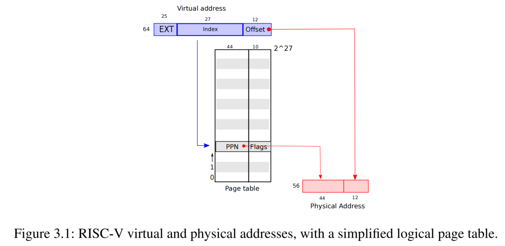
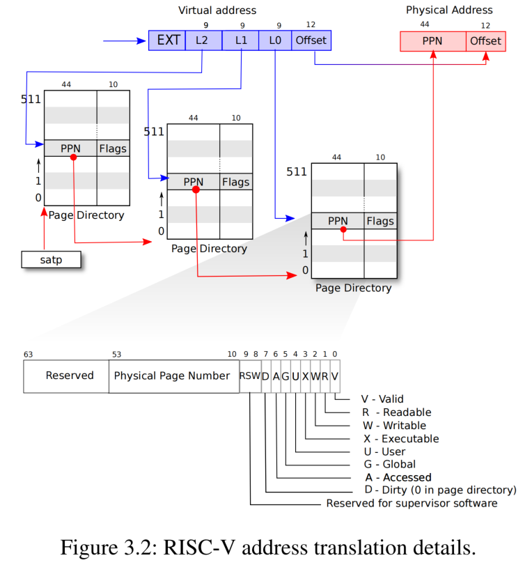
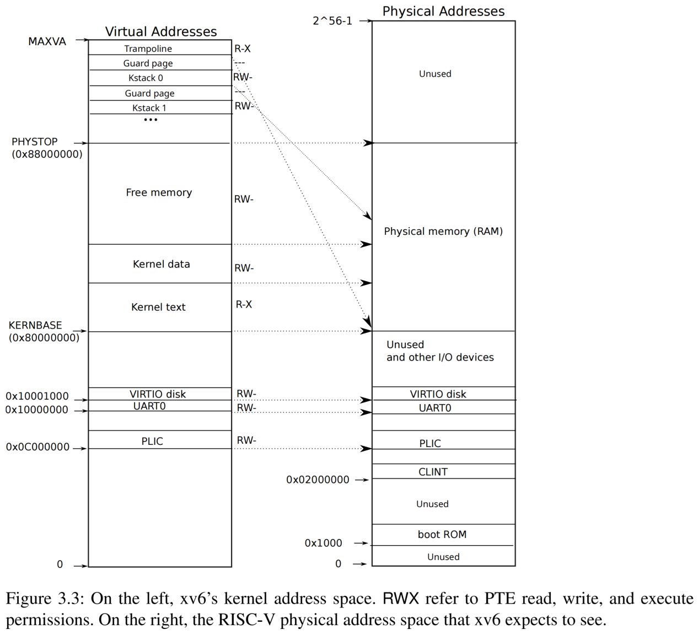
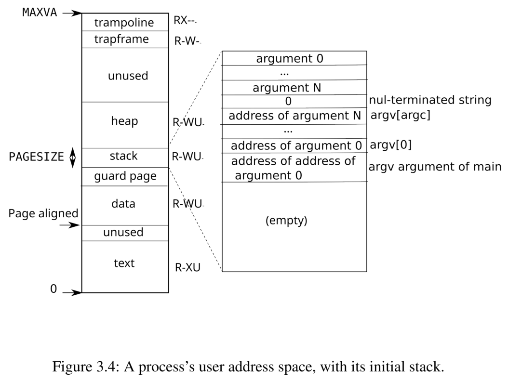

# 第 3 章 页表（Chapter 3 Page tables）

> Page tables are the most popular mechanism through which the operating system provides each process with its own private address space and memory. Page tables determine what memory addresses mean, and what parts of physical memory can be accessed. They allow xv6 to isolate different process’s address spaces and to multiplex them onto a single physical memory. Page tables are a popular design because they provide a level of indirection that allow operating systems to perform many tricks. Xv6 performs a few tricks: mapping the same memory (a trampoline page) in several address spaces, and guarding kernel and user stacks with an unmapped page. The rest of this chapter explains the page tables that the RISC-V hardware provides and how xv6 uses them.

“页表（Page tables）” 是操作系统为每个进程实现私有地址空间和内存的最常用的机制。理解页表的概念有助于我们理解内存地址的含义，页表也定义了物理内存的哪些部分可以被访问。xv6 利用页表隔离不同进程的地址空间，从而实现多个进程对单个物理内存空间的复用。页表是一种常用的设计，它提供了一层抽象（a level of indirection），方便操作系统基于该设计实现一些有趣的应用。xv6 利用页表实现了如下操作：它将同一块内存页（即下文中所介绍的 trampoline 页）映射到不同的地址空间中，用一个未映射的页保护用户栈和内核栈。本章的其余部分将介绍 RISC-V 硬件提供的页表机制以及 xv6 如何使用它。

## 3.1 分页硬件（Paging hardware）

> As a reminder, RISC-V instructions (both user and kernel) manipulate virtual addresses. The machine’s RAM, or physical memory, is indexed with physical addresses. The RISC-V page table hardware connects these two kinds of addresses, by mapping each virtual address to a physical address.

值得注意的是，RISC-V 指令（包括用户态指令和内核态指令）使用的都是虚拟地址，而机器的 RAM（物理内存）是通过物理地址访问的。RISC-V 的页表硬件通过将每个虚拟地址映射到物理地址来为这两种地址建立关联。

> Xv6 runs on Sv39 RISC-V, which means that only the bottom 39 bits of a 64-bit virtual address are used; the top 25 bits are not used. In this Sv39 configuration, a RISC-V page table is logically an array of 2^27 (134,217,728) *page table entries (PTEs)*. Each PTE contains a 44-bit physical page number (PPN) and some flags. The paging hardware translates a virtual address by using the top 27 bits of the 39 bits to index into the page table to find a PTE, and making a 56-bit physical address whose top 44 bits come from the PPN in the PTE and whose bottom 12 bits are copied from the original virtual address. Figure 3.1 shows this process with a logical view of the page table as a simple array of PTEs (see Figure 3.2 for a fuller story). A page table gives the operating system control over virtual-to-physical address translations at the granularity of aligned chunks of 4096 (2^12) bytes. Such a chunk is called a page.

xv6 基于 RISC-V Sv39 运行，这意味着它只使用一个 64 位虚拟地址的低 39 位；高 25 位不使用。在这种 Sv39 模式下，RISC-V 页表在逻辑上可以看成是一个由 2^27 个 *页表项（Page Table Entry，下文简称 PTE）* 组成的数组，每个 PTE 中有 44 个比特位用于存放 “物理页编号（Physical Page Number，简称 PPN）”， 另外还包括一些标志位（Flags）。分页硬件使用虚拟地址中低 39 位中的高 27 位作为下标来索引页表，以找到该虚拟地址对应的一个 PTE，然后生成一个 56 位的物理地址，其高 44 位来自 PTE 中的 PPN，低 12 位来自对应虚拟地址的低 12 位。图 3.1 描述了这个过程，页表可以被看作一个简单的由 PTE 组成的数组（更完整的介绍可以参见图 3.2）。页表使得操作系统能够以大小为 4096 ( 2^12 ) 字节的内存块为单元控制虚拟地址到物理地址的转换（同时注意这些内存单元必须按 4096 字节为边界进行对齐）。这样的内存块在术语上称为 *页（page）*。



> In Sv39 RISC-V, the top 25 bits of a virtual address are not used for translation. The physical address also has room for growth: there is room in the PTE format for the physical page number to grow by another 10 bits. The designers of RISC-V chose these numbers based on technology predictions. 2^39 bytes is 512 GB, which should be enough address space for applications running on RISC-V computers. 2^56 is enough physical memory space for the near future to fit many I/O devices and RAM chips. If more is needed, the RISC-V designers have defined Sv48 with 48-bit virtual addresses [3].

在 Sv39 RISC-V 中，虚拟地址的高 25 位不参与地址转换。物理地址范围也有进一步扩展的空间，这体现在 PTE 中还有 10 个比特位没有使用，可以用来扩展物理页的编号长度（译者注：PTE 总长度为 64 个比特，PPN 占 44 位，Flags 占 10 位）。RISC-V 的设计者基于技术上的考量选择了这些数字。2^39 字节对应 512 GB，这个虚拟地址空间大小应该足够让应用程序在 RISC-V 计算机上运行。2^56 字节大小的物理内存空间在不久的将来足以支持可能出现的 I/O 设备和 RAM 芯片。如果需要更多，RISC-V 规范的设计人员还定义了 Sv48 模式，它会使用 64 位虚拟地址中的 48 个比特位来表达有效虚拟地址。

> As Figure 3.2 shows, a RISC-V CPU translates a virtual address into a physical in three steps. A page table is stored in physical memory as a three-level tree. The root of the tree is a 4096-byte page-table page that contains 512 PTEs, which contain the physical addresses for page-table pages in the next level of the tree. Each of those pages contains 512 PTEs for the final level in the tree. The paging hardware uses the top 9 bits of the 27 bits to select a PTE in the root page-table page, the middle 9 bits to select a PTE in a page-table page in the next level of the tree, and the bottom 9 bits to select the final PTE. (In Sv48 RISC-V a page table has four levels, and bits 39 through 47 of a virtual address index into the top-level.)

如图 3.2 所示，对于 RISC-V 的处理器，将一个虚拟地址转换为一个物理地址分三个步骤进行。一个页表以三级的树状结构存储在物理内存中。该树的根是一个大小为 4096 字节的 “页表页（page-table page）”（译者注：在图 3.2 中中标记为 “Page Directory”），包含了 512 个PTE，每个 PTE 中存放了该树下一级页表页的物理地址信息。第二级的页表页同样每个页包含了 512 个 PTE，每一个 PTE 存放了该树最后一级（也就是第三级）页表页的物理地址信息。分页硬件使用虚拟地址中的 27 位（Index）中的最高的 9 个比特位（译者注：图 3.2 中 Virtual Address 中的 L2）在根（root）页表页中找到一个 PTE，中间的 9 个比特位（译者注：图 3.2 中 Virtual Address 中的 L1）在树的下一级页表页面中定位第二级 PTE，最低的 9 个比特位（译者注：图 3.2 中 Virtual Address 中的 L0）选择最后一级 PTE（对于 Sv48， 一个页表有四级，使用虚拟地址中的第 39 位到 47 位来索引根页表页。）。

> If any of the three PTEs required to translate an address is not present, the paging hardware raises a *page-fault exception*, leaving it up to the kernel to handle the exception (see Chapter 4).

如果转换地址过程中所需的三个 PTE 中的任何一个不存在，分页硬件就会触发 *缺页异常（page-fault exception）*，是否处理该异常取决于内核的行为（具体参见第 4 章介绍）。

> The three-level structure of Figure 3.2 allows a memory-efficient way of recording PTEs, compared to the single-level design of Figure 3.1. In the common case in which large ranges of virtual addresses have no mappings, the three-level structure can omit entire page directories. For example, if an application uses only a few pages starting at address zero, then the entries 1 through 511 of the top-level page directory are invalid, and the kernel doesn’t have to allocate pages those for 511 intermediate page directories. Furthermore, the kernel also doesn’t have to allocate pages for the bottom-level page directories for those 511 intermediate page directories. So, in this example, the three-level design saves 511 pages for intermediate page directories and `511 × 512` pages for bottom-level page directories.

与图 3.1 的单级页表设计相比，图 3.2 的三级结构在存放 PTE 时更节省内存。考虑到通常情况下绝大部分的虚拟地址并不会实际映射物理内存，三级结构下我们可以省略很多存放 PTE 的 “页目录（Page Directory）”。举个例子，如果一个应用程序只使用了从地址 0 开始的有限的几个物理页，那么第一级页目录中只有第一项（编号为 0）的 PTE 有效，编号为 1 的 PTE 到编号为 511 的 PTE 都用不上，这也意味着内核不必为这 511 个 PTE 所对应的第二级页目录分配物理页。自然也更不必为这 511 个第二级页目录分配第三级的页目录。所以，以这个例子为例计算，采用三级页表设计后，我们节省了第二级页目录的 511 个物理页，以及 `511 x 512` 个第三级的页目录的内存。

> Although a CPU walks the three-level structure in hardware as part of executing a load or store instruction, a potential downside of three levels is that the CPU must load three PTEs from memory to perform the translation of the virtual address in the load/store instruction to a physical address. To avoid the cost of loading PTEs from physical memory, a RISC-V CPU caches page table entries in a *Translation Look-aside Buffer (TLB)*.

每次执行 “加载（load）” 或者 “存储（store）” 指令时处理器都需要遍历三级页表结构将指令中的虚拟地址转换为物理地址，虽然这个操作完全由硬件负责执行，但缺点是每次都需要去内存中访问 PTE。为了减少从物理内存加载 PTE 的开销，RISC-V 处理器会将 PTE 缓存在 *TLB（Translation Look-aside Buffer）* 中。



> Each PTE contains flag bits that tell the paging hardware how the associated virtual address is allowed to be used. `PTE_V` indicates whether the PTE is present: if it is not set, a reference to the page causes an exception (i.e., is not allowed). `PTE_R` controls whether instructions are allowed to read to the page. `PTE_W` controls whether instructions are allowed to write to the page. `PTE_X` controls whether the CPU may interpret the content of the page as instructions and execute them. `PTE_U` controls whether instructions in user mode are allowed to access the page; if `PTE_U` is not set, the PTE can be used only in supervisor mode. Figure 3.2 shows how it all works. The flags and all other page hardware-related structures are defined in (kernel/riscv.h)

每个 PTE 包含一些标志位，这些标志位用于告诉分页硬件如何访问和使用对应的虚拟地址。标志位 `PTE_V` 说明该条 PTE 是否有效：如果它没有被设置，对该页的引用会导致异常（即不允许访问该页）。标志位 `PTE_R` 指示是否允许指令读取该页。标志位 `PTE_W` 控制是否允许指令写入该页。标志位 `PTE_X` 控制处理器是否可以从该页读取指令并解释执行。标志位 `PTE_U` 控制用户模式下的指令是否允许访问该页；如果没有设置 `PTE_U`，该 PTE 只能在管理员模式下被访问。图 3.2 显示了具体的细节定义。标志位常量和所有其他与页硬件相关的结构体都定义在（kernel/riscv.h）中。

> To tell a CPU to use a page table, the kernel must write the physical address of the root page-table page into the satp register. A CPU will translate all addresses generated by subsequent instructions using the page table pointed to by its own `satp`. Each CPU has its own `satp` so that different CPUs can run different processes, each with a private address space described by its own page table.

为了告诉处理器使用页表，内核必须将 “根页表页（root page-table page）” 的物理地址写入到 `satp` 寄存器中。一个 CPU 将基于自己的 `satp` 所指向的页表对后续指令中的虚拟地址进行翻译（生成物理地址）。每个 CPU 都有自己的 `satp`，因此多个 CPU 可以运行不同的进程，每个进程都可以使用自己的页表从而拥有各自私有的地址空间。

> From the kernel’s point of view, a page table is data stored in memory, and the kernel creates and modifies page tables using code much like you might see for any tree-shaped data structure.

从内核的角度来看，一个页表和其他存储在内存中的数据并没有什么区别，内核像操作其他树状数据结构一样，用类似的代码来创建和访问页表。

> A few notes about terms used in this book. *Physical memory* refers to storage cells in RAM. A byte of physical memory has an address, called a *physical address*. Instructions that dereference addresses (such as loads, stores, jumps, and function calls) use only virtual addresses, which the paging hardware translates to physical addresses, and then sends to the RAM hardware to read or write storage. An *address space* is the set of virtual addresses that are valid in a given page table; each xv6 process has a separate user address space, and the xv6 kernel has its own address space as well. *User memory* refers to a process’s user address space plus the physical memory that the page table allows the process to access. *Virtual memory* refers to the ideas and techniques associated with managing page tables and using them to achieve goals such as isolation.

这里再强调一下本书中用到的一些术语。*物理内存（Physical memory）* 是指 RAM 中的存储单元。物理内存中的每个字节有一个地址，称为 *物理地址（physical address）*。指令中涉及地址时（譬如加载，存储，跳转以及函数调用）用的都是虚拟地址，分页硬件将其转换为物理地址，然后将其发送到 RAM 硬件去执行实际的读写。所谓的一个 *地址空间（address space）* 是指在一个给定页表中有效映射的一段虚拟地址范围；xv6 中每个进程都有一个独立的用户地址空间，而 xv6 的内核也同样有它自己的地址空间。*用户内存（User memory）* 指的是一个进程的用户地址空间以及进程的页表允许进程访问的物理内存范围。*虚拟内存（Virtual memory）* 则指的是通过管理和使用页表实现隔离的概念和技术。



## 3.2 内核地址空间（Kernel address space）

> Xv6 maintains one page table per process, describing each process’s user address space, plus a single page table that describes the kernel’s address space. The kernel configures the layout of its address space to give itself access to physical memory and various hardware resources at predictable virtual addresses. Figure 3.3 shows how this layout maps kernel virtual addresses to physical addresses. The file (kernel/memlayout.h) declares the constants for xv6’s kernel memory layout.

xv6 为每个进程维护一个页表，用以描述每个进程的用户地址空间，除此之外，xv6 还维护了一个单独的用于描述内核地址空间的页表。内核采用了一种 “可预期（predictable）” 的映射方式设定其地址空间的布局，方便自己通过虚拟地址访问物理内存和各种硬件资源。图 3.3 显示了在这种布局下内核如何将虚拟地址映射到物理地址。文件 (kernel/memlayout.h) 中定义了 xv6 内核内存布局相关的常量。

> QEMU simulates a computer that includes RAM (physical memory) starting at physical address `0x80000000` and continuing through at least `0x88000000`, which xv6 calls `PHYSTOP`. The QEMU simulation also includes I/O devices such as a disk interface. QEMU exposes the device interfaces to software as *memory-mapped* control registers that sit below `0x80000000` in the physical address space. The kernel can interact with the devices by reading/writing these special physical addresses; such reads and writes communicate with the device hardware rather than with RAM. Chapter 4 explains how xv6 interacts with devices.

QEMU 模拟了一台计算机，这台计算机中的 RAM（物理内存）拥有一段连续的物理地址，其地址范围是从 `0x80000000` 开始，到 `0x88000000` 结束。对于这个结束地址，在 xv6 的代码中给它起了个名字叫 `PHYSTOP`。QEMU 模拟的对象还包括一些 I/O 设备，如磁盘接口。QEMU 将设备接口，即一些控制寄存器通过 *内存映射（memory-mapped）* 的方式提供给软件进行访问，这些寄存器的地址值位于物理地址 `0x80000000` 以下。内核可以通过读取和写入这些特殊的物理地址与设备交互；需要注意的是这里读取和写入访问的是设备硬件，而不 RAM。第 4 章解释了 xv6 如何与设备进行交互。

> The kernel gets at RAM and memory-mapped device registers using “direct mapping;” that is, mapping the resources at virtual addresses that are equal to the physical address. For example, the kernel itself is located at `KERNBASE=0x80000000` in both the virtual address space and in physical memory. Direct mapping simplifies kernel code that reads or writes physical memory. For example, when `fork` allocates user memory for the child process, the allocator returns the physical address of that memory; `fork` uses that address directly as a virtual address when it is copying the parent’s user memory to the child.

内核使用 “直接映射（direct mapping）” 的方式访问内存和内存映射的设备寄存器，也就是说，在资源映射过程中物理地址的值就等于虚拟地址的值。例如，内核的起始地址在虚拟地址空间中和物理内存中都位于 `KERNBASE=0x80000000` 的地方。这种直接映射的方式简化了内核中读取或写入物理内存的代码的编写。例如，当 `fork` 为子进程分配用户内存时，分配器返回的是用户内存的物理地址；`fork` 在将父进程的用户内存复制到子进程时将该地址值当作虚拟地址直接使用。

> There are a couple of kernel virtual addresses that aren’t direct-mapped:
> • The trampoline page. It is mapped at the top of the virtual address space; user page tables have this same mapping. Chapter 4 discusses the role of the trampoline page, but we see here an interesting use case of page tables; a physical page (holding the trampoline code) is mapped twice in the virtual address space of the kernel: once at top of the virtual address space and once with a direct mapping.
> • The kernel stack pages. Each process has its own kernel stack, which is mapped high so that below it xv6 can leave an unmapped guard page. The guard page’s PTE is invalid (i.e., `PTE_V` is not set), so that if the kernel overflows a kernel stack, it will likely cause an exception and the kernel will panic. Without a guard page an overflowing stack would overwrite other kernel memory, resulting in incorrect operation. A panic crash is preferable.

有几处内核虚拟地址没有采用直接映射的方式：
- “蹦床页(trampoline page)”。它被映射在虚拟地址空间的顶部；用户页表对其采用了相同的映射方式。第 4 章讨论了蹦床页的作用，但我们在这里看到了一个有趣的页表使用案例；一个（含有蹦床代码的）物理页在内核的虚拟地址空间中被映射了两次：一次在虚拟地址空间的顶部，一次是直接映射。
- 内核的栈页。每个进程都有一个自己的内核栈（物理内存），它们被映射为位置偏高一些的虚拟地址，xv6 在每个内核栈对应的虚拟地址区间下面都预留了一个没有映射物理内存的虚拟页，我们称之为 “保护页（guard page）”。保护页的 PTE 是无效的（也就是说其比特位 `PTE_V` 没有设置），这样一旦内核栈溢出就会触发一个异常，对该异常的内核处理结果就是内核 “崩溃（panic）”。如果没有保护页，栈溢出将会覆盖其他内核内存，导致不可预期的错误操作。相比来说，直接内核崩溃更加可取。

> While the kernel uses its stacks via the high-memory mappings, they are also accessible to the kernel through a direct-mapped address. An alternate design might have just the direct mapping, and use the stacks at the direct-mapped address. In that arrangement, however, providing guard pages would involve unmapping virtual addresses that would otherwise refer to physical memory, which would then be hard to use.

虽然 xv6 内核在使用内核栈时采用了将其映射为较高虚拟地址的方式，但通过直接映射的方式也是可以的。譬如我们可以将所有的内核映射统一为直接映射映射方式，这样我们就可以通过直接映射的虚拟地址访问栈。然而，如果这么做的话，为了提供保护页将涉及取消映射虚拟地址的操作，这将增加实现的复杂度（译者注：这里原文的意思是说，直接映射方式下保护页所占用的虚拟地址空间也默认直接映射了物理页，为了不浪费这些物理内存，我们可能需要先取消这些保护页直接映射的物理内存再将它们重新映射到其他虚拟地址去访问）。

> The kernel maps the pages for the trampoline and the kernel text with the permissions `PTE_R` and `PTE_X`. The kernel reads and executes instructions from these pages. The kernel maps the other pages with the permissions `PTE_R` and `PTE_W`, so that it can read and write the memory in those pages. The mappings for the guard pages are invalid.

内核在映射蹦床页和含有内核 “文本（text，即指令部分）” 的物理页时设置了 `PTE_R` 和 `PTE_X` 标志位 。内核会从这些页读取和执行指令。内核在映射其他物理页时设置了 `PTE_R` 和 `PTE_W` 标志位，这样它就可以读写那些内存页。对于保护页则采用了无效的映射（译者注：指设置 `PTE_V` 标志位为 0）。

## 3.3 代码讲解：创建一个地址空间（Code: creating an address space）

> Most of the xv6 code for manipulating address spaces and page tables resides in `vm.c` (kernel/vm.c:1). The central data structure is `pagetable_t`, which is really a pointer to a RISC-V root page-table page; a `pagetable_t` may be either the kernel page table, or one of the per-process page tables. The central functions are `walk`, which finds the PTE for a virtual address, and `mappages`, which installs PTEs for new mappings. Functions starting with `kvm` manipulate the kernel page table; functions starting with `uvm` manipulate a user page table; other functions are used for both. `copyout` and `copyin` copy data to and from user virtual addresses provided as system call arguments; they are in `vm.c` because they need to explicitly translate those addresses in order to find the corresponding physical memory.

xv6 中大多数用于操作地址空间和页表的代码都在 `vm.c` (kernel/vm.c:1) 中。其核心数据结构是 `pagetable_t`，它的类型实际上是指向 RISC-V 根页表页的指针；一个 `pagetable_t` 可以是内核页表（译者注：即 `kernel_pagetable`），也可以是某个进程的页表（译者注：文中也叫 “用户页表（user page table）”，对应 `struct proc` 中的 `pagetable`）。最核心的函数是 `walk` 和 `mappages`，前者根据虚拟地址找到对应的 PTE，后者为新的映射关系创建 PTE。以 `kvm` 为前缀的函数用于操作内核页表；以 `uvm` 为前缀的函数用于操作用户页表；其他函数则可能两者兼而有之。`copyout` 和 `copyin` 这一对函数用于将数据从内核复制到给定的用户虚拟地址或反过来从给定的用户虚拟地址复制数据到内核，这里给定的虚拟地址一般来自系统调用传入的参数（译者注：对应 `copyout` 函数的参数 `dstva` 以及 `copyin` 函数的参数 `dst`）; 由于这两个函数需要显式地翻译这些地址，以便找到对应的物理内存，因此我们把这两个函数定义在 `vm.c` 中。

> Early in the boot sequence, `main` calls `kvminit` (kernel/vm.c:54) to create the kernel’s page table using `kvmmake` (kernel/vm.c:20). This call occurs before xv6 has enabled paging on the RISC-V, so addresses refer directly to physical memory. `kvmmake` first allocates a page of physical memory to hold the root page-table page. Then it calls `kvmmap` to install the translations that the kernel needs. The translations include the kernel’s instructions and data, physical memory up to `PHYSTOP`, and memory ranges which are actually devices. `proc_mapstacks` (kernel/proc.c:33) allocates a kernel stack for each process. It calls `kvmmap` to map each stack at the virtual address generated by `KSTACK`, which leaves room for the invalid stack-guard pages.

在启动的早期阶段，`main` 调用 `kvminit` (kernel/vm.c:54) ，而 `kvminit` 又继续调用 `kvmmake` (kernel/vm.c:20) 创建内核的页表。由于此时 xv6 还未在 RISC-V 上开启分页，因此这些函数中的指令直接引用物理内存地址。`kvmmake` 首先分配一个物理页来保存根页表页。然后它调用 `kvmmap` 来设置内核的映射。映射的内容包括内核的指令区和数据区（上限直到物理内存的 `PHYSTOP` 处），以及对应设备 I/O 的内存地址范围。（`kvmmake` 中所调用的）`proc_mapstacks` (kernel/proc.c:33) 为每个进程分配一个内核栈。它调用 `kvmmap` 将每个栈映射到由宏 `KSTACK` 计算得到的虚拟地址处，`KSTACK` 的计算结果为无效的栈保护页留出空间。

> `kvmmap` (kernel/vm.c:132) calls `mappages` (kernel/vm.c:144), which installs mappings into a page table for a range of virtual addresses to a corresponding range of physical addresses. It does this separately for each virtual address in the range, at page intervals. For each virtual address to be mapped, `mappages` calls `walk` to find the address of the PTE for that address. It then initializes the PTE to hold the relevant physical page number, the desired permissions (`PTE_W`, `PTE_X`, and/or `PTE_R`), and `PTE_V` to mark the PTE as valid (kernel/vm.c:165).

`kvmmap` (kernel/vm.c:132) 调用 `mappages` (kernel/vm.c:144)，`mappages` 为一段范围内的虚拟地址和物理地址之间建立映射关系并将这些映射关系保存到页表中。它以页大小为单位（译者注：即代码中的 `PGSIZE`），为范围内的所有虚拟地址逐个建立映射。对于要映射的每个虚拟地址，`mappages` 调用 `walk` 来找到该地址的 PTE 地址。然后，它初始化 PTE 以保存相关的物理页号，所需的权限（`PTE_W`、`PTE_X` 和/或 `PTE_R`）以及用于标记 PTE 是否有效的 `PTE_V` (kernel/vm.c:165)。

> `walk` (kernel/vm.c:86) mimics the RISC-V paging hardware as it looks up the PTE for a virtual address (see Figure 3.2). `walk` descends the page table one level at a time, using each level’s 9 bits of virtual address to index into the relevant page directory page. At each level it finds either the PTE of the next level’s page directory page, or the PTE of final page (kernel/vm.c:92). If a PTE in a first or second level page directory page isn’t valid, then the required directory page hasn’t yet been allocated; if the `alloc` argument is set, `walk` allocates a new page-table page and puts its physical address in the PTE. It returns the address of the PTE in the lowest layer in the tree (kernel/vm.c:102).

在根据虚拟地址查找对应的 PTE 时（参见图 3.2），`walk` (kernel/vm.c:86) 模仿 RISC-V 的分页硬件。`walk` 从根页表开始逐层往下搜索，一次从 3 级页表中获取 9 个比特位用于在对应层级的页目录页中定位表项。在每一层中它将获得下一级页目录页对应的 PTE 或叶子物理页的 PTE (kernel/vm.c:92)。如果第一级或者第二级页目录页中的 PTE 无效，则说明所需的目录页还没有分配；如果 `alloc` 参数值为 1，`walk` 就会分配一个新的页表页，并将其物理地址记录在 PTE 中。它返回树中最低一级的 PTE 的地址 (kernel/vm.c:102)。

> The above code depends on physical memory being direct-mapped into the kernel virtual address space. For example, as `walk` descends levels of the page table, it pulls the (physical) address of the next-level-down page table from a PTE (kernel/vm.c:94), and then uses that address as a virtual address to fetch the PTE at the next level down (kernel/vm.c:92).

上面的代码可以工作的前提是内核中虚拟地址和物理地址采用的是直接映射的方式。例如，当 `walk` 逐级遍历页表时，它从 PTE (kernel/vm.c:94) 中提取下一级页表的（物理）地址，然后直接使用该地址值作为虚拟地址来获取更下一级的 PTE (kernel/vm.c:92)。

> `main` calls `kvminithart` (kernel/vm.c:62) to install the kernel page table. It writes the physical address of the root page-table page into the register `satp`. After this the CPU will translate addresses using the kernel page table. Since the kernel uses a direct mapping, the now virtual address of the next instruction will map to the right physical memory address.

`main` 调用 `kvminithart` (kernel/vm.c:62) 来安装内核页表。在它将根页表页的物理地址写入寄存器 `satp` 之后（页表被开启），至此开始 CPU 将基于内核页表翻译地址。由于内核使用直接映射，下一条指令引用的虚拟地址将被映射到正确的物理内存地址。

> Each RISC-V CPU caches page table entries in a *Translation Look-aside Buffer (TLB)*, and when xv6 changes a page table, it must tell the CPU to invalidate corresponding cached TLB entries. If it didn’t, then at some point later the TLB might use an old cached mapping, pointing to a physical page that in the meantime has been allocated to another process, and as a result, a process might be able to scribble on some other process’s memory. The RISC-V has an instruction `sfence.vma` that flushes the current CPU’s TLB. Xv6 executes `sfence.vma` in `kvminithart` after reloading the satp register, and in the trampoline code that switches to a user page table before returning to user space (kernel/trampoline.S:89).

每个 RISC-V CPU 都会将 PTE 缓存在 *Translation Look-aside Buffer (TLB)* 中。当 xv6 切换页表时，它必须告知 CPU 将 TLB 中缓存的相关 PTE 失效。否则，TLB 稍后可能会使用旧的缓存的映射，指向此时已分配给其他进程的物理页面，其结果可能会造成，一个进程在其他进程的内存上进行写入操作。RISC-V 有一个指令 `sfence.vma`，用于刷新当前 CPU 的 TLB。在 `kvminithart` 中 xv6 在重新加载 satp 寄存器之后会执行 `sfence.vma`，此外在 trampoline 相关代码中，当 xv6 在返回用户空间之前切换用户页表 (kernel/trampoline.S:89)（译者注：原文这边是不是写错了？89 行是从用户页表切换到内核页表之前，如果是返回用户态应该是 110 行）。

> It is also necessary to issue `sfence.vma` before changing `satp`, in order to wait for completion of all outstanding loads and stores. This wait ensures that preceding updates to the page table have completed, and ensures that preceding loads and stores use the old page table, not the new one.

同样，也有必要在更改 satp 之前执行 `sfence.vma` 指令，以等待所有未完成的加载和存储操作完成。此等待可确保先前对页表的更新已完成，并确保先前的加载和存储操作使用的是旧页表，而不是新页表。

> To avoid flushing the complete TLB, RISC-V CPUs may support address space identifiers (ASIDs) [3]. The kernel can then flush just the TLB entries for a particular address space. Xv6 does not use this feature.

为了避免刷新整个 TLB，RISC-V CPU 需要支持 address space identifiers (ASID) [3]。这样，内核就可以只刷新特定地址空间的 TLB 条目。但 xv6 没有支持此功能。

## 3.4 物理内存分配（Physical memory allocation）

> The kernel must allocate and free physical memory at run-time for page tables, user memory, kernel stacks, and pipe buffers.

内核必须在运行时为页表、用户内存、内核栈和管道缓冲区分配和释放物理内存。

> Xv6 uses the physical memory between the end of the kernel and `PHYSTOP` for run-time allocation. It allocates and frees whole 4096-byte pages at a time. It keeps track of which pages are free by threading a linked list through the pages themselves. Allocation consists of removing a page from the linked list; freeing consists of adding the freed page to the list.

xv6 将从内核自身占用内存空间的末尾到 `PHYSTOP` 之间的物理内存用于运行期间的内存分配。它一次分配或者释放一整个物理页（4096 字节）。为了方便跟踪哪些物理页可用，xv6 使用链表将所有的物理页串联起来。分配时从链表中移除一个物理页；释放时将被释放的物理页添加回到链表中。

## 3.5 代码讲解：物理内存分配器（Code: Physical memory allocator）

> The allocator resides in `kalloc.c` (kernel/kalloc.c:1). The allocator’s data structure is a *free list* of physical memory pages that are available for allocation. Each free page’s list element is a `struct run` (kernel/kalloc.c:17). Where does the allocator get the memory to hold that data structure? It store each free page’s `run` structure in the free page itself, since there’s nothing else stored there. The free list is protected by a spin lock (kernel/kalloc.c:21-24). The list and the lock are wrapped in a struct to make clear that the lock protects the fields in the struct. For now, ignore the lock and the calls to `acquire` and `release`; Chapter 6 will examine locking in detail.

“分配器 (allocator)” 位于 `kalloc.c` (kernel/kalloc.c:1) 中。分配器的数据结构设计是将可供分配的物理内存页组织为一个 *空闲链表（free list）*。这个链表的每个元素是一个 `struct run` (kernel/kalloc.c:17)。分配器将这个数据结构放在哪里呢？每个空闲页的 `run` 结构就存放在空闲页上，因为在那里并没有存储其他东西。空闲链表受到 “自旋锁（spin lock）” 的保护 (kernel/kalloc.c:21-24)。链表和锁被封装在一个结构体中，以明确这个锁就是用于保护其所在结构体中的链表成员。让我们先忽略锁以及代码中对 `acquire` 和 `release` 的调用；第 6 章将详细介绍锁。

> The function `main` calls `kinit` to initialize the allocator (kernel/kalloc.c:27). `kinit` initializes the free list to hold every page between the end of the kernel and `PHYSTOP`. Xv6 ought to determine how much physical memory is available by parsing configuration information provided by the hardware. Instead xv6 assumes that the machine has 128 megabytes of RAM. `kinit` calls `freerange` to add memory to the free list via per-page calls to `kfree`. A PTE can only refer to a physical address that is aligned on a 4096-byte boundary (is a multiple of 4096), so `freerange` uses `PGROUNDUP` to ensure that it frees only aligned physical addresses. The allocator starts with no memory; these calls to `kfree` give it some to manage.

`main` 函数调用 `kinit` 来初始化分配器 (kernel/kalloc.c:27)。`kinit` 负责初始化空闲链表，可用的物理内存范围从内核结束的位置（译者注：即 `end[]`）一直到 `PHYSTOP` 之间，以页（译者注：`PGSIZE`）为单位进行划分。更严格的做法，xv6 应该通过解析硬件提供的配置信息来确定究竟有多少物理内存可用。而 xv6 的做法是直接假设机器有 128M 字节的内存。`kinit` 通过调用 `freerange` 将内存添加到空闲链表中，`freerange` 的实现是针对每个物理页调用 `kfree`。PTE 的格式定义要求对应的物理地址必须是按 4096 字节边界对齐（即物理地址必须是 4096 的倍数），所以 `freerange` 通过使用 `PGROUNDUP` 来确保它释放的物理页地址满足对齐要求。通过对这些物理页逐个调用 `kfree`，将它们加入分配器中。

> The allocator sometimes treats addresses as integers in order to perform arithmetic on them (e.g., traversing all pages in `freerange`), and sometimes uses addresses as pointers to read and write memory (e.g., manipulating the `run` structure stored in each page); this dual use of addresses is the main reason that the allocator code is full of C type casts.

分配器有时将地址视为整数，以便对其执行算术运算（例如，在 `freerange` 中遍历所有物理页），有时将地址用作读写内存的指针（例如，访问存储在每个物理页中的 `run` 结构体）；这种对地址的双重使用导致分配器代码中多处出现 C 类型转换。

> The function `kfree` (kernel/kalloc.c:47) begins by setting every byte in the memory being freed to the value 1. This will cause code that uses memory after freeing it (uses “dangling references”) to read garbage instead of the old valid contents; hopefully that will cause such code to break faster. Then `kfree` prepends the page to the free list: it casts `pa` to a pointer to `struct run`, records the old start of the free list in `r->next`, and sets the free list equal to `r`. `kalloc` removes and returns the first element in the free list.

函数 `kfree` (kernel/kalloc.c:47) 首先将需要释放的物理页中的每一个字节的值设置为 1。这么做的目的是将原先内存中的信息擦除，确保一旦出现 “悬空引用（dangling references）”，即一块内存被释放后未经分配而被访问的情况下不会暴露原先存放的有效信息，同时也希望籍此让错误的代码更快崩溃。然后 `kfree` 将物理页插入到空闲链表的头部，具体做法是：先将 `pa` 强制转换为一个指向 `struct run` 的指针 `r`，然后将空闲链表原来的头部节点地址记录在 `r->next` 中，最后将空闲链表的头节点指向 `r`. `kalloc` 负责删除并返回空闲链表中的第一个元素。

## 3.6 进程地址空间（Process address space）

> Each process has its own page table, and when xv6 switches between processes, it also changes page tables. Figure 3.4 shows a process’s address space in more detail than Figure 2.3. A process’s user memory starts at virtual address zero and can grow up to `MAXVA` (kernel/riscv.h:375), allowing a process to address in principle 256 Gigabytes of memory.

每个进程都有它自己的页表，当 xv6 在进程之间切换时，也会更改页表。相比于图 2.3，图 3.4 在进程的地址空间上给出了更详细的描述。一个进程的用户内存地址从虚拟地址零开始，最大可以增长到 `MAXVA`  (kernel/riscv.h:375)，原则上允许一个进程内存寻址空间为 256G。

> A process’s address space consists of pages that contain the text of the program (which xv6 maps with the permissions `PTE_R`, `PTE_X`, and `PTE_U`), pages that contain the pre-initialized data of the program, a page for the stack, and pages for the heap. Xv6 maps the data, stack, and heap with the permissions `PTE_R`, `PTE_W`, and `PTE_U`.

一个进程的地址空间由包含程序指令的物理页（xv6 映射时会赋予 `PTE_R`、`PTE_X` 和 `PTE_U` 权限），包含已初始化数据的物理页，一个用于栈的物理页以及用于堆的多个物理页组成。xv6 映射数据、栈和堆时指定 `PTE_R`、`PTE_W` 和 `PTE_U` 权限。

> Using permissions within a user address space is a common technique to harden a user process. If the text were mapped with `PTE_W`, then a process could accidentally modify its own program; for example, a programming error may cause the program to write to a null pointer, modifying instructions at address 0, and then continue running, perhaps creating more havoc. To detect such errors immediately, xv6 maps the text without `PTE_W`; if a program accidentally attempts to store to address 0, the hardware will refuse to execute the store and raises a page fault (see Section 4.6). The kernel then kills the process and prints out an informative message so that the developer can track down the problem.

在用户地址空间中映射时指定权限是保证用户进程安全的常用技术。如果文本段所在内存映射时指定了 `PTE_W`，则进程可能会意外修改其自身的程序；例如，代码编程错误可能导致程序向空指针所指向的位置写数据，从而修改地址 0 处的指令，允许这样的程序继续运行，甚至可能造成更大的破坏。为了立即检测到此类错误，xv6 映射文本段所在内存区域时不使用 `PTE_W`；如果程序意外尝试往地址 0 处写入，硬件将拒绝执行该写操作并引发 “页错误（page fault）”（参见 4.6 节）。内核会终止该进程并打印一条信息，以便开发人员追踪该问题。

> Similarly, by mapping data without `PTE_X`, a user program cannot accidentally jump to an address in the program’s data and start executing at that address.

类似地，映射数据段时不指定 `PTE_X` 权限，这样用户程序就不会意外跳转到程序数据段所在的地址并从该地址开始执行。

> In the real world, hardening a process by setting permissions carefully also aids in defending against security attacks. An adversary may feed carefully-constructed input to a program (e.g., a Web server) that triggers a bug in the program in the hope of turning that bug into an exploit [14]. Setting permissions carefully and other techniques, such as randomizing of the layout of the user address space, make such attacks harder.

在现实世界中，通过小心地设置权限来加固进程也有助于防御安全攻击。攻击者可能会向程序（例如，Web 服务器）输入精心构造的输入，尝试触发程序中的错误并将该错误转化为可利用的漏洞 [14]。通过谨慎设置权限以及其他技术（例如随机化用户地址空间的布局）可以提高此类攻击的难度系数。

> The stack is a single page, and is shown with the initial contents as created by exec. Strings containing the command-line arguments, as well as an array of pointers to them, are at the very top of the stack. Just under that are values that allow a program to start at `main` as if the function `main(argc, argv)` had just been called.

xv6 为用户栈分配了一个物理页，（图 3.4）上显示了执行 `exec` 时栈上的初始内容。这包含存放命令行参数的字符串以及指向这些参数的指针数组，它们都位于栈的最顶部。在其下方是允许程序从 `main` 开始执行的值，栈的布局就好像刚刚调用了函数 `main(argc, argv)` 一样。

> To detect a user stack overflowing the allocated stack memory, xv6 places an inaccessible guard page right below the stack by clearing the `PTE_U` flag. If the user stack overflows and the process tries to use an address below the stack, the hardware will generate a page-fault exception because the guard page is inaccessible to a program running in user mode. A real-world operating system might instead automatically allocate more memory for the user stack when it overflows.

为了检测用户栈是否溢出，xv6 在栈的正下方放置一个不可访问的保护页，同时清除了该保护页的 `PTE_U` 标志。如果用户栈溢出，即进程尝试访问栈区下方的虚拟地址，将触发硬件产生 page-fault 异常，因为该保护页被禁止在用户模式下被程序访问。真实世界中的操作系统也可能会在用户栈溢出时自动为其分配更多内存。



> When a process asks xv6 for more user memory, xv6 grows the process’s heap. Xv6 first uses `kalloc` to allocate physical pages. It then adds PTEs to the process’s page table that point to the new physical pages. Xv6 sets the `PTE_W`, `PTE_R`, `PTE_U`, and `PTE_V` flags in these PTEs. Most processes do not use the entire user address space; xv6 leaves `PTE_V` clear in unused PTEs.

当进程向 xv6 请求更多用户内存时，xv6 会扩展进程的堆。xv6 先调用 `kalloc` 分配物理页。然后，它将指向新物理页的 PTE 添加到进程的页表中。xv6 会在这些 PTE 中设置 `PTE_W`、`PTE_R`、`PTE_U` 和 `PTE_V` 标志。大多数进程不会用完整个用户地址空间；xv6 会在未使用的 PTE 中确保 `PTE_V` 标志没有被置上。

> We see here a few nice examples of use of page tables. First, different processes’ page tables translate user addresses to different pages of physical memory, so that each process has private user memory. Second, each process sees its memory as having contiguous virtual addresses starting at zero, while the process’s physical memory can be non-contiguous. Third, the kernel maps a page with trampoline code at the top of the user address space (without `PTE_U`), thus a single page of physical memory shows up in all address spaces, but can be used only by the kernel.

我们在这里看到了一些非常好的使用页表的例子。首先，不同进程的页表将用户地址转换为不同的物理内存页，这样每个进程就都拥有私有的用户内存。其次，每个进程都将其内存视为具有从零开始的连续虚拟地址，而进程的物理内存可以是不连续的。第三，内核将一个包含 “蹦床（trampoline）” 代码的物理页映射到用户地址空间的顶部（但未设置 `PTE_U`），这样，所有进程地址空间中都会映射这个物理内存页，可是这个页却只能被内核访问。

## 3.7 代码讲解：sbrk（Code: sbrk）

> `sbrk` is the system call for a process to shrink or grow its memory. The system call is implemented by the function `growproc` (kernel/proc.c:260). `growproc` calls `uvmalloc` or `uvmdealloc`, depending on whether `n` is positive or negative. `uvmalloc` (kernel/vm.c:233) allocates physical memory with `kalloc`, zeros the llocated memory, and adds PTEs to the user page table with `mappages`. `uvmdealloc` calls `uvmunmap` (kernel/vm.c:178), which uses `walk` to find PTEs and `kfree` to free the physical memory they refer to.

进程通过调用 `sbrk` 这个系统调用来减少或增加其拥有的内存。该系统调用的具体实现函数是 `growproc` (kernel/proc.c:260)。`growproc` 会根据其入参 `n` 是正数还是负数分别调用 `uvmalloc` 或 `uvmdealloc`。`uvmalloc` (kernel/vm.c:233) 使用 `kalloc` 分配物理内存，它会将分配的内存清零，然后使用 `mappages` 将 PTE 添加到用户页表中。`uvmdealloc` 调用 `uvmunmap` (kernel/vm.c:178)，后者使用 `walk` 找到 PTE，并使用 `kfree` 释放它们所引用的物理内存。

> Xv6 uses a process’s page table not just to tell the hardware how to map user virtual addresses, but also as the only record of which physical memory pages are allocated to that process. That is the reason why freeing user memory (in `uvmunmap`) requires examination of the user page table.

在 xv6 中，进程的页表不仅是用于告诉硬件如何映射用户虚拟地址，同时也记录了分配给该进程的物理内存页（这也是内核中唯一一处记录相关信息的地方）。这也是为何我们在 `uvmunmap` 中释放用户内存时需要检查用户页表的原因。

## 3.8 代码讲解：exec（Code: exec）

> `exec` is a system call that replaces a process’s user address space with data read from a file, called a binary or executable file. A binary is typically the output of the compiler and linker, and holds machine instructions and program data. `exec` (kernel/exec.c:23) opens the named binary `path` using `namei` (kernel/exec.c:36), which is explained in Chapter 8. Then, it reads the ELF header. Xv6 binaries are formatted in the widely-used *ELF format*, defined in (kernel/elf.h). An ELF binary consists of an ELF header, `struct elfhdr` (kernel/elf.h:6), followed by a sequence of program section headers, `struct proghdr` (kernel/elf.h:25). Each `progvhdr` describes a section of the application that must be loaded into memory; xv6 programs have two program section headers: one for instructions and one for data.

`exec` 是一个系统调用，它将进程用户地址空间的内容替换为从一个二进制的可执行文件中读取的数据。这个二进制文件通常是利用编译器和链接器产生，包含了机器指令和程序数据。`exec` (kernel/exec.c:23) 函数中调用 `namei` (kernel/exec.c:36) 打开参数 `path` 指定的二进制文件，`namei` 具体将在第 8 章中解释。然后，`exec` 读取文件的 ELF 头。xv6 可识别的二进制文件采用广泛使用的 *ELF 格式*，这个格式定义在 (kernel/elf.h) 文件中。ELF 二进制文件由一个 ELF 头（采用 `struct elfhdr` (kernel/elf.h:6) 表示）和一系列 “程序节头（program section header）”（采用 `struct proghdr` (kernel/elf.h:25) 表示）组成。每个 `progvhdr` 描述应用程序中必须加载到内存中的部分；xv6 程序有两个程序节头：一个包含指令，一个包含数据。

> The first step is a quick check that the file probably contains an ELF binary. An ELF binary starts with the four-byte “magic number” `0x7F`, `‘E’`, `‘L’`, `‘F’`, or `ELF_MAGIC` (kernel/elf.h:3). If the ELF header has the right magic number, `exec` assumes that the binary is well-formed.

（`exec` 函数中读入文件后）第一步是快速检查该文件是否符合 ELF 二进制格式。ELF 二进制文件的最前部是一个四字节的 “魔数（magic number）” `0x7F`、`‘E’`、`‘L’`、`‘F’`，即代码 (kernel/elf.h:3) 中定义的宏 `ELF_MAGIC`。如果 ELF 头包含正确的魔数，`exec` 则假定该二进制文件格式满足 ELF 标准要求。

> `exec` allocates a new page table with no user mappings with `proc_pagetable` (kernel/exec.c:49), allocates memory for each ELF segment with `uvmalloc` (kernel/exec.c:65), and loads each segment into memory with `loadseg` (kernel/exec.c:10). `loadseg` uses `walkaddr` to find the physical address of the allocated memory at which to write each page of the ELF segment, and `readi` to read from the file.

接下来 `exec` 调用函数 `proc_pagetable` (kernel/exec.c:49) 创建一个新页表（还没有映射任何的用户内存），然后调用 `uvmalloc` (kernel/exec.c:65) 为每个 ELF “段（segment）” 分配内存，并调用 `loadseg` (kernel/exec.c:10) 将每个段加载到内存中。`loadseg` 函数中使用 `walkaddr` 来查找分配内存的物理地址，在该地址写入 ELF 段的每一页，并使用 `readi` 从文件中读取数据。

> The program section header for `/init`, the first user program created with `exec`, looks like this:

下面是 “/init” 的程序节头信息，它是 xv6 通过调用 `exec` 函数加载的第一个用户程序：

```shell
objdump -p user/_init
user/_init: file format elf64-little
Program Header:
0x70000003 off 0x0000000000006bb0 vaddr 0x0000000000000000
                                    paddr 0x0000000000000000 align 2**0
         filesz 0x000000000000004a memsz 0x0000000000000000 flags r--
    LOAD off 0x0000000000001000 vaddr 0x0000000000000000
                                    paddr 0x0000000000000000 align 2**12
         filesz 0x0000000000001000 memsz 0x0000000000001000 flags r-x
    LOAD off 0x0000000000002000 vaddr 0x0000000000001000
                                    paddr 0x0000000000001000 align 2**12
        filesz 0x0000000000000010 memsz 0x0000000000000030 flags rw
   STACK off 0x0000000000000000 vaddr 0x0000000000000000
                                    paddr 0x0000000000000000 align 2**4
        filesz 0x0000000000000000 memsz 0x0000000000000000 flags rw-
```

> We see that the text segment should be loaded at virtual address 0x0 in memory (without write permissions) from content at offset 0x1000 in the file. We also see that the data should be loaded at address 0x1000, which is at a page boundary, and without executable permissions.

我们看到，文本段（位于文件中偏移 0x1000 处）会被加载到内存中的虚拟地址 0x0 处（无写入权限）。我们还看到，数据段会被加载到地址 0x1000 处，该地址和页边界对齐，并且无可执行权限。

> A program section header’s `filesz` may be less than the `memsz`, indicating that the gap between them should be filled with zeroes (for C global variables) rather than read from the file. For `/init`, the data `filesz` is 0x10 bytes and `memsz` is 0x30 bytes, and thus `uvmalloc` allocates enough physical memory to hold 0x30 bytes, but reads only 0x10 bytes from the file `/init`.

一个程序节头的 `filesz` 的值可能小于 `memsz` 的值，这表明（在内存中）这些节之间的空隙会被零填充（对于 C 全局变量），而不是从文件中读取。对于 `/init`，数据段的 `filesz` 的值为 0x10 （单位是字节），`memsz` 的值为 0x30，因此 `uvmalloc` 会分配足够的物理内存来容纳 0x30 个字节，但只会从文件 `/init` 中读取 0x10 个字节。

> Now `exec` allocates and initializes the user stack. It allocates just one stack page. `exec` copies the argument strings to the top of the stack one at a time, recording the pointers to them in `ustack`. It places a null pointer at the end of what will be the `argv` list passed to `main`. The values for `argc` and `argv` are passed to `main` through the system-call return path: `argc` is passed via the system call return value, which goes in `a0`, and `argv` is passed through the `a1` entry of the process’s trapframe.

接下来 `exec` 分配并初始化用户栈。它只会为栈分配一个物理页的内存。`exec` 依次将所有参数的字符串复制到栈的顶部，并将指向它们的指针记录在 `ustack`（数组）中。它将一个空指针放置在将要传递给 `main` 的 `argv` 列表的末尾。`argc` 和 `argv` 的值通过系统调用返回路径传递给 `main`：`argc` 通过系统调用返回值传递，该返回值位于寄存器 `a0` 中，而 `argv` 则通过进程 “陷阱帧（trapframe）” 中的 `a1` 成员传递。

> `exec` places an inaccessible page just below the stack page, so that programs that try to use more than one page will fault. This inaccessible page also allows `exec` to deal with arguments that are too large; in that situation, the `copyout` (kernel/vm.c:359) function that `exec` uses to copy arguments to the stack will notice that the destination page is not accessible, and will return -1.

`exec` 在紧挨着栈页下方放置了一个不可访问的页，这样如果程序在使用栈的过程中越界就会报错。这个不可访问的页使得 `exec` 能够处理参数过长的问题；在这种情况下，`exec` 在调用 `copyout` (kernel/vm.c:359) 将参数从内核复制到用户栈的过程中中能检测出来目标页不可访问，从而返回 -1。

> During the preparation of the new memory image, if `exec` detects an error like an invalid program segment, it jumps to the label `bad`, frees the new image, and returns -1. `exec` must wait to free the old image until it is sure that the system call will succeed: if the old image is gone, the system call cannot return -1 to it. The only error cases in `exec` happen during the creation of the image. Once the image is complete, `exec` can commit to the new page table (kernel/exec.c:125) and free the old one (kernel/exec.c:129).

在准备新的进程页表期间，如果 `exec` 检测到错误（例如无效的程序段），它会跳转到标签 `bad` 处，释放新的进程页表并返回 -1。 `exec` 必须在系统调用成功，也就是函数的最后才能释放旧的页表，如果过早释放，系统调用连返回 -1 都会有问题。`exec` 中唯一可能失败的地方发生在页表创建过程中。新的页表创建成功后，`exec` 可以为进程安装新的页表 (kernel/exec.c:125) 并释放旧的页表 (kernel/exec.c:129)。

> `exec` loads bytes from the ELF file into memory at addresses specified by the ELF file. Users or processes can place whatever addresses they want into an ELF file. Thus `exec` is risky, because the addresses in the ELF file may refer to the kernel, accidentally or on purpose. The consequences for an unwary kernel could range from a crash to a malicious subversion of the kernel’s isolation mechanisms (i.e., a security exploit). Xv6 performs a number of checks to avoid these risks. For example `if(ph.vaddr + ph.memsz < ph.vaddr)` checks for whether the sum overflows a 64-bit integer. The danger is that a user could construct an ELF binary with a `ph.vaddr` that points to a user-chosen address, and `ph.memsz` large enough that the sum overflows to 0x1000, which will look like a valid value. In an older version of xv6 in which the user address space also contained the kernel (but not readable/writable in user mode), the user could choose an address that corresponded to kernel memory and would thus copy data from the ELF binary into the kernel. In the RISC-V version of xv6 this cannot happen, because the kernel has its own separate page table; `loadseg` loads into the process’s page table, not in the kernel’s page table. 

`exec` 将 ELF 文件中的内容加载到 ELF 文件中指定的内存地址。这些地址可以在 ELF 文件中任意指定。因此，执行 `exec` 存在风险，因为 ELF 文件中的地址可能指向内核（无论是有意的还是无意的）。如果内核不仔细检查，轻则崩溃，重则可能导致内核的隔离机制被恶意破坏（即发生安全漏洞）。xv6 会执行一系列检查来避免这些风险。例如，`if(ph.vaddr + ph.memsz < ph.vaddr)` 这行代码会检查求和计算结果针对一个 64 位整数是否会溢出。风险在于，用户可能会构造一个 ELF 二进制文件，其中 `ph.vaddr` 指向用户选择的地址，而 `ph.memsz` 足够大，导致两者相加后的和溢出后返回到 0x1000，而这看起来像是一个有效值（译者注：如果不检查溢出后返回到 0x1000 的情况，会导致原本不该被加载到 text 段的内容被加载到 text 段并覆盖原有合法指令）。（另外一种风险情况是）在旧版本的 xv6 中，用户地址空间也包含内核（但在用户模式下不可读写），用户可以选择一个与内核内存对应的地址，从而将数据从 ELF 二进制文件复制到内核。在 RISC-V 版本的 xv6 中，这种情况不会发生，因为内核有自己独立的页表；`loadseg` 负责将数据加载到进程的页表中，而不是加载到内核的页表中。

> It is easy for a kernel developer to omit a crucial check, and real-world kernels have a long history of missing checks whose absence can be exploited by user programs to obtain kernel privileges. It is likely that xv6 doesn’t do a complete job of validating user-level data supplied to the kernel, which a malicious user program might be able to exploit to circumvent xv6’s isolation.

内核开发人员很容易忽略对关键点的检查，现实世界中的内核长期以来都容易忽视这些检查，用户程序可以利用这些问题来尝试获取内核权限。xv6 很可能无法完全验证提供给内核的用户级数据，恶意用户程序可能会利用这些数据来绕过 xv6 的隔离机制。

## 3.9 现实世界（Real world）

> Like most operating systems, xv6 uses the paging hardware for memory protection and mapping. Most operating systems make far more sophisticated use of paging than xv6 by combining paging and page-fault exceptions, which we will discuss in Chapter 4.

与大多数操作系统一样，xv6 使用分页硬件实现对内存保护和映射。大多数操作系统对分页的使用比 xv6 更加复杂，往往将分页和缺页异常处理结合起来，我们将在第 4 章讨论这一点。

> Xv6 is simplified by the kernel’s use of a direct map between virtual and physical addresses, and by its assumption that there is physical RAM at address 0x80000000, where the kernel expects to be loaded. This works with QEMU, but on real hardware it turns out to be a bad idea; real hardware places RAM and devices at unpredictable physical addresses, so that (for example) there might be no RAM at 0x80000000, where xv6 expect to be able to store the kernel. More serious kernel designs exploit the page table to turn arbitrary hardware physical memory layouts into predictable kernel virtual address layouts.

xv6 在设计上的简化之处在于在内核中对虚拟地址和物理地址之间采用直接映射的方式，并假设内核的加载地址恰好就是物理内存的起始地址 0x80000000。这对于 QEMU 是没有问题的，但在实际硬件上却并非如此简单；在真实的硬件上 RAM 和设备的物理地址并不固定，（譬如）xv6 认为存放内核的物理地址 0x80000000 处可能根本就不是 RAM。更严谨的内核设计不应该对物理内存布局有任何假定，而是通过定义确定的内核虚拟地址布局，然后利用页表将任意的硬件物理内存布局转换为这个虚拟的地址布局。

> RISC-V supports protection at the level of physical addresses, but xv6 doesn’t use that feature.

RISC-V 支持物理地址级别的保护，但 xv6 没有使用该功能。

> On machines with lots of memory it might make sense to use RISC-V’s support for “super pages.” Small pages make sense when physical memory is small, to allow allocation and page-out to disk with fine granularity. For example, if a program uses only 8 kilobytes of memory, giving it a whole 4-megabyte super-page of physical memory is wasteful. Larger pages make sense on machines with lots of RAM, and may reduce overhead for page-table manipulation.

在拥有大量内存的机器上，使用 RISC-V 对 “超级页（super pages）” 的支持或许是明智之举。当物理内存较小时，使用较小的物理页比较合理，这样可以以更精细的颗粒度分配内存并将其 “换出（page-out）” 到磁盘。例如，如果一个程序只使用 8 KB 的内存，那么给它分配一个完整的 4 MB 的超级页就是一种浪费。在拥有大量 RAM 的机器上，使用更大的物理页比较合理，因为这可以减少页表操作的开销。

> The xv6 kernel’s lack of a malloc-like allocator that can provide memory for small objects prevents the kernel from using sophisticated data structures that would require dynamic allocation. A more elaborate kernel would likely allocate many different sizes of small blocks, rather than (as in xv6) just 4096-byte blocks; a real kernel allocator would need to handle small allocations as well as large ones.

xv6 内核缺少类似 malloc 的分配器来为小的结构体对象分配内存，这使得内核在动态分配复杂的数据结构时比较浪费内存。更复杂的内核实现可能会需要分配许多不同大小的小内存块，而不是（像 xv6 中那样）每次分配的内存块最小也要 4096 字节；真正的内核分配器需要既能够分配小的内存块也能够分配大的内存块。

> Memory allocation is a perennial hot topic, the basic problems being efficient use of limited memory and preparing for unknown future requests [9]. Today people care more about speed than space efficiency.

内存分配是一个长久以来一直存在的热门话题，其基本问题是如何高效利用有限的内存并为将来未知的请求做好准备 [9]。如今，人们更倾向于关心分配的速度而非空间效率。

## 3.10 练习（Exercises）

> 1. Parse RISC-V’s device tree to find the amount of physical memory the computer has.

1. 解析 RISC-V 的设备树以确定计算机拥有的物理内存大小。

> 2. Write a user program that grows its address space by one byte by calling `sbrk(1)`. Run the program and investigate the page table for the program before the call to `sbrk` and after the call to `sbrk`. How much space has the kernel allocated? What does the PTE for the new memory contain?

2. 编写一个用户程序，通过调用 `sbrk(1)` 将其地址空间增加一个字节。运行该程序，并检查调用 `sbrk` 之前和之后的页表。内核分配了多少空间？新内存的 PTE 包含中的内容是什么？

> 3. Modify xv6 to use super pages for the kernel.

3. 修改 xv6 内核使用 “超级页（super page）”。

> 4. Unix implementations of `exec` traditionally include special handling for shell scripts. If the file to execute begins with the text `#!`, then the first line is taken to be a program to run to interpret the file. For example, if `exec` is called to run `myprog arg1` and `myprog` ’s first line is `#!/interp`, then `exec` runs `/interp` with command line `/interp myprog arg1`. Implement support for this convention in xv6.

4. Unix 上对 `exec` 的实现传统上包含对 Shell 脚本的特殊处理。如果要执行的文件以文本 `#!` 开头，则第一行将被视为指明了一个用于解释该文件的程序。例如，如果调用 `exec` 来运行 `myprog arg1`，而 `myprog` 的第一行是 `#!/interp`，则 `exec` 会使用命令行 `/interp myprog arg1` 来运行 `/interp`。为 xv6 实现以上功能。

> 5. Implement address space layout randomization for the kernel.

5. 为内核实现地址空间布局随机化。
