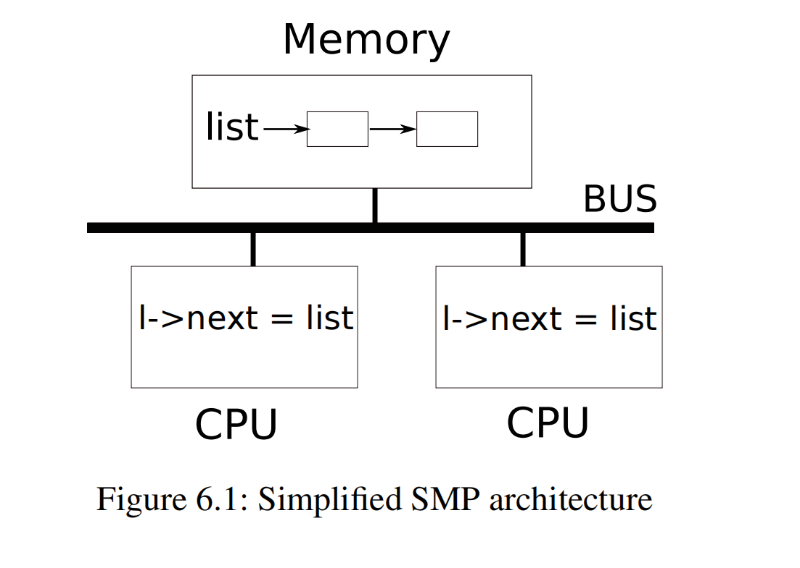
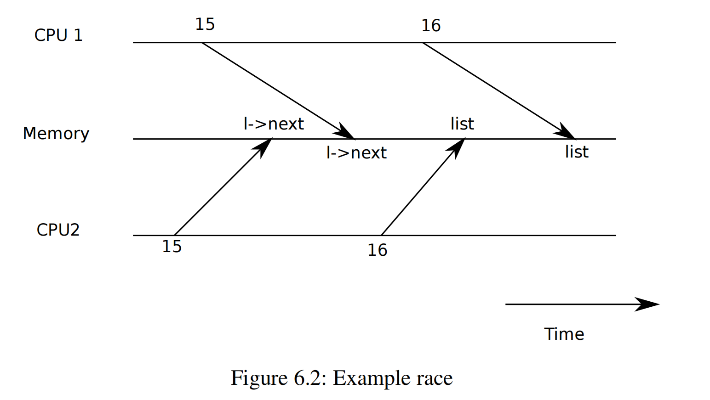
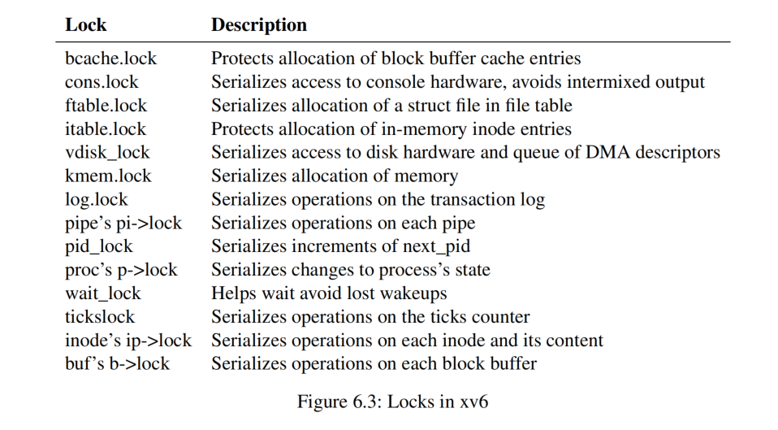

# 第 6 章 锁（Chapter 6 Locking）

> Most kernels, including xv6, interleave the execution of multiple activities. One source of interleaving is multiprocessor hardware: computers with multiple CPUs executing independently, such as xv6’s RISC-V. These multiple CPUs share physical RAM, and xv6 exploits the sharing to maintain data structures that all CPUs read and write. This sharing raises the possibility of one CPU reading a data structure while another CPU is mid-way through updating it, or even multiple CPUs updating the same data simultaneously; without careful design such parallel access is likely to yield incorrect results or a broken data structure. Even on a uniprocessor, the kernel may switch the CPU among a number of threads, causing their execution to be interleaved. Finally, a device interrupt handler that modifies the same data as some interruptible code could damage the data if the interrupt occurs at just the wrong time. The word *concurrency* refers to situations in which multiple instruction streams are interleaved, due to multiprocessor parallelism, thread switching, or interrupts.

大多数内核（包括 xv6）都会交错执行多个活动。交错的原因之一是多处理器系统（即具有多个独立执行的 CPU 的计算机）的存在，运行 xv6 的 RISC-V（模拟器）就是一个多处理器系统。这些 CPU 共享物理内存，xv6 基于这种共享特性维护着供所有 CPU 都可读写的数据结构。这种共享特性增加了一个 CPU 读取数据结构期间另一个 CPU 更新该数据结构的可能性，甚至多个 CPU 同时更新同一份数据；如果没有精心的设计，这种并行访问很可能会产生错误的结果甚至损坏数据结构。即使在单处理器系统上，内核也可能在多个线程之间切换 CPU，导致它们交错执行​​。最后，如果设备中断处理程序与某些可能被中断打断的代码会访问和修改同一份数据，如果不做额外的保护，数据同样会被损坏。*并发（concurrency）* 一词指的正是上面所提到的由于多处理器并行、线程切换或中断导致多个指令流交错执行的情况。

> Kernels are full of concurrently-accessed data. For example, two CPUs could simultaneously call `kalloc`, thereby concurrently popping from the head of the free list. Kernel designers like to allow for lots of concurrency, since it can yield increased performance through parallelism, and increased responsiveness. However, as a result kernel designers must convince themselves of correctness despite such concurrency. There are many ways to arrive at correct code, some easier to reason about than others. Strategies aimed at correctness under concurrency, and abstractions that support them, are called *concurrency control* techniques.

内核中充满了并发访问的数据。例如，两个 CPU 可以同时调用 `kalloc`，导致同时从空闲列表的头部弹出数据。内核设计人员喜欢大量使用并发，因为利用并行性可以提高性能，从而加快响应速度。然而，这么做的代价是，内核设计人员必须确保在并发情况下代码仍然能够正确工作。有很多方法可以实现这个目标，有些方法比较好理解，而有些则比较复杂。旨在确保并发环境下代码正确性的策略，以及支持这些策略的函数设计，被称为 *并发控制（concurrency control）* 技术。

> Xv6 uses a number of concurrency control techniques, depending on the situation; many more are possible. This chapter focuses on a widely used technique: the *lock*. A lock provides mutual exclusion, ensuring that only one CPU at a time can hold the lock. If the programmer associates a lock with each shared data item, and the code always holds the associated lock when using an item, then the item will be used by only one CPU at a time. In this situation, we say that the lock protects the data item. Although locks are an easy-to-understand concurrency control mechanism, the downside of locks is that they can limit performance, because they serialize concurrent operations.

xv6 视具体情况使用了多种并发控制技术；这类技术还有很多。本章重点介绍一种广泛使用的技术：*锁（lock）*。锁提供互斥功能，确保同一时间只有一个 CPU 可以持有锁。如果程序员为每个共享数据项关联一个锁，并且代码在访问该数据项时始终持有关联的锁，那么该数据项同一时间将只能被一个 CPU 使用。在这种情况下，我们称锁保护了该数据项。虽然锁是一种易于理解的并发控制机制，但它的缺点是会影响性能，因为它们会导致一些并发操作退化成串行操作。

> The rest of this chapter explains why xv6 needs locks, how xv6 implements them, and how it uses them.

本章的其余部分解释了为什么 xv6 需要锁、xv6 如何实现锁以及又是如何使用它们的。



## 6.1 竞争（Races）

> As an example of why we need locks, consider two processes with exited children calling `wait` on two different CPUs. `wait` frees the child’s memory. Thus on each CPU, the kernel will call `kfree` to free the children’s memory pages. The kernel allocator maintains a linked list: `kalloc()` (kernel/kalloc.c:69) pops a page of memory from a list of free pages, and `kfree()` (kernel/kalloc.c:47) pushes a page onto the free list. For best performance, we might hope that the `kfree`s of the two parent processes would execute in parallel without either having to wait for the other, but this would not be correct given xv6’s `kfree` implementation.

举个例子来说明为什么我们需要锁，假设存在两个进程，它们的子进程已退出，这两个进程分别在两个不同的 CPU 上调用 `wait`。`wait` 会释放子进程的内存。因此，在两个 CPU 上，内核都会调用 `kfree` 来释放子进程的内存页。内核的内存分配器维护了一个空闲物理页的链表：`kalloc()` (kernel/kalloc.c:69) 从这个链表中弹出一个内存页，`kfree()` (kernel/kalloc.c:47) 将一个内存页插入到这个链表中。为了获得最佳性能，我们当然希望两个父进程的 `kfree` 能够并行执行，而无需等待对方，但考虑到 xv6 的 `kfree` 实现，这显然是行不通的。

> Figure 6.1 illustrates the setting in more detail: the linked list of free pages is in memory that is shared by the two CPUs, which manipulate the list using load and store instructions. (In reality, the processors have caches, but conceptually multiprocessor systems behave as if there were a single, shared memory.) If there were no concurrent requests, you might implement a list `push` operation as follows:

图 6.1 更详细地说明了这种场景：空闲页的链表位于两个 CPU 共享的内存中，这两个 CPU 使用 “加载（load）” 和 “存储（store）” 指令来操作该链表（译者注：在谈及 CPU 时，通常会把对内存的读操作称为 load，对内存的写操作称为 store）。（实际上，处理器都有缓存，但从概念上讲，多处理器系统的行为就像只有一个共享的内存一样。）如果没有并发请求，我们可以按如下方式对链表实现 `push` 操作：

```c
 1 struct element {
 2   int data;
 3   struct element *next;
 4 };
 5
 6 struct element *list = 0;
 7
 8 void
 9 push(int data)
10 {
11   struct element *l;
12
13   l = malloc(sizeof *l);
14   l->data = data;
15   l->next = list;
16   list = l;
17 }
```



> This implementation is correct if executed in isolation. However, the code is not correct if more than one copy executes concurrently. If two CPUs execute `push` at the same time, both might execute line 15 as shown in Fig 6.1, before either executes line 16, which results in an incorrect outcome as illustrated by Figure 6.2. There would then be two list elements with `next` set to the former value of `list`. When the two assignments to `list` happen at line 16, the second one will overwrite the first; the element involved in the first assignment will be lost.

如果一次只有一个实例执行，这么实现是没有问题的。但是，如果多个实例同时运行则会出问题。具体来说就是说如果两个 CPU 同时执行 `push`，则两个 CPU 可能都先执行上面代码所示的第 15 行（译者注：即图 6.1 中 CPU 上列的 `l->next = list`），然后再执行第 16 行，从而导致如图 6.2 所示的错误结果。（CPU1 和 CPU2 分别执行第 15 行后）会有两个（新增）链表节点的 `next` 都指向 `list` 先前所指向的 element 对象。同时当第 16 行对 `list` 进行两次赋值时，第二个赋值将覆盖第一个赋值；也就是说第一个赋值中涉及的 element 对象将会丢失。

> The lost update at line 16 is an example of a *race*. A race is a situation in which a memory location is accessed concurrently, and at least one access is a write. A race is often a sign of a bug, either a lost update (if the accesses are writes) or a read of an incompletely-updated data structure. The outcome of a race depends on the machine code generated by the compiler, the timing of the two CPUs involved, and how their memory operations are ordered by the memory system, which can make race-induced errors difficult to reproduce and debug. For example, adding print statements while debugging `push` might change the timing of the execution enough to make the race disappear.

第 16 行导致赋值的丢失就是一个 *竞争（race）* 的例子。竞争是指同时访问某个内存位置，并且至少有一个访问是写入的情况。竞争通常很容易引入 bug，要么是丢失更新（如果访问是写入操作），要么是读取了未更新完全的数据结构。竞争的结果不仅取决于编译器生成的指令顺序，也涉及两个 CPU 上的运行时序以及内存系统对它们操作内存的排序方式，这会使竞争导致的错误难以复现和调试。例如，在调试 `push` 时添加打印语句可能会改变执行时序，从而导致竞争消失。

> The usual way to avoid races is to use a lock. Locks ensure *mutual exclusion*, so that only one CPU at a time can execute the sensitive lines of `push`; this makes the scenario above impossible. The correctly locked version of the above code adds just a few lines (highlighted in yellow):

避免竞争的常用方法是使用锁。锁确保了 *互斥（mutual exclusion）*，即同时只有一个 CPU 可以执行 `push` 这段敏感代码；从而避免了上述竞争的情况发生。对上述代码正确加锁后的版本仅添加了几行代码（以黄色突出显示, 译者注：即第 7，16 和 19 行）：

```c
 6 struct element *list = 0;
 7 struct lock listlock;
 8
 9 void
10 push(int data)
11 {
12   struct element *l;
13   l = malloc(sizeof *l);
14   l->data = data;
15
16   acquire(&listlock);
17   l->next = list;
18   list = l;
19   release(&listlock);
20 }
```

> The sequence of instructions between `acquire` and `release` is often called a *critical section*. The lock is typically said to be protecting `list`.

`acquire` 和 `release` 之间的指令序列通常被称为 *临界区（critical section）*。我们称锁保护了 `list`。

> When we say that a lock protects data, we really mean that the lock protects some collection of invariants that apply to the data. Invariants are properties of data structures that are maintained across operations. Typically, an operation’s correct behavior depends on the invariants being true when the operation begins. The operation may temporarily violate the invariants but must reestablish them before finishing. For example, in the linked list case, the invariant is that `list` points at the first element in the list and that each element’s `next` field points at the next element. The implementation of `push` violates this invariant temporarily: in line 17, `l` points to the next list element, but `list` does not point at `l` yet (reestablished at line 18). The race we examined above happened because a second CPU executed code that depended on the list invariants while they were (temporarily) violated. Proper use of a lock ensures that only one CPU at a time can operate on the data structure in the critical section, so that no CPU will execute a data structure operation when the data structure’s invariants do not hold.

当我们说某个锁保护了某某数据时，实际上是指该锁保护了这些数据上的一种 “不变量（invariant）”。所谓 invariant 是指数据结构的一种特性，并且该特性需要在一系列操作前后维持不变。通常，操作开始时 invariant 必须成立，这是操作的行为是否正确的前提。操作过程中可能会暂时破坏 invariant，但必须在完成之前重新恢复它。以前述的链表为例，invariant 指是 `list` 应该指向链表的第一个元素，并且每个元素的 `next` 字段指向下一个元素。`push` 函数执行过程中会暂时不满足这个 invariant：譬如在第 17 行，`l` 指向下一个元素，但此时 `list` 尚未指向 `l`（在第 18 行会重新建立）。我们上面介绍的竞争情况之所以发生是因为第二个 CPU 在链表的 invariant（暂时）被破坏时执行了依赖于这些 invariant 的代码。正确使用锁确保了每次只有一个 CPU 可以对临界区中的数据结构进行操作，这样当数据结构的 invariant 不成立时，任何其他 CPU 都不会访问该数据结构。

> You can think of a lock as *serializing* concurrent critical sections so that they run one at a time, and thus preserve invariants (assuming the critical sections are correct in isolation). You can also think of critical sections guarded by the same lock as being atomic with respect to each other, so that each sees only the complete set of changes from earlier critical sections, and never sees partially-completed updates.

你可以认为对可能并发的临界区采用同一把锁进行保护相当于 *串行化（serializing）* 了它们的运行，即同时只能有一个临界区可以运行，这保证了 invariant（前提是对于单个临界区来说，其执行逻辑本身必须保证正确）。同样，我们也可以认为这些被同一把锁保护的临界区之间保持了原子性，也就是说当我们进入一个临界区时可以确定已经执行过的临界区的操作都必然是完整的，不会出现只看到部分更新的情况。

> Though useful for correctness, locks inherently limit performance. For example, if two processes call `kfree` concurrently, the locks will serialize the two critical sections, so that there is no benefit from running them on different CPUs. We say that multiple processes *conflict* if they want the same lock at the same time, or that the lock experiences *contention*. A major challenge in kernel design is avoidance of lock contention in pursuit of parallelism. Xv6 does little of that, but sophisticated kernels organize data structures and algorithms specifically to avoid lock contention. In the list example, a kernel may maintain a separate free list per CPU and only touch another CPU’s free list if the current CPU’s list is empty and it must steal memory from another CPU. Other use cases may require more complicated designs.

虽然锁有助于确保正确性，但它天然地会降低性能。例如，如果两个进程并发调用 `kfree`，锁会将两个临界区串行化，因此即使这个 `kfree` 运行在不同的 CPU 上也不会对性能带来任何提升。如果多个进程同时需要获取同一把锁，我们称进程之间发生了 *冲突（conflict）*，或者说对于锁发生了 *争用（contention）*。内核设计的一个主要挑战是如何在追求并发的同时避免锁争用。xv6 在这方面做得很少，但成熟的内核会专门组织数据结构和算法来避免锁争用。在链表的示例中，(成熟的) 内核可能会为每个 CPU 维护一个单独的空闲链表，并且只有当当前的 CPU 的链表为空而必须从另一个 CPU “窃取（steal）” 内存时，才会访问另一个 CPU 的空闲链表。对于其他用例可能需要更复杂的设计。

> The placement of locks is also important for performance. For example, it would be correct to move `acquire` earlier in `push`, before line 13. But this would likely reduce performance because then the calls to `malloc` would be serialized. The section “Using locks” below provides some guidelines for where to insert `acquire` and `release` invocations.

锁的放置位置对性能影响也很大。例如，将 `acquire` 移到 `push` 的更靠前位置（第 13 行之前）逻辑上也没有问题。但这可能会降低性能，因为这样对 `malloc` 的调用就会被串行化。下文的 “使用锁” 小节部分提供了一些关于在何处插入 `acquire` 和 `release` 调用的指导。

## 6.2 代码讲解：锁（Code: Locks）

> Xv6 has two types of locks: spinlocks and sleep-locks. We’ll start with spinlocks. Xv6 represents a spinlock as a `struct spinlock` (kernel/spinlock.h:2). The important field in the structure is `locked`, a word that is zero when the lock is available and non-zero when it is held. Logically, xv6 should acquire a lock by executing code like

xv6 中实现的锁有两种类型，它们是：“自旋锁（spinlock）” 和 “睡眠锁（sleep-lock）”。我们先看一下自旋锁。xv6 用结构体类型 `struct spinlock`（kernel/spinlock.h:2）来表示自旋锁。该结构体中有个重要的字段叫 `locked`，当锁未被持有时，该项值等于零；当锁被持有时，该项值不为零。从逻辑上讲，xv6 中可以通过执行如下代码来获取锁：

```c
21 void
22 acquire(struct spinlock *lk) // does not work!
23 {
24   for(;;) {
25     if(lk->locked == 0) {
26       lk->locked = 1;
27       break;
28     }
29   }
30 }
```

> Unfortunately, this implementation does not guarantee mutual exclusion on a multiprocessor. It could happen that two CPUs simultaneously reach line 25, see that `lk->locked` is zero, and then both grab the lock by executing line 26. At this point, two different CPUs hold the lock, which violates the mutual exclusion property. What we need is a way to make lines 25 and 26 execute as an *atomic* (i.e., indivisible) step.

可惜这个实现无法保证在多处理器系统上实现互斥。考虑如下可能会发生的场景：两个 CPU 同时执行到第 25 行，发现 `lk->locked` 为零，然后都通过执行第 26 行来获取锁。此时，两个不同的 CPU 都持有了这个锁，这违反了互斥性。我们需要一种方法，使第 25 行和第 26 行以 *原子（atomic）* （也就是说，不可分割的）的方式执行。

> Because locks are widely used, multi-core processors usually provide instructions that implement an atomic version of lines 25 and 26. On the RISC-V this instruction is `amoswap r, a`. `amoswap` reads the value at the memory address `a`, writes the contents of register `r` to that address, and puts the value it read into `r`. That is, it swaps the contents of the register and the memory address. It performs this sequence atomically, using special hardware to prevent any other CPU from using the memory address between the read and the write.

由于锁被广泛使用，多核处理器通常会提供以原子方式实现第 25 行和第 26 行的指令。在 RISC-V 架构上，该指令为 `amoswap r，a`。`amoswap` 读取内存地址 `a` 处的值，将寄存器 `​​r` 的内容写入地址 `a`，同时将读取的值存入 `r`。也就是说，它将寄存器（`r`）中的值和内存地址 `a` 处的值进行了交换。它以原子方式（译者注：单条机器指令）执行了这个交换的动作，从硬件层面阻止任何其他 CPU 在读取和写入操作步骤之间能够访问该内存地址。

> Xv6’s `acquire` (kernel/spinlock.c:22) uses the portable C library call `__sync_lock_test_and_set`, which boils down to the `amoswap` instruction; the return value is the old (swapped) contents of `lk->locked`. The `acquire` function wraps the swap in a loop, retrying (spinning) until it has acquired the lock. Each iteration swaps one into `lk->locked` and checks the previous value; if the previous value is zero, then we’ve acquired the lock, and the swap will have set `lk->locked` to one. If the previous value is one, then some other CPU holds the lock, and the fact that we atomically swapped one into `lk->locked` didn’t change its value.

xv6 的 `acquire` (kernel/spinlock.c:22) 函数中调用了更具备移植性的 C 库函数 `__sync_lock_test_and_set`，该函数调用最终编译为 `amoswap` 指令；其返回值是原本存放在 `lk->locked` 中的交换前的值。`acquire` 函数将交换过程包装在一个循环中，不断重试（自旋）直到获取锁。每次迭代都会将 1（这个值存放在寄存器中）和 `lk->locked` 中的值进行交换，并检查 `lk->locked` 中交换前的值；如果先前值为 0，则表示成功地获取了锁，同时交换操作也会将 `lk->locked` 的值变成了 1（译者注：参考上文的代码，相当于将 25 行检查和 26 行设置以原子方式完成了）。如果 `lk->locked` 交换前的值本身就为 1，则表示其他 CPU 已经持有该锁，而我们将 `lk->locked` 中的值原子性地交换为 1 也不会改变其原先的值。

> Once the lock is acquired, `acquire` records, for debugging, the CPU that acquired the lock. The `lk->cpu` field is protected by the lock and must only be changed while holding the lock.

一旦获取到锁，`acquire` 会记录获取锁的 CPU，这主要是为了调试。`lk->cpu` 字段受锁保护，只能在持有锁的前提下才能对其进行更改。

> The function `release` (kernel/spinlock.c:47) is the opposite of `acquire`: it clears the `lk->cpu` field and then releases the lock. Conceptually, the release just requires assigning zero to `lk->locked`. The C standard allows compilers to implement an assignment with multiple store instructions, so a C assignment might be non-atomic with respect to concurrent code. Instead, `release` uses the C library function `__sync_lock_release` that performs an atomic assignment. This function also boils down to a RISC-V `amoswap` instruction.

函数 `release` (kernel/spinlock.c:47) 的行为与 `acquire` 相反：它首先清除 `lk->cpu` 的内容，然后释放锁。从概念上讲，释放操作只需要将 `lk->locked` 赋值为零即可。（虽然从 C 语言上看，赋值为零的操作只是一条语句）但编译器仍然可能将其编译为多条存储指令，因此 C 语言形式的赋值操作对于并发来说仍然可能是非原子的。所以，`release` 没有使用简单的 C 赋值语句，而是调用 C 库函数 `__sync_lock_release` 来执行原子化的赋值。该函数最终也编译为 RISC-V 的 `amoswap` 指令。

## 6.3 代码讲解：使用锁（Code: Using locks）

> Xv6 uses locks in many places to avoid races. As described above, `kalloc` (kernel/kalloc.c:69) and `kfree` (kernel/kalloc.c:47) form a good example. Try Exercises 1 and 2 to see what happens if those functions omit the locks. You’ll likely find that it’s difficult to trigger incorrect behavior, suggesting that it’s hard to reliably test whether code is free from locking errors and races. Xv6 may well have as-yet-undiscovered races.

xv6 在很多地方使用锁来避免竞争。如上所述，`kalloc` (kernel/kalloc.c:69) 和 `kfree` (kernel/kalloc.c:47) 就是一个很好的例子。尝试 “练习 1” 和 “练习 2”，看看如果这些函数省略了锁会发生什么。你可能会发现很难触发错误的行为，因为想要可靠地测试代码并确保没有锁相关的错误和竞争问题可不是一件容易的事情。xv6 同样也很可能存在一些尚未发现的竞争问题。

> A hard part about using locks is deciding how many locks to use and which data and invariants each lock should protect. There are a few basic principles. First, any time a variable can be written by one CPU at the same time that another CPU can read or write it, a lock should be used to keep the two operations from overlapping. Second, remember that locks protect invariants: if an invariant involves multiple memory locations, typically all of them need to be protected by a single lock to ensure the invariant is maintained.

使用锁的难点在于决定使用多少个锁，以及每个锁应该保护哪些数据以及 invariant（译者注：回顾一下 6.1 节中有关 invariant 的定义）。有几个基本原则。首先，当一个变量会被一个 CPU 写入，而同时又有另一个 CPU 会读取或写入该变量时，则应该使用锁来防止这两个操作互相影响。其次，请记住锁可以保护 invariant：如果一个 invariant 涉及多处内存，通常情况下所有这些内存都需要用同一个锁来保护，以确保维持其 invariant。

> The rules above say when locks are necessary but say nothing about when locks are unnecessary, and it is important for efficiency not to lock too much, because locks reduce parallelism. If parallelism isn’t important, then one could arrange to have only a single thread and not worry about locks. A simple kernel can do this on a multiprocessor by having a single lock that must be acquired on entering the kernel and released on exiting the kernel (though blocking system calls such as pipe reads or `wait` would pose a problem). Many uniprocessor operating systems have been converted to run on multiprocessors using this approach, sometimes called a “big kernel lock,” but the approach sacrifices parallelism: only one CPU can execute in the kernel at a time. If the kernel does any heavy computation, it would be more efficient to use a larger set of more fine-grained locks, so that the kernel could execute on multiple CPUs simultaneously.

上述规则说明了何时需要锁，但并未说明何时不需要锁。为了提高效率，同样需要注意不要使用过多的锁，因为锁会降低并发效率。如果不考虑并发的话，甚至可以安排只使用一个线程，这样就不必担心锁的问题了。为了在多处理器上避免并发，一个内核从简化设计出发，也可以只定义一把锁，但凡进入内核时就先持有这把锁，在退出内核时释放它（尽管这么做会造成一些问题，譬如这阻塞了管道读取或者 `wait` 等系统调用）。许多原先针对单处理器设计的操作系统在移植到多处理器系统上时会采用这种方法（有时称为 “大内核锁（big kernel lock）”），但这种方法牺牲了并发性：即内核一次只能在一个 CPU 上执行。如果内核会执行繁重的计算，则使用一组数量更多、颗粒度更细的锁会更高效，这样内核代码就可以同时在多个 CPU 上执行了。

> As an example of coarse-grained locking, xv6’s `kalloc.c` allocator has a single free list protected by a single lock. If multiple processes on different CPUs try to allocate pages at the same time, each will have to wait for its turn by spinning in `acquire`. Spinning wastes CPU time, since it’s not useful work. If contention for the lock wasted a significant fraction of CPU time, perhaps performance could be improved by changing the allocator design to have multiple free lists, each with its own lock, to allow truly parallel allocation.

举个粗粒度锁的例子，xv6 的内核内存分配器（定义在 `kalloc.c` 中）维护了一个空闲页的链表，这个链表被一把锁保护。如果不同 CPU 上的多个进程同时尝试分配内存页，则每个进程都必须通过调用 `acquire` （该函数会自旋）来等待轮到自己。自旋过程中处理器无法做其他的事情，这明显是对处理器的浪费。考虑到锁的争用浪费了大量 CPU 时间，从提高性能出发，或许可以修改分配器的设计，使其拥有多个空闲链表，每个链表都拥有自己的锁，从而允许实现真正的并行分配。

> As an example of fine-grained locking, xv6 has a separate lock for each file, so that processes that manipulate different files can often proceed without waiting for each other’s locks. The file locking scheme could be made even more fine-grained if one wanted to allow processes to simultaneously write different areas of the same file. Ultimately lock granularity decisions need to be driven by performance measurements as well as complexity considerations.

再看一个细粒度锁的例子，xv6 为每个文件设置了单独的锁，因此操作不同文件的进程通常无需等待彼此的锁即可继续操作。如果希望允许多个进程同时写入同一文件的不同区域，则可以将文件的锁方案进一步细分。总而言之，锁的粒度究竟如何决定，这取决于性能指标和实现上的复杂性这两者之间的权衡。

> As subsequent chapters explain each part of xv6, they will mention examples of xv6’s use of locks to deal with concurrency. As a preview, Figure 6.3 lists all of the locks in xv6.

后续章节在讲解 xv6 的各个部分时，会涉及到 xv6 使用锁处理并发的示例。作为预览，图 6.3 列出了 xv6 中定义的所有锁。



## 6.4 死锁和加锁的顺序（Deadlock and lock ordering）

> If a code path through the kernel must hold several locks at the same time, it is important that all code paths acquire those locks in the same order. If they don’t, there is a risk of *deadlock*. Let’s say two code paths in xv6 need locks A and B, but code path 1 acquires locks in the order A then B, and the other path acquires them in the order B then A. Suppose thread T1 executes code path 1 and acquires lock A, and thread T2 executes code path 2 and acquires lock B. Next T1 will try to acquire lock B, and T2 will try to acquire lock A. Both acquires will block indefinitely, because in both cases the other thread holds the needed lock, and won’t release it until its acquire returns. To avoid such deadlocks, all code paths must acquire locks in the same order. The need for a global lock acquisition order means that locks are effectively part of each function’s specification: callers must invoke functions in a way that causes locks to be acquired in the agreed-on order.

如果内核中的某一条代码路径会同时持有多个锁，则所有会尝试获取这些锁的代码路径都必须以相同的顺序获取这些锁。否则，就会有 *死锁（deadlock）* 的风险。假设 xv6 中有两条代码路径都需要持有锁 A 和 B，代码路径 1 按照先 A 后 B 的顺序获取锁，而另一条路径则按照先 B 后 A 的顺序获取锁。假设线程 T1 执行代码路径 1 并获取锁 A，线程 T2 执行代码路径 2 并获取锁 B。接下来，T1 将尝试获取锁 B，而 T2 将尝试获取锁 A。这两个尝试获取锁的操作都会无限期阻塞，因为在这种情况下，每个线程都持有了另一个线程希望获取的锁，并且在它申请获取第二把锁的操作返回之前是不会释放它已经获取的锁的。为了避免这种死锁情况，所有代码路径都必须以相同的顺序获取锁。这种对于全局锁的获取顺序的要求实际上成为了每个函数编写需要遵循的规范的一部分：即我们在调用函数时必须要保证获取锁的顺序一致。

> Xv6 has many lock-order chains of length two involving per-process locks (the lock in each `struct proc`) due to the way that `sleep` works (see Chapter 7). For example, `consoleintr` (kernel/console.c:136) is the interrupt routine which handles typed characters. When a newline arrives, any process that is waiting for console input should be woken up. To do this, `consoleintr` holds `cons.lock` while calling `wakeup`, which acquires the waiting process’s lock in order to wake it up. In consequence, the global deadlock-avoiding lock order includes the rule that `cons.lock` must be acquired before any process lock. The file-system code contains xv6’s longest lock chains. For example, creating a file requires simultaneously holding a lock on the directory, a lock on the new file’s inode, a lock on a disk block buffer, the disk driver’s `vdisk_lock`, and the calling process’s `p->lock`. To avoid deadlock, file-system code always acquires locks in the order mentioned in the previous sentence.

由于 `sleep` 的工作方式（参见第 7 章），xv6 在不少代码执行路径中依次持有锁的个数大于 2（译者注：下文将这个依次持有多个锁的代码执行路径形象比喻为 “锁链（lock chain）”），这些锁涉及每个进程的锁（每个 `struct proc` 中的 `lock` 成员）。例如，`consoleintr` (kernel/console.c:136) 是处理输入字符的中断例程。当我们按下回车键（对应输入 “换行（newline）” 符）时，所有等待控制台输入的进程都会被唤醒。为此，`consoleintr` 会先持有锁 `cons.lock`，然后调用 `wakeup`，后者会获取等待进程的锁以试图将其唤醒。这导致我们为了避免发生全局死锁，需要在有关加锁顺序规则中新增一个要求：即必须在获取任何进程的锁之前先获取 `cons.lock`。xv6 中最长的锁链出现在文件系统的代码里。例如，创建一个文件需要同时持有目录上的锁、新文件的 inode 上的锁、磁盘块缓冲区的锁、磁盘驱动程序的锁 `vdisk_lock` 以及调用进程的 `p->lock` 锁。为了避免死锁，文件系统中的代码会始终按照上一句中提到的顺序获取锁。

> Honoring a global deadlock-avoiding order can be surprisingly difficult. Sometimes the lock order conflicts with logical program structure, e.g., perhaps code module M1 calls module M2, but the lock order requires that a lock in M2 be acquired before a lock in M1. Sometimes the identities of locks aren’t known in advance, perhaps because one lock must be held in order to discover the identity of the lock to be acquired next. This kind of situation arises in the file system as it looks up successive components in a path name, and in the code for `wait` and `exit` as they search the table of processes looking for child processes. Finally, the danger of deadlock is often a constraint on how fine-grained one can make a locking scheme, since more locks often means more opportunity for deadlock. The need to avoid deadlock is often a major factor in kernel implementation.

为了避免全局死锁而严格遵守加锁顺序可能出奇地困难。有时，锁定顺序与程序的逻辑结构会冲突，例如，代码模块 M1 可能调用模块 M2，但锁定顺序要求先获取 M2 中的锁，然后再获取 M1 中的锁。有时，无法提前知道要获取哪些锁，这或许是因为必须先持有前一个锁才能知道下一个要获取的锁是谁。这种情况会出现在文件系统中，因为它会查找路径名中（以 “/” 分隔的）组成部分；也会出现在 `wait` 和 `exit` 函数中，因为它们会在进程表中搜索子进程。总之，由于死锁风险的存在，通常我们要考虑尽量限制加锁方案中涉及的锁的个数，因为锁越多，发生死锁的可能性也就越大。避免死锁通常是一个内核要实现的主要目标之一。

## 6.5 可重入锁（Re-entrant locks）

> It might appear that some deadlocks and lock-ordering challenges could be avoided by using *reentrant locks*, which are also called *recursive locks*. The idea is that if the lock is held by a process and if that process attempts to acquire the lock again, then the kernel could just allow this (since the process already has the lock), instead of calling panic, as the xv6 kernel does.

也许看起来，使用 *可重入锁(reentrant locks)*（也称为 *递归锁（recursive locks）*）可以避免一些死锁和加锁顺序的问题。其想法是，如果某个进程已经持有一把锁，然后该进程尝试再次获取同一把锁，那么内核应该允许该行为（因为该进程已经拥有该锁），可现实是 xv6 内核没有支持这种行为，而是当此类事件发生时直接 panic。

> It turns out, however, that re-entrant locks make it harder to reason about concurrency: reentrant locks break the intuition that locks cause critical sections to be atomic with respect to other critical sections. Consider the following functions `f` and `g`, and a hypothetical function `h`:

事实证明，在锁问题上允许可重入只会使得并发实现变得更加困难：可重入的锁会破坏引入锁机制后我们对临界区之间应该保持原子性这个直觉（译者注：有关临界区原子性的概念，具体看下文的例子解释）。考虑下面这个例子中的函数 `f` 和 `g`，以及另一个函数 `h`（ `h` 的具体实现和这里讨论的主题无关所以不详细列出）：

```c
struct spinlock lock;
int data = 0; // protected by lock

f() {
  acquire(&lock);
  if(data == 0){
    call_once();
    h();
    data = 1;
  }
  release(&lock);
}

g() {
  aquire(&lock);
  if(data == 0){
    call_once();
    data = 1;
  }
  release(&lock);
}

h() {
...
}
```

> Looking at this code fragment, the intuition is that `call_once` will be called only once: either by `f`, or by `g`, but not by both. 

从此代码片段来看，给人的直觉是 `call_once` 只会被调用一次：要么由 `f` 调用，要么由 `g` 调用，但不会被两者同时调用。

> But if re-entrant locks are allowed, and `h` happens to call `g`, `call_once` will be called *twice*.

但是如果允许锁可重入，并且 `h` 恰好调用了 `g`，则 `call_once` 将被调用 *两次*。

> If re-entrant locks aren’t allowed, then `h` calling `g` results in a deadlock, which is not great either. But, assuming it would be a serious error to call `call_once`, a deadlock is preferable. The kernel developer will observe the deadlock (the kernel panics) and can fix the code to avoid it, while calling `call_once` twice may silently result in an error that is difficult to track down.

如果不允许锁可重入，那么 `h` 调用 `g` 会导致死锁，这同样不是什么好事。但是，假设调用 `call_once`（两次）会是一个严重的错误，那么我们宁愿选择死锁。内核开发者会观察到死锁（内核直接 panic），从而可以（意识到问题）并修复代码来避免它，而两次调用 `call_once` 可能会悄无声息地导致难以追踪的错误发生。

> For this reason, xv6 uses the simpler to understand non-re-entrant locks. As long as programmers keep the locking rules in mind, however, either approach can be made to work. If xv6 were to use re-entrant locks, one would have to modify `acquire` to notice that the lock is currently held by the calling thread. One would also have to add a count of nested acquires to struct spinlock, in similar style to `push_off`, which is discussed next.

因此，出于以上考虑，xv6 选择了更简单容易理解的不可重入锁。不过，只要程序员牢记锁的使用规则，是否支持可重入都是可以的。如果 xv6 要使用可重入的锁，则必须修改 `acquire` 函数，以便能够发现当前调用线程已持有该锁。此外，还必须在 `struct spinlock` 中添加字段记录嵌套上锁的层数，其方式类似于 `push_off`（该函数将在下文中讨论）。

## 6.6 锁和中断处理（Locks and interrupt handlers）

> Some xv6 spinlocks protect data that is used by both threads and interrupt handlers. For example, the `clockintr` timer interrupt handler might increment `ticks` (kernel/trap.c:164) at about the same time that a kernel thread reads `ticks` in `sys_sleep` (kernel/sysproc.c:61). The lock `tickslock` serializes the two accesses.

xv6 会使用一些自旋锁来保护线程和中断处理程序之间共享的数据。例如，`clockintr` 这个定时器中断处理函数会增加 `ticks` (kernel/trap.c:163) 的值，而同时内核线程可能在 `sys_sleep` (kernel/sysproc.c:64) 中读取 `ticks` 的值。xv6 用锁 `tickslock` 串行化两者对 `ticks` 的访问。

> The interaction of spinlocks and interrupts raises a potential danger. Suppose `sys_sleep` holds `tickslock`, and its CPU is interrupted by a timer interrupt. `clockintr` would try to acquire `tickslock`, see it was held, and wait for it to be released. In this situation, `tickslock` will never be released: only `sys_sleep` can release it, but `sys_sleep` will not continue running until `clockintr` returns. So the CPU will deadlock, and any code that needs either lock will also freeze.

自旋锁和中断的共同作用会引发潜在的风险。假设（一个线程执行）`sys_sleep` 持有了 `tickslock`，然后一个定时器中断打断了该函数所在线程在当前 CPU 上的执行。`clockintr` 会尝试获取 `tickslock`，因为发现它已经被他人持有，于是中断函数开始进入自旋等待锁被释放。在这种情况下，`tickslock` 永远也得不到释放：因为只有 `sys_sleep` 会释放它，但是执行 `sys_sleep` 的线程却只有等中断处理函数 `clockintr` 退出后才能继续。于是 CPU 进入死锁状态，并且任何需要获取锁的代码也会因为拿不到锁而被阻塞。

> To avoid this situation, if a spinlock is used by an interrupt handler, a CPU must never hold that lock with interrupts enabled. Xv6 is more conservative: when a CPU acquires any lock, xv6 always disables interrupts on that CPU. Interrupts may still occur on other CPUs, so an interrupt’s `acquire` can wait for a thread to release a spinlock; just not on the same CPU.

为了避免这种情况，如果中断处理函数会试图获取一个自旋锁的话，那么其他代码（译者注：特指线程代码）必须保证在持有锁的同时关闭中断（译者注：正如上一段所描述的，因为中断的优先级更高，当锁已经被线程持有后，一旦中断抢占了处理器并试图持有同一把锁时就会被阻塞，这会导致中断处理无法退出，线程也就得不到执行，更没有机会释放锁，最终导致两边进入相互等待而死锁的境地）。xv6 的实现更保守：只要一个 CPU 持有一把锁，xv6 总是同时禁用该 CPU 上的中断。中断仍然可能发生在其他 CPU 上，但即使这个（发生在其他 CPU 上的）中断调用了 `acquire` （尝试获取同一把锁）也没关系，因为这不会阻塞太久，已经持有锁的线程一旦释放这个锁则中断就能立即抢到锁并继续，只要它们两者不在同一个 CPU 上，就不会造成死锁。

> Xv6 re-enables interrupts when a CPU holds no spinlocks; it must do a little book-keeping to cope with nested critical sections. `acquire` calls `push_off` (kernel/spinlock.c:89) and `release` calls `pop_off` (kernel/spinlock.c:100) to track the nesting level of locks on the current CPU. When that count reaches zero, `pop_off` restores the interrupt enable state that existed at the start of the outermost critical section. The `intr_off` and `intr_on` functions execute RISC-V instructions to disable and enable interrupts, respectively.

当 CPU 不再持有自旋锁时，xv6 会重新启用中断；考虑到可能存在嵌套的临界区，所以还需要一些额外的工作来处理这种情况。这包括在 `acquire` 中调用 `push_off` (kernel/spinlock.c:89)，以及在 `release` 中调用 `pop_off` (kernel/spinlock.c:100)，其目的是跟踪当前 CPU 上持有锁的嵌套层级。当该计数达到零时，`pop_off` 会恢复最外层临界区开始时的中断启用状态。禁用和启用中断在 RISC-V 上分别通过调用 `intr_off` 和 `intr_on` 函数来实现。

> It is important that `acquire` call `push_off` strictly before setting `lk->locked` (kernel/spinlock.c:28). If the two were reversed, there would be a brief window when the lock was held with interrupts enabled, and an unfortunately timed interrupt would deadlock the system. Similarly, it is important that `release` call `pop_off` only after releasing the lock (kernel/spinlock.c:66).

重要的是，`acquire` 必须在设置 `lk->locked` (kernel/spinlock.c:28) 之前调用 `push_off`。如果两者颠倒，会出现一个短暂的窗口，在此期间既持有锁，而同时中断又没有关闭，如果此时很不幸来了一个定时器中断，则可能会导致系统死锁。同样重要的是，`release` 必须在释放锁 (kernel/spinlock.c:66) 之后再调用 `pop_off`。

## 6.7 指令和内存排序（Instruction and memory ordering）

> It is natural to think of programs executing in the order in which source code statements appear. That’s a reasonable mental model for single-threaded code, but is incorrect when multiple threads interact through shared memory [2, 4]. One reason is that compilers emit load and store instructions in orders different from those implied by the source code, and may entirely omit them (for example by caching data in registers). Another reason is that the CPU may execute instructions out of order to increase performance. For example, a CPU may notice that in a serial sequence of instructions A and B are not dependent on each other. The CPU may start instruction B first, either because its inputs are ready before A’s inputs, or in order to overlap execution of A and B.

我们很自然地认为程序执行的顺序与源代码语句出现的顺序一致。对于单线程程序来说，这种想法是合理的，但当多个线程通过共享内存交互时，这种想法就不成立了 [2, 4]。原因之一是，经过编译器处理后生成的加载指令和存储指令的顺序可能与源代码表达的顺序不同，甚至这些访存指令可能完全被优化掉（例如，通过将数据缓存在寄存器中）。另一个原因是，CPU 可能会为了提高性能而乱序执行指令。例如，CPU 可能会注意到，在一系列指令中，A 和 B 彼此并不依赖。CPU 可能会首先执行指令 B，这是因为可能 B 的输入在 A 的输入完成之前已经就绪，或者仅仅是为了 “叠加执行（overlap execution）” A 和 B。

> As an example of what could go wrong, in this code for `push`, it would be a disaster if the compiler or CPU moved the store corresponding to line 4 to a point after the `release` on line 6:

举一个可能出错的例子，在 `push` 的这个代码中，如果编译器或 CPU 将第 4 行对应的存储指令移到第 6 行 `release` 之后的某个位置，那将会引起一场灾难：

```c
1 l = malloc(sizeof *l);
2 l->data = data;
3 acquire(&listlock);
4 l->next = list;
5 list = l;
6 release(&listlock);
```

> If such a re-ordering occurred, there would be a window during which another CPU could acquire the lock and observe the updated list, but see an uninitialized `list->next`.

如果发生这样的 “指令重排（re-ordering）”，就会出现一个空窗期，在此期间另一个 CPU 可以获取锁并观察到更新后的列表，但会看到 `list->next` 仍未被赋值。

> The good news is that compilers and CPUs help concurrent programmers by following a set of rules called the memory model, and by providing some primitives to help programmers control re-ordering.

好消息是，编译器和 CPU 通过遵循一组称为 “内存模型（memory model）” 的规则并提供一些原语来帮助编写并发程序的程序员们控制指令重排。

> To tell the hardware and compiler not to re-order, xv6 uses `__sync_synchronize()` in both `acquire` (kernel/spinlock.c:22) and `release` (kernel/spinlock.c:47). `__sync_synchronize()` is a memory barrier: it tells the compiler and CPU to not reorder loads or stores across the barrier. The barriers in xv6’s `acquire` and `release` force order in almost all cases where it matters, since xv6 uses locks around accesses to shared data. Chapter 9 discusses a few exceptions.

为了告诉硬件和编译器不要对指令进行重新排序，xv6 在 `acquire` (kernel/spinlock.c:22) 和 `release` (kernel/spinlock.c:47) 中都使用了 `__sync_synchronize()` 这个函数。`__sync_synchronize()` 是一个 “内存屏障（memory barrier）” 函数：它告诉编译器和 CPU 不要将屏障前的加载或存储操作移到屏障后面去执行。xv6 在访问共享数据时会使用锁，所以 xv6 的 `acquire` 和 `release` 中的屏障几乎在其涉及的所有情况下都会强制程序按代码顺序执行。第 9 章讨论了一些例外情况。

## 6.8 睡眠锁（Sleep locks）

> Sometimes xv6 needs to hold a lock for a long time. For example, the file system (Chapter 8) keeps a file locked while reading and writing its content on the disk, and these disk operations can take tens of milliseconds. Holding a spinlock that long would lead to waste if another process wanted to acquire it, since the acquiring process would waste CPU for a long time while spinning. Another drawback of spinlocks is that a process cannot yield the CPU while retaining a spinlock; we’d like to do this so that other processes can use the CPU while the process with the lock waits for the disk. Yielding while holding a spinlock is illegal because it might lead to deadlock if a second thread then tried to acquire the spinlock; since `acquire` doesn’t yield the CPU, the second thread’s spinning might prevent the first thread from running and releasing the lock. Yielding while holding a lock would also violate the requirement that interrupts must be off while a spinlock is held. Thus we’d like a type of lock that yields the CPU while waiting to acquire, and allows yields (and interrupts) while the lock is held.

有时 xv6 需要长时间持有锁。例如，文件系统（第 8 章）在磁盘上读写文件内容时会保持文件锁定，而这些磁盘操作可能需要数十毫秒。如果采用自旋锁，则当其他进程想要获取锁（而不可得）时，会进入长时间自旋，这是一种十分浪费处理器的行为。自旋锁的另一个缺点是，进程在持有自旋锁时无法让出 CPU；而我们希望的是当一个进程持有了锁并等待磁盘时，其他进程有机会使用 CPU。一个线程在持有自旋锁后主动让出 CPU 是危险的，因为此时如果有第二个线程也尝试获取这把锁，可能会导致死锁；由于 `acquire` 不会让出 CPU，第二个线程进入自旋后，让出 CPU 的第一个线程有可能再也无法恢复执行并释放锁。在持有锁时让出 CPU 和我们在持有自旋锁期间必须关闭中断的要求也有冲突（译者注：在单处理器上一旦关闭中断相当于停止了调度，让出 CPU 的线程就此永远进入睡眠）。因此，我们需要一种新的锁，这种锁支持在尝试等待锁时能让出 CPU，同时在持有锁时也允许主动让出 CPU（包括不会关闭中断）。

> Xv6 provides such locks in the form of *sleep-locks*. `acquiresleep` (kernel/sleeplock.c:22) yields the CPU while waiting, using techniques that will be explained in Chapter 7. At a high level, a sleep-lock has a `locked` field that is protected by a spinlock, and `acquiresleep`’s call to `sleep` atomically yields the CPU and releases the spinlock. The result is that other threads can execute while `acquiresleep` waits.

xv6 通过提供 *睡眠锁（sleep-lock）* 满足了以上要求。`acquiresleep` (kernel/sleeplock.c:22) 在等待锁时会让出 CPU，其使用的技术将在第 7 章中讲解。简单来说，睡眠锁有一个 `locked` 成员，该成员受一把自旋锁保护，`acquiresleep` 中会（先尝试获取这把自旋锁，然后）调用 `sleep`，在 `sleep` 中会原子性地让出 CPU 以及释放这把自旋锁。这样，在 `acquiresleep` 等待锁期间，其他线程就有机会可以执行。

> Because sleep-locks leave interrupts enabled, they cannot be used in interrupt handlers. Because `acquiresleep` may yield the CPU, sleep-locks cannot be used inside spinlock critical sections (though spinlocks can be used inside sleep-lock critical sections).

由于睡眠锁不会关闭中断，因此它们不能在中断处理程序中使用。同时由于 `acquiresleep` 可能会让出 CPU，因此睡眠锁也不能在自旋锁保护的临界区内使用（但反过来自旋锁可以在被睡眠锁保护的临界区内使用）。

> Spin-locks are best suited to short critical sections, since waiting for them wastes CPU time; sleep-locks work well for lengthy operations.

自旋锁最适合保护执行时间比较短的临界区，因为自旋等待实在太浪费 CPU 时间；睡眠锁适用于保护执行时间比较长的临界区。

## 6.9 现实世界（Real world）

> Programming with locks remains challenging despite years of research into concurrency primitives and parallelism. It is often best to conceal locks within higher-level constructs like synchronized queues, although xv6 does not do this. If you program with locks, it is wise to use a tool that attempts to identify races, because it is easy to miss an invariant that requires a lock.

尽管业界多年来对并发原语和并行处理进行了深入研究，但使用锁进行编程对程序员来说仍然充满挑战。通常情况下，最好将锁封装在更高级的结构中（譬如同步队列等），然而 xv6 并没有这样做。编程中使用锁时，最好使用一个能够识别竞争的工具，因为很容易忘记对 invariant 上锁。

> Most operating systems support POSIX threads (Pthreads), which allow a user process to have several threads running concurrently on different CPUs. Pthreads has support for user-level locks, barriers, etc. Pthreads also allows a programmer to optionally specify that a lock should be reentrant. 

大多数操作系统都支持 POSIX 线程（Pthreads），它允许用户进程在不同的 CPU 上并发运行多个线程。Pthreads 支持用户模式下的锁和屏障等。Pthreads 还允许程序员选择指定锁是否可重入。

> Supporting Pthreads at user level requires support from the operating system. For example, it should be the case that if one pthread blocks in a system call, another pthread of the same process should be able to run on that CPU. As another example, if a pthread changes its process’s address space (e.g., maps or unmaps memory), the kernel must arrange that other CPUs that run threads of the same process update their hardware page tables to reflect the change in the address space.

在用户模式下支持 Pthreads 需要操作系统的支持。例如，如果一个 pthread 在系统调用中阻塞，同一进程的另一个 pthread 应该仍然能够在该 CPU 上运行。再譬如，如果一个 pthread 更改了其进程的地址空间（例如，映射或取消映射了某些内存），则对于那些运行同一进程中的线程的 CPU 来说，内核必须同时更新这些 CPU 所使用的页表，从而及时反映进程地址空间的变化。

> It is possible to implement locks without atomic instructions [10], but it is expensive, and most operating systems use atomic instructions.

不使用原子指令 [10] 来实现锁是可能的，但是成本很高，所以大多数操作系统都使用原子指令。

> Locks can be expensive if many CPUs try to acquire the same lock at the same time. If one CPU has a lock cached in its local cache, and another CPU must acquire the lock, then the atomic instruction to update the cache line that holds the lock must move the line from the one CPU’s cache to the other CPU’s cache, and perhaps invalidate any other copies of the cache line. Fetching a cache line from another CPU’s cache can be orders of magnitude more expensive than fetching a line from a local cache.

多个 CPU 争抢同一把锁可能会引入很大的开销。假设一个 CPU 的本地缓存中缓存了一把锁，当另一个 CPU 尝试获取该锁时，更新持有该锁的缓存行的原子指令必须确保对于该缓存行的更新从当前 CPU 的缓存同步到另一个 CPU 的缓存中，这可能还包括使该缓存行的任何其他副本失效的动作。从另一个 CPU 的缓存中获取缓存行的开销比从本地缓存中获取缓存行的开销要高出几个数量级。

> To avoid the expenses associated with locks, many operating systems use lock-free data structures and algorithms [6, 12]. For example, it is possible to implement a linked list like the one in the beginning of the chapter that requires no locks during list searches, and one atomic instruction to insert an item in a list. Lock-free programming is more complicated, however, than programming locks; for example, one must worry about instruction and memory reordering. Programming with locks is already hard, so xv6 avoids the additional complexity of lock-free programming.

为了避免与锁相关的开销，许多操作系统在数据结构和算法实现中采用了无锁设计 [6, 12]。例如，可以实现类似本章开头的链表，它在对链表执行搜索期间无需上锁，并且只需一条原子指令即可实现对链表的插入。然而，无锁编程比有锁编程更复杂；例如，必须考虑指令和内存的重新排序问题。使用锁进行编程本身就已经很困难，因此 xv6 为了避免引入额外的复杂性没有采用无锁设计。

## 6.10 练习（Exercises）

> 1. Comment out the calls to `acquire` and `release` in `kalloc` (kernel/kalloc.c:69). This seems like it should cause problems for kernel code that calls `kalloc`; what symptoms do you expect to see? When you run xv6, do you see these symptoms? How about when running `usertests`? If you don’t see a problem, why not? See if you can provoke a problem by inserting dummy loops into the critical section of `kalloc`.

1. 注释掉 `kalloc` (kernel/kalloc.c:69) 中调用 `acquire` 和 `release` 的语句。这似乎会导致调用 `kalloc` 的内核代码出现问题；您预计会看到什么现象？运行 xv6 时，您会看到这些现象吗？运行 `usertests` 时又会看到什么呢？如果您没有看到问题，请说明原因。看看能否通过在 `kalloc` 的临界区中加入循环来引发问题。

> 2. Suppose that you instead commented out the locking in `kfree` (after restoring locking in `kalloc`). What might now go wrong? Is lack of locks in `kfree` less harmful than in `kalloc`?

2. 假设你注释掉了 `kfree` 中的锁定（在恢复 `kalloc` 中的锁定之后）。现在可能出现什么问题？ `kfree` 中缺少锁定的危害比 `kalloc` 中小吗？

> 3. If two CPUs call `kalloc` at the same time, one will have to wait for the other, which is bad for performance. Modify `kalloc.c` to have more parallelism, so that simultaneous calls to `kalloc` from different CPUs can proceed without waiting for each other.

3. 如果两个 CPU 同时调用 `kalloc`，其中一个 CPU 必须等待另一个 CPU 的执行，这会降低性能。请修改 `kalloc.c`，使其具有更高的并行性，以便不同 CPU 同时调用 `kalloc` 时无需相互等待。

> 4. Write a parallel program using POSIX threads, which is supported on most operating systems. For example, implement a parallel hash table and measure if the number of puts/gets scales with increasing number of CPUs.

4. 使用大多数操作系统都支持的 POSIX 线程编写一个并行程序。例如，实现一个并行哈希表，并测量 put/get 操作的数量是否随着 CPU 数量的增加而变化。

> 5. Implement a subset of Pthreads in xv6. That is, implement a user-level thread library so that a user process can have more than 1 thread and arrange that these threads can run in parallel on different CPUs. Come up with a design that correctly handles a thread making a blocking system call and changing its shared address space.

5. 在 xv6 中实现 Pthreads 的一个子集。也就是说，实现一个用户级线程库，使一个用户进程可以拥有多个线程，并安排这些线程在不同的 CPU 上并行运行。设计一个方案，能够支持线程运行过程中执行会导致阻塞的系统调用，以及支持更改其共享地址空间。
