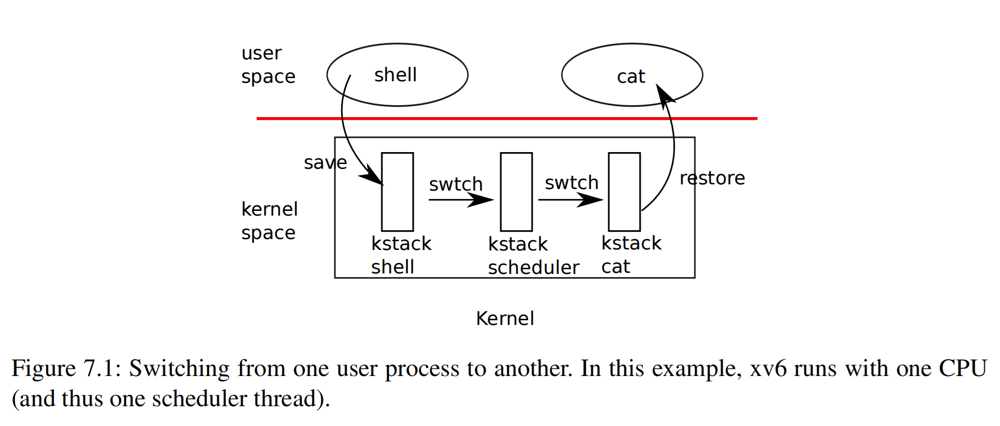

# 第 7 章 调度（Chapter 7 Scheduling）

> Any operating system is likely to run with more processes than the computer has CPUs, so a plan is needed to time-share the CPUs among the processes. Ideally the sharing would be transparent to user processes. A common approach is to provide each process with the illusion that it has its own virtual CPU by *multiplexing* the processes onto the hardware CPUs. This chapter explains how xv6 achieves this multiplexing.

一个操作系统上运行的进程数几乎总会超过计算机上处理器的数量，因此需要一个方案，在进程之间分时共享处理器。理想情况下，这种共享对用户进程透明。一种常见的方法是让进程 *复用（multiplex）* 硬件（处理器），让每个进程都感觉拥有自己专有的虚拟处理器。本章将解释 xv6 如何实现这种复用。

## 7.1 复用（Multiplexing）

> Xv6 multiplexes by switching each CPU from one process to another in two situations. First, xv6’s `sleep` and `wakeup` mechanism switches when a process makes a system call that blocks (has to wait for an event), typically in `read`, `wait`, or `sleep`. Second, xv6 periodically forces a switch to cope with processes that compute for long periods without blocking. The former are voluntary switches; the latter are called involuntary. This multiplexing creates the illusion that each process has its own CPU.

xv6 会在两种情况下将一个处理器上的进程从一个切换到另一个来实现复用。一种情况是，一个进程调用了可能导致阻塞的系统调用（必须等待某个事件），此时通过 xv6 的 `sleep` 和 `wakeup` 机制会实现进程切换，典型的此类系统调用包括 `read`、`wait` 或 `sleep`。另一种情况是，xv6 会定期进行强制切换，以应对那些计算密集且不发生阻塞的进程。前者属于主动切换；后者是被动切换。这种复用机制营造出一种错觉，让人感觉每个进程都拥有自己的处理器（译者注：multiplex 也可以翻译为 “多路复用”，这里的 “多路” 指多个进程复用一个处理器，本文直接翻译为 “复用”，简洁一点）。

> Implementing multiplexing poses a few challenges. First, how to switch from one process to another? The basic idea is to save and restore CPU registers, though the fact that this cannot be expressed in C makes it tricky. Second, how to force switches in a way that is transparent to user processes? Xv6 uses the standard technique in which a hardware timer’s interrupts drive context switches. Third, all of the CPUs switch among the same set of processes, so a locking plan is necessary to avoid races. Fourth, a process’s memory and other resources must be freed when the process exits, but it cannot do all of this itself because (for example) it can’t free its own kernel stack while still using it. Fifth, each CPU of a multi-core machine must remember which process it is executing so that system calls affect the correct process’s kernel state. Finally, `sleep` and `wakeup` allow a process to give up the CPU and wait to be woken up by another process or interrupt. Care is needed to avoid races that result in the loss of wakeup notifications.

实现复用面临一些挑战。首先，如何从一个进程切换到另一个进程？基本思想是需要保存和恢复处理器的寄存器，但对于这些操作，由于无法用 C 语言编写，因此比较棘手。其次，如何对用户进程以透明的方式实现强制切换？xv6 采用的是常用的方法，即通过硬件定时器的中断触发上下文切换。第三，因为需要支持多个处理器在同一组进程之间切换，因此需要引入锁机制来避免竞争。第四，进程退出时必须释放其拥有的内存和其他资源，但它无法自行完成所有这些操作，譬如它无法在仍然使用内核栈的同时又要释放它。第五，多核机器的每个处理器必须记住它正在执行哪个进程，以便系统调用能够确保只会涉及正确的进程及其内核状态。最后，`sleep` 和 `wakeup` 允许进程放弃处理器并等待被其他进程或中断唤醒。（对此）需要注意避免竞争，因为这可能会导致丢失唤醒通知。



## 7.2 代码讲解：上下文切换（Code: Context switching）

> Figure 7.1 outlines the steps involved in switching from one user process to another: a trap (system call or interrupt) from user space to the old process’s kernel thread, a context switch to the current CPU’s scheduler thread, a context switch to a new process’s kernel thread, and a trap return to the user-level process. Xv6 has separate threads (saved registers and stacks) in which to execute the scheduler because it is not safe for the scheduler to execute on any process’s kernel stack: some other CPU might wake the process up and run it, and it would be a disaster to use the same stack on two different CPUs. There is a separate scheduler thread for each CPU to cope with situations in which more than one CPU is running a process that wants to give up the CPU. In this section we’ll examine the mechanics of switching between a kernel thread and a scheduler thread.

图 7.1 概述了从一个用户进程切换到另一个用户进程所涉及的步骤：在用户态运行的旧进程因为一个 trap（系统调用或中断）将处理器切换为内核态，执行上下文切换，开始运行当前 CPU 的 “调度器（scheduler）” 线程（译者注：下文直接称其为 scheduler），第二次上下文切换在内核态下切换到新进程，最后从 trap 返回到用户态，开始在用户态下执行新进程。xv6 使用单独的内核线程（并为它保存自己的寄存器和使用自己的栈）来执行 scheduler，利用任何进程的内核栈来执行 scheduler 都是不安全的：因为其他 CPU 可能会唤醒并运行该进程，在两个不同的 CPU 上使用相同的栈将是一场灾难。因此 xv6 为每个 CPU 都安排了一个各自专有的 scheduler 线程，以应对某个主动放弃 CPU 的进程被多个 CPU 争抢的情况。在本节中，我们将研究在内核线程和 scheduler 线程之间切换的机制。

> Switching from one thread to another involves saving the old thread’s CPU registers, and restoring the previously-saved registers of the new thread; the fact that the stack pointer and program counter are saved and restored means that the CPU will switch stacks and switch what code it is executing.

从一个线程切换到另一个线程涉及保存旧线程的 CPU 寄存器，并为新线程恢复以前保存的寄存器；切换上下文涉及保存和恢复 “栈指针（stack pointer）” 以及 “程序计数器（program counter）”，这说明 CPU 会切换栈以及切换正在执行的指令序列。

> The function `swtch` saves and restores registers for a kernel thread switch. `swtch` doesn’t directly know about threads; it just saves and restores sets of RISC-V registers, called *contexts*. When it is time for a process to give up the CPU, the process’s kernel thread calls `swtch` to save its own context and restore the scheduler’s context. Each context is contained in a `struct context` (kernel/proc.h:2), itself contained in a process’s `struct proc` or a CPU’s `struct cpu`. `swtch` takes two arguments: `struct context *old` and `struct context *new`. It saves the current registers in `old`, loads registers from `new`, and returns.

函数 `swtch` 用于在切换内核线程过程中保存和恢复寄存器。`swtch` 并不关心具体的线程是谁；它只是保存和恢复当前 RISC-V 处理器的寄存器信息，我们称之为 *上下文（context）*。当进程需要放弃 CPU 时，该进程的内核线程会调用 `swtch` 来保存其自身的上下文并恢复 scheduler 线程的上下文。每个上下文都保存在一个 `struct context`（kernel/proc.h:2）中，而后者本身又包含在进程的 `struct proc` 或 CPU 的 `struct cpu` 中。`swtch` 接受两个参数：`struct context *old` 和 `struct context *new`。它将当前寄存器保存在 `old` 中，然后从 `new` 中加载并恢复寄存器，最后返回。

> Let’s follow a process through `swtch` into the scheduler. We saw in Chapter 4 that one possibility at the end of an interrupt is that `usertrap` calls `yield`. `yield` in turn calls `sched`, which calls `swtch` to save the current context in `p->context` and switch to the scheduler context previously saved in `cpu->context` (kernel/proc.c:506).

让我们来跟踪一下通过 `swtch` 从进程切换到 scheduler 的过程。我们在第 4 章中看到，中断处理到最后存在一种可能性是通过 `usertrap`调用 `yield`。`yield` 继续调用 `sched`，`sched` 中会调用 `swtch` 将当前上下文保存在 `p->context` 中，并切换到先前保存在 `cpu->context` 中的 scheduler 的上下文 (kernel/proc.c:506)。

> `swtch` (kernel/swtch.S:3) saves only callee-saved registers; the C compiler generates code in the caller to save caller-saved registers on the stack. `swtch` knows the offset of each register’s field in `struct context`. It does not save the program counter. Instead, `swtch` saves the `ra` register, which holds the return address from which `swtch` was called. Now `swtch` restores registers from the new context, which holds register values saved by a previous `swtch`. When `swtch` returns, it returns to the instructions pointed to by the restored ra register, that is, the instruction from which the new thread previously called `swtch`. In addition, it returns on the new thread’s stack, since that’s where the restored `sp` points.

`swtch` (kernel/swtch.S:3) 仅保存 “被调用方负责保存（callee-saved）” 的寄存器；这是因为 C 编译器（译者注：根据 RISC-V 规范定义的函数调用约定）会在调用 `swtch` 的函数（我们称其为 “调用者（caller）”）中生成一些额外的指令，将 “调用方负责保存（caller-saved）” 的寄存器的值保存在栈上。`swtch` 知道 `struct context` 中保存的每个寄存器字段的偏移量。它不保存 program counter。相反，`swtch` 会保存 `ra` 寄存器，该寄存器保存了调用 `swtch` 结束后应该返回的地址。保存完成后 `swtch` 将处理器的寄存器内容恢复为新的上下文，新的上下文中保存了上一次 `swtch` 被调用时保存的寄存器值。当 `swtch` 返回时，它会返回到恢复的 `ra` 寄存器所指向的指令的地址，即新线程先前调用 `swtch` 时设置的返回地址（译者注：即 C 代码中 `swtch` 的下一条语句）。此外，它重新开始使用新线程的栈，因为恢复后的 `sp` 指向了新线程的栈。

> In our example, `sched` called `swtch` to switch to `cpu->context`, the per-CPU scheduler context. That context was saved at the point in the past when `scheduler` called `swtch` (kernel/proc.c:466) to switch to the process that’s now giving up the CPU. When the `swtch` we have been tracing returns, it returns not to `sched` but to `scheduler`, with the stack pointer in the current CPU’s scheduler stack.

在我们的示例（即图 7.1）中，（shell 进程调用的）`sched` 通过调用 `swtch` 切换到 `cpu->context`，即每个 CPU 专有的 scheduler 上下文。而这个（被恢复的）scheduler 的上下文则是由 `scheduler` 函数在过去某个时间调用 `swtch` (kernel/proc.c:466) 切换到当前这个正在放弃 CPU 的进程（即 shell 进程）的时候所保存的。如果我们跟踪 `swtch` 返回的位置，会发现它返回时不是在 `sched` 中，而是返回到 `scheduler`（调用 `swtch` 的地方），同时栈指针也会被恢复到指向当前 CPU 的 scheduler 线程的栈。

## 7.3 代码讲解：调度（Code: Scheduling）

> The last section looked at the low-level details of `swtch`; now let’s take `swtch` as a given and examine switching from one process’s kernel thread through the scheduler to another process. The scheduler exists in the form of a special thread per CPU, each running the `scheduler` function. This function is in charge of choosing which process to run next. A process that wants to give up the CPU must acquire its own process lock `p->lock`, release any other locks it is holding, update its own state (`p->state`), and then call `sched`. You can see this sequence in `yield` (kernel/proc.c:512), `sleep` and `exit`. `sched` double-checks some of those requirements (kernel/proc.c:496-501) and then checks an implication: since a lock is held, interrupts should be disabled. Finally, `sched` calls `swtch` to save the current context in `p->context` and switch to the scheduler context in `cpu->context`. `swtch` returns on the scheduler’s stack as though `scheduler`’s `swtch` had returned (kernel/proc.c:466). The scheduler continues its `for` loop, finds a process to run, switches to it, and the cycle repeats.

上一节介绍了 `swtch` 的底层细节；现在，我们以 `swtch` 为例，分析如何通过 scheduler 从一个进程的内核线程切换到另一个进程。scheduler 在每个 CPU 上都安排了一个特殊的线程，这个特殊的线程运行 `scheduler` 函数。该函数负责选择下一个在该 CPU 上运行的进程。想要放弃 CPU 的进程必须先获取到自己的进程锁 `p->lock`，释放其持有的任何其他锁，更新自身状态（`p->state`），然后调用 `sched`。我们可以在 `yield` (kernel/proc.c:512)、`sleep` 和 `exit` 中看到上述类似的程序执行步骤。`sched` 会仔细检查一些状态（kernel/proc.c:496-501），最后还会检查一个隐含的条件：由于持有锁，中断应该处于禁用状态。最后，`sched` 调用 `swtch` 将当前上下文保存在 `p->context` 中，并根据 `cpu->context` 中的值切换到 scheduler 的上下文。`swtch` 在 scheduler 的栈上返回，具体返回地址在 `scheduler` 函数中 (kernel/proc.c:466)。返回后 scheduler 继续其 `for` 循环，找到要运行的进程，切换到该进程，然后重复此循环。

> We just saw that xv6 holds `p->lock` across calls to `swtch`: the caller of `swtch` must already hold the lock, and control of the lock passes to the switched-to code. This arrangement is unusual: it’s more common for the thread that acquires a lock to also release it. Xv6’s context switching must break this convention because `p->lock` protects invariants on the process’s `state` and `context` fields that are not true while executing in `swtch`. For example, if `p->lock` were not held during `swtch`, a different CPU might decide to run the process after `yield` had set its state to `RUNNABLE`, but before `swtch` caused it to stop using its own kernel stack. The result would be two CPUs running on the same stack, which would cause chaos. Once `yield` has started to modify a running process’s state to make it `RUNNABLE`, `p->lock` must remain held until the invariants are restored: the earliest correct release point is after `scheduler` (running on its own stack) clears `c->proc`. Similarly, once `scheduler` starts to convert a `RUNNABLE` process to `RUNNING`, the lock cannot be released until the process’s kernel thread is completely running (after the `swtch`, for example in `yield`).

我们刚刚看到，xv6 在执行 `swtch` 过程中会持有 `p->lock`：`swtch` 的调用者（译者注：譬如 `sched`）必须在调用 `swtch` 之前确保已经持有该锁，而对锁的释放则由切换到的目的线程即 scheduler 线程中 `release(&p->lock)` (kernel/proc.c:473) 负责释放。这种安排并不常见，一般情况下获取锁和释放锁的线程会是同一个线程。而 xv6 的上下文切换过程中必须打破这种惯例，持有 `p->lock` 的作用是保护进程的 `state` 和 `context` 之间的 invariant 关系，确保两者在 `swtch` 执行期间的一致性。举例来说，如果 在 `swtch` 期间没有持有 `p->lock`，那么存在一个窗口期，即在 `yield` 将进程状态设置为 `RUNNABLE` 之后，同时在 `swtch` 导致进程停止使用其自身内核栈之前，另一个 CPU 也可能会决定运行该进程（译者注：即另一个 CPU 上也可能同时执行 `scheduler` 并且正好发现该进程的状态已满足 `RUNNABLE` 并重新运行该进程）。结果将导致两个 CPU 在同一个栈上运行，这自然会造成混乱。所以在 `yield` 开始修改正在运行的进程状态，使其变为 `RUNNABLE` 期间，`p->lock` 必须保持锁定，直到 invariant 恢复：最早正确的释放时间点是在 `scheduler`（它在其自己的栈上运行）清除 `c->proc` 之后。同样，一旦 `scheduler` 开始将 `RUNNABLE` 进程转换为 `RUNNING`，在该进程的内核线程完全运行之后（例如，在 `yield` 中的 `swtch` 之后），锁才能被释放。

> The only place a kernel thread gives up its CPU is in `sched`, and it always switches to the same location in `scheduler`, which (almost) always switches to some kernel thread that previously called `sched`. Thus, if one were to print out the line numbers where xv6 switches threads, one would observe the following simple pattern: (kernel/proc.c:466), (kernel/proc.c:506),(kernel/proc.c:466), (kernel/proc.c:506), and so on. Procedures that intentionally transfer control to each other via thread switch are sometimes referred to as *coroutines*; in this example, `sched` and `scheduler` are co-routines of each other.

内核线程放弃 CPU 的唯一位置是在 `sched` 中，并且它总是切换到 `scheduler` 中的相同位置，而 `scheduler` （几乎）总是切换到之前调用 `sched` 的某个内核线程。因此，如果我们尝试打印 xv6 切换线程过程中执行代码的行号，就会发现以下简单的模式：(kernel/proc.c:466)、(kernel/proc.c:506)、(kernel/proc.c:466)、(kernel/proc.c:506) 如此往复。通过线程切换主动相互转移对 CPU 的控制权的 “过程（procedure）” 有时被称为 *协程（coroutine）*；在本例中，`sched` 和 `scheduler` 是一对协程。

> There is one case when the scheduler’s call to `swtch` does not end up in `sched`. `allocproc` sets the context `ra` register of a new process to `forkret` (kernel/proc.c:524), so that its first `swtch` “returns” to the start of that function. `forkret` exists to release the `p->lock`; otherwise, since the new process needs to return to user space as if returning from `fork`, it could instead start at `usertrapret`.

存在一种例外（译者注：注意上一节中圆括号里的用词 “几乎”），scheduler 调用 `swtch` 后不会跳转到 `sched` 中。`allocproc` 将新进程的 `context.ra` 字段设置为 `forkret` (kernel/proc.c:524) 的地址，这样 `scheduler` 中第一次执行 `swtch` 时 “返回” 的位置将是 `forkret` 函数的首地址。之所以专门新定义一个 `forkret`，主要是为了释放 `p->lock`（译者注：见 kernel/proc.c:529）；否则，对这个新建的进程来说，完全可以和 `fork` 一样直接调用 `usertrapret` 来返回用户态。

> `scheduler` (kernel/proc.c:445) runs a loop: find a process to run, run it until it yields, repeat. The scheduler loops over the process table looking for a runnable process, one that has `p->state == RUNNABLE`. Once it finds a process, it sets the per-CPU current process variable `c->proc`, marks the process as `RUNNING`, and then calls `swtch` to start running it (kernel/proc.c:461-466).

`scheduler` (kernel/proc.c:445) 中有一个循环：通过该循环寻找一个可以运行的进程，然后运行它直到它让出 CPU，然后继续寻找下一个。scheduler 会循环遍历进程表，寻找一个可运行的进程，即 `p->state == RUNNABLE` 的进程。一旦找到这个进程，它会设置每个 CPU 专有的当前进程字段 `c->proc` 记住这个进程，同时将该进程标记为 `RUNNING`，然后调用 `swtch` 开始运行它 (kernel/proc.c:461-466)。

## 7.4 代码讲解：`mycpu` 和 `myproc`（Code: `mycpu` and `myproc`）

> Xv6 often needs a pointer to the current process’s `proc` structure. On a uniprocessor one could have a global variable pointing to the current `proc`. This doesn’t work on a multi-core machine, since each CPU executes a different process. The way to solve this problem is to exploit the fact that each CPU has its own set of registers.

xv6 中经常需要使用一个指向当前进程的 `proc` 结构体的指针。在单处理器上，可以定义一个指向当前 `proc` 的全局变量。但这在多核机器上行不通，因为每个 CPU 上当前执行的进程都不相同。解决这个问题的方法是利用每个 CPU 专属的那组寄存器。

> While a given CPU is executing in the kernel, xv6 ensures that the CPU’s `tp` register always holds the CPU’s hartid. RISC-V numbers its CPUs, giving each a unique hartid. `mycpu` (kernel/proc.c:74) uses `tp` to index an array of `cpu` structures and return the one for the current CPU. A `struct cpu` (kernel/proc.h:22) holds a pointer to the `proc` structure of the process currently running on that CPU (if any), saved registers for the CPU’s scheduler thread, and the count of nested spinlocks needed to manage interrupt disabling.

当一个给定的 CPU 在内核态下运行时，xv6 会确保 CPU 的 `tp` 寄存器始终保存该 CPU 的 hartid 的值。RISC-V 规定每个 CPU 都有一个唯一的 hartid 作为其编号。`mycpu` (kernel/proc.c:74) 使用 `tp` 的值来索引结构体 `cpu` 的数组，并返回当前 CPU 对应的结构体。`struct cpu` (kernel/proc.h:22) 的成员包括一个指向当前在该 CPU 上运行的进程（如果有）的结构体 `proc` 的指针（`cpu.proc`）；一个用于保存该 CPU 对应的 scheduler 线程的寄存器上下文的成员变量（`cpu.context`）；以及一个用于记录嵌套的自旋锁数量的成员变量（`cpu.noff`），这个成员变量可用于管理是否关闭中断。

> Ensuring that a CPU’s `tp` holds the CPU’s hartid is a little involved, since user code is free to modify `tp`. `start` sets the `tp` register early in the CPU’s boot sequence, while still in machine mode (kernel/start.c:45). `usertrapret` saves `tp` in the trampoline page, in case user code modifies it. Finally, `uservec` restores that saved `tp` when entering the kernel from user space (kernel/trampoline.S:78). The compiler guarantees never to modify `tp` in kernel code. It would be more convenient if xv6 could ask the RISC-V hardware for the current hartid whenever needed, but RISC-V allows that only in machine mode, not in supervisor mode.

确保 CPU 的 `tp` 保存 CPU 的 hartid 有点复杂，因为用户态代码有权限自由修改 `tp`。在 CPU 启动的早期，`start` 会设置 `tp` 寄存器，此时 CPU 仍处于机器模式 (kernel/start.c:45)。`usertrapret` 将 `tp` 保存在 trampoline 内存页中，以防用户代码修改它。最后，当进程从用户空间进入内核时 `uservec` 会恢复保存的 `tp` (kernel/trampoline.S:78)。编译器会保证永远不会在内核代码中修改 `tp`（译者注：这是 RISC-V ABI 的规定）。如果 xv6 可以随时在需要时向 RISC-V 硬件获取当前的 hartid 就更方便了，但 RISC-V 仅在机器模式下允许这样做，而在管理员模式下则不允许。

> The return values of `cpuid` and `mycpu` are fragile: if the timer were to interrupt and cause the thread to yield and later resume execution on a different CPU, a previously returned value would no longer be correct. To avoid this problem, xv6 requires that callers disable interrupts, and only enable them after they finish using the returned `struct cpu`.

`cpuid` 和 `mycpu` 的返回值需要被保护起来：因为定时器中断有可能会导致当前（调用了 `cpuid` 和 `mycpu` 的）线程放弃 CPU，而该线程稍后又在另一个 CPU 上恢复执行，则先前返回的值将不再正确。为了避免这个问题，xv6 要求调用这些函数时禁用中断，并且仅在使用完返回的 `struct cpu` 的指针值后才能开启中断。

> The function `myproc` (kernel/proc.c:83) returns the `struct proc` pointer for the process that is running on the current CPU. `myproc` disables interrupts, invokes `mycpu`, fetches the current process pointer (`c->proc`) out of the `struct cpu`, and then enables interrupts. The return value of `myproc` is safe to use even if interrupts are enabled: if a timer interrupt moves the calling process to a different CPU, its `struct proc` pointer will stay the same.

函数 `myproc`（kernel/proc.c:83）返回当前 CPU 上运行的进程的 `struct proc` 指针。`myproc` 中会先禁用中断，然后调用 `mycpu`，从 `struct cpu` 中获取当前进程指针（`c->proc`），然后启用中断。虽然此时启用了中断，`myproc` 的返回值也是可以安全使用的：因为即使定时器中断将调用 `mycpu` 的进程移动到不同的 CPU，但此时获得的 `struct proc` 指针的值并不会被改变（译者注：可以这么理解，`myproc` 本质是一个进程找自己，如果已经找到自己后即使自己被迁移到别的 CPU 对结果也没有影响）。

## 7.5 睡眠与唤醒（Sleep and wakeup）

> Scheduling and locks help conceal the actions of one thread from another, but we also need abstractions that help threads intentionally interact. For example, the reader of a pipe in xv6 may need to wait for a writing process to produce data; a parent’s call to `wait` may need to wait for a child to exit; and a process reading the disk needs to wait for the disk hardware to finish the read. The xv6 kernel uses a mechanism called sleep and wakeup in these situations (and many others). Sleep allows a kernel thread to wait for a specific event; another thread can call wakeup to indicate that threads waiting for a specified event should resume. Sleep and wakeup are often called *sequence coordination* or *conditional synchronization* mechanisms.

调度和锁有助于隐藏线程之间的相互作用，但我们也需要一些明确的原语来表达线程之间有意识的交互。例如，xv6 中管道的 “读端（reader）”（译者注：即从管道中读取数据的进程，后面的 “写端” 同理）可能需要等待管道的 “写端（writer）” 写入数据；父进程调用 `wait` 等待子进程退出；读取磁盘的进程需要等待磁盘硬件完成读取。xv6 内核针对这些情况（以及许多其他情况）引入了一种称为 “睡眠（sleep）” 和 “唤醒（wakeup）” 的机制。“睡眠” 允许内核线程等待特定事件；另一个线程可以调用 “唤醒” 来通知处于等待指定事件中的线程恢复运行。“睡眠” 和 “唤醒” 通常被称为 *次序协调（sequence coordination）* 或 *条件同步（conditional synchronization）* 机制。

> Sleep and wakeup provide a relatively low-level synchronization interface. To motivate the way they work in xv6, we’ll use them to build a higher-level synchronization mechanism called a *semaphore* [5] that coordinates producers and consumers (xv6 does not use semaphores). A semaphore maintains a count and provides two operations. The “V” operation (for the producer) increments the count. The “P” operation (for the consumer) waits until the count is non-zero, and then decrements it and returns. If there were only one producer thread and one consumer thread, and they executed on different CPUs, and the compiler didn’t optimize too aggressively, this implementation would be correct:

“睡眠（sleep）” 和 “唤醒（wakeup）” 提供了一对相对底层的同步接口。为了更好地理解它们在 xv6 中的工作方式，这里我们给出一个例子，这个例子使用它们构建一个更高级的同步机制，我们称之为 *信号量（semaphore）* [5]，该机制用于协调 “生产者（producer）” 和 “消费者（consumer）” 的行为（注意在 xv6 中并没有真正实现和使用信号量）。信号量维护一个计数并提供两种操作原语。（生产者）调用 “V” 操作会增加计数。（消费者）调用 “P” 操作检查计数值，如果发现计数为零则会阻塞等待，直到计数变成非零，然后减少计数并返回（译者注：生产者负责使条件成立，即使得计数值不为零，它调用代码中的 `V` 函数，对 count 计数做 +1 操作，而消费者则负责检查条件是否成立以及对 count 计数做 -1 操作）。如果只有一个生产者线程和一个消费者线程，并且它们在不同的 CPU 上执行，并且编译器没有进行过于激进的优化，那么以下代码是一个可以正确工作的具体实现：

```c
100 struct semaphore {
101   struct spinlock lock;
102   int count;
103 };
104
105 void
106 V(struct semaphore *s)
107 {
108   acquire(&s->lock);
109   s->count += 1;
110   release(&s->lock);
111 }
112
113 void
114 P(struct semaphore *s)
115 {
116   while(s->count == 0)
117     ;
118   acquire(&s->lock);
119   s->count -= 1;
120   release(&s->lock);
121 }
```

> The implementation above is expensive. If the producer acts rarely, the consumer will spend most of its time spinning in the `while` loop hoping for a non-zero count. The consumer’s CPU could probably find more productive work than *busy waiting* by repeatedly polling `s->count`. Avoiding busy waiting requires a way for the consumer to yield the CPU and resume only after `V` increments the count.

上述实现的开销很大。如果生产者不怎么调用 `V` 的话，则消费者对 `P` 的调用将导致在 `while` 循环上花费大量的时间来等待计数变成非零值。运行消费者线程的 CPU 或许可以被用于运行一些更有价值的计算，而不是把时间花在反复轮询 `s->count` 这种 *忙等待（busy waiting）* 的工作上。为了避免忙等待我们需要实现一种机制，让消费者既能交出 CPU，又能在 `V` 操作增加计数后快速恢复运行。

> Here’s a step in that direction, though as we will see it is not enough. Let’s imagine a pair of calls, `sleep` and `wakeup`, that work as follows. `sleep(chan)` waits for an event designated by the value of `chan`, called the *wait channel*. `sleep` puts the calling process to sleep, releasing the CPU for other work. `wakeup(chan)` wakes all processes that are in calls to `sleep` with the same `chan` (if any), causing their `sleep` calls to return. If no processes are waiting on `chan`, `wakeup` does nothing. We can change the semaphore implementation to use `sleep` and `wakeup` (changes highlighted in yellow):

下面的代码朝着这个目标前进了一步，尽管我们将看到这还不够。让我们想象存在一对函数调用，`sleep` 和 `wakeup`，它们的工作方式如下。`sleep(chan)` 等待由 `chan` 的值指定的事件，我们把 `chan` 称为 *等待通道（wait channel）*。`sleep` 使调用进程进入睡眠状态，释放 CPU 以供其他工作使用。`wakeup(chan)` 唤醒所有在同一个 `chan` 上调用 `sleep` 的进程（这样的进程也可能并不存在），这会导致它们的 `sleep` 调用返回（译者注：即退出睡眠）。如果没有进程在 `chan` 上等待，`wakeup` 则什么也不做。我们可以将信号量实现改进为使用 `sleep` 和 `wakeup`（更改以黄色突出显示，译者注：即下面代码中的第 205 行和第 213 行）：

```c
200 void
201 V(struct semaphore *s)
202 {
203   acquire(&s->lock);
204   s->count += 1;
205   wakeup(s); // 此行黄色高亮
206   release(&s->lock);
207 }
208
209 void
210 P(struct semaphore *s)
211 {
212   while(s->count == 0)
213     sleep(s); // 此行黄色高亮
214   acquire(&s->lock);
215   s->count -= 1;
216   release(&s->lock);
217 }
```

> `P` now gives up the CPU instead of spinning, which is nice. However, it turns out not to be straightforward to design `sleep` and `wakeup` with this interface without suffering from what is known as the *lost wake-up* problem. Suppose that `P` finds that `s->count == 0` on line 212. While `P` is between lines 212 and 213, `V` runs on another CPU: it changes `s->count` to be nonzero and calls `wakeup`, which finds no processes sleeping and thus does nothing. Now `P` continues executing at line 213: it calls `sleep` and goes to sleep. This causes a problem: `P` is asleep waiting for a `V` call that has already happened. Unless we get lucky and the producer calls `V` again, the consumer will wait forever even though the count is non-zero.

`P` 现在会放弃 CPU 而不是死循环，这看上去不错。然而，事实证明，如此实现 `sleep` 和 `wakeup` 很容易导致一个微妙而不易察觉的所谓 *丢失唤醒（lost wake-up）* 问题。假设 `P` 在第 212 行发现 `s->count == 0`。在 `P` 开始调用第 213 行的 `sleep` 函数之前，在另一个 CPU 上开始运行 `V`：它将 `s->count` 更改为非零值并调用 `wakeup`，后者发现此时没有进程在休眠，因此什么也不做。此时，调用 `P` 的进程继续执行第 213 行：它调用 `sleep` 并进入休眠状态。这会导致一个问题：`P` 所在进程进入休眠状态，等待已经发生的 `V` 调用。除非我们很幸运，生产者再次调用 `V`，否则虽然计数值此时已经是非零状态，但消费者仍将永远等待。

> The root of this problem is that the invariant that `P` sleeps only when `s->count == 0` is violated by `V` running at just the wrong moment. An incorrect way to protect the invariant would be to move the lock acquisition (highlighted in yellow below) in `P` so that its check of the count and its call to `sleep` are atomic:

导致该问题的根源在于，对于 `P` 来说，需要满足一个 invariant 要求，即仅在 `s->count == 0` 时才会休眠，但这个 invariant 却会因为 `V` 在错误时刻的行为所破坏（译者注：这里所谓的错误时刻的行为即上一段中描述的 “在 `P` 开始调用第 213 行的 `sleep` 函数之前，在另一个 CPU 上开始运行 `V`：它将 `s->count` 更改为非零值并调用 `wakeup`”）。保护 invariant 的一种错误方法是将 `P` 中获取锁的操作往前移（下图中黄色高亮部分，译者注：下面代码的第 312 行），使其对计数的检查和 `sleep` 调用成为原子操作：

```c
300 void
301 V(struct semaphore *s)
302 {
303   acquire(&s->lock);
304   s->count += 1;
305   wakeup(s);
306   release(&s->lock);
307 }
308
309 void
310 P(struct semaphore *s)
311 {
312   acquire(&s->lock); // 此行黄色高亮
313   while(s->count == 0)
314     sleep(s);
315   s->count -= 1;
316   release(&s->lock);
317 }
```

> One might hope that this version of `P` would avoid the lost wakeup because the lock prevents `V` from executing between lines 313 and 314. It does that, but it also deadlocks: `P` holds the lock while it sleeps, so `V` will block forever waiting for the lock.

人们可能希望这个版本的 `P` 能够避免 “丢失唤醒” 问题，因为锁阻止了 `V` 在第 313 行和第 314 行之间执行。它确实做到了这一点，但它也会导致死锁：`P` 在持有锁后进入睡眠，这导致了 `V` 因为等不到锁而永远阻塞。（译者注：根据上一节对 invariant 的分析，睡眠完成后即可释放锁，这也是下面改进的思路）

> We’ll fix the preceding scheme by changing `sleep`’s interface: the caller must pass the *condition lock* to `sleep` so it can release the lock after the calling process is marked as asleep and waiting on the sleep channel. The lock will force a concurrent `V` to wait until `P` has finished putting itself to sleep, so that the `wakeup` will find the sleeping consumer and wake it up. Once the consumer is awake again `sleep` reacquires the lock before returning. Our new correct sleep/wakeup scheme is usable as follows (change highlighted in yellow):

我们通过修改 `sleep` 的接口定义来改进之前的方案：调用者必须将 *条件锁（condition lock）* 传递给 `sleep`，以便在调用进程被切换为睡眠状态并在 “等待通道” 上执行等待后能够释放锁。该锁将强制并发的 `V` 在锁上等待，直到 `P` 完成自身的睡眠，这样 `wakeup` 就能找到睡眠中的消费者并将其唤醒。一旦消费者再次醒来，`sleep` 会在返回之前重新获取锁。我们新的正确的睡眠和​​唤醒方案如下所示（更改部分以黄色突出显示，译者注：下面代码的第 414 行）：

```c
400 void
401 V(struct semaphore *s)
402 {
403   acquire(&s->lock);
404   s->count += 1;
405   wakeup(s);
406   release(&s->lock);
407 }
408
409 void
410 P(struct semaphore *s)
411 {
412   acquire(&s->lock);
413   while(s->count == 0)
414     sleep(s, &s->lock); // 此行黄色高亮
415   s->count -= 1;
416   release(&s->lock);
417 }
```

> The fact that `P` holds `s->lock` prevents `V` from trying to wake it up between `P`’s check of `s->count` and its call to `sleep`. However, `sleep` must release `s->lock` and put the consuming process to sleep in a way that’s atomic from the point of view of `wakeup`, in order to avoid lost wakeups.

进入 `P` 后会先获取 `s->lock`，这可以避免在检查 `s->count` 和调用 `sleep` 之间生产者进程（即调用 `V` 的进程）执行唤醒操作。然而，进入 `sleep` 后必须立刻释放 `s->lock`，然后将消费者进程切换成睡眠态，这一系列的操作要确保不能被 `wakeup` 所打断，这样才能避免 “丢失唤醒”（译者注：具体 `sleep` 和 `wakeup` 函数如何确保上述的原子性这里并没有展开，在下一节，即 7.6 节会具体解释）。

## 7.6 代码讲解：睡眠与唤醒（Code: Sleep and wakeup）

> Xv6’s `sleep` (kernel/proc.c:548) and `wakeup` (kernel/proc.c:579) provide the interface used in the last example above. The basic idea is to have `sleep` mark the current process as `SLEEPING` and then call `sched` to release the CPU; `wakeup` looks for a process sleeping on the given wait channel and marks it as `RUNNABLE`. Callers of `sleep` and `wakeup` can use any mutually convenient number as the channel. Xv6 often uses the address of a kernel data structure involved in the waiting.

xv6 的 `sleep` (kernel/proc.c:548) 和 `wakeup` (kernel/proc.c:579) 实现了上面最后一个示例中使用的接口。其基本思想是让 `sleep` 将当前进程标记为 `SLEEPING`，然后调用 `sched` 释放 CPU；`wakeup` 查找在给定 “等待通道” 上睡眠的进程，并将其状态切换为 `RUNNABLE`。`sleep` 和 `wakeup` 的调用者可以使用任何彼此方便的值作为通道。xv6 通常使用等待过程中涉及的内核数据结构的地址（译者注：譬如上面代码例子中的 `s`）。

> `sleep` acquires `p->lock` (kernel/proc.c:559) and *only then* releases `lk`. As we’ll see, the fact that `sleep` holds one or the other of these locks at all times is what prevents a concurrent `wakeup` (which must acquire and hold both) from acting. Now that `sleep` holds just `p->lock`, it can put the process to sleep by recording the sleep channel, changing the process state to `SLEEPING`, and calling `sched` (kernel/proc.c:563-566). In a moment it will be clear why it’s critical that `p->lock` is not released (by `scheduler`) until after the process is marked `SLEEPING`.

`sleep` 首先尝试获取 `p->lock` (kernel/proc.c:559)，只有拿到这把锁才会释放 `lk`。正如我们将看到的，`sleep` 始终确保只会持有 `p->lock` 或者 `lk` 中的一个，这么做阻止了并发的 `wakeup`（执行 `wakeup` 要求同时获取并持有这两把锁（译者注：参考上面的例子代码，`lk`（即 `s->lock`）是在进入 `wakeup` 之前所获取，而对于 `p->lock`，参考 xv6 中 `wakeup` 函数的实现，是在 `wakeup` 函数中被获取）。（继续 `sleep` 函数的解释，参考 (kernel/proc.c:562-566)）`sleep` 此时只持有 `p->lock`，接下来它记录睡眠通道、再将进程状态更改为 `SLEEPING`，最后调用 `sched` 将进程进入睡眠状态。稍后我们将解释为什么只有在进程被标记为 `SLEEPING` 之后，`p->lock` 才能被 `scheduler` 释放，这一点很重要。

> At some point, a process will acquire the condition lock, set the condition that the sleeper is waiting for, and call `wakeup(chan)`. It’s important that `wakeup` is called while holding the condition lock[1]. `wakeup` loops over the process table (kernel/proc.c:579). It acquires the `p->lock` of each process it inspects. When `wakeup` finds a process in state `SLEEPING` with a matching `chan`, it changes that process’s state to `RUNNABLE`. The next time `scheduler` runs, it will see that the process is ready to be run.

总会在其他某个时间点上，另一个进程会获取 “条件锁（condition lock）”，设置睡眠进程正在等待的条件，然后调用 `wakeup(chan)`（译者注：参考上面例子代码中的 `V` 操作，`s->lock` 即为该例子中的 “条件锁”）。重要的是，调用 `wakeup` 的前提是要先持有条件锁 [1]。`wakeup` 会循环遍历进程表 (kernel/proc.c:579)。它会尝试获取每个进程的 `p->lock`。当 `wakeup` 发现一个进程的状态处于 `SLEEPING` 且 `chan` 匹配时，它会将该进程的状态更改为 `RUNNABLE`。下次 `scheduler` 运行时，它就会发现该进程已准备好可以再次运行。

> Why do the locking rules for `sleep` and `wakeup` ensure that a process that’s going to sleep won’t miss a concurrent wakeup? The going-to-sleep process holds either the condition lock or its own `p->lock` or both from *before* it checks the condition until *after* it is marked `SLEEPING`. The process calling `wakeup` holds *both* locks in `wakeup`’s loop. Thus the waker either makes the condition true before the consuming thread checks the condition; or the waker’s `wakeup` examines the sleeping thread strictly after it has been marked `SLEEPING`. Then `wakeup` will see the sleeping process and wake it up (unless something else wakes it up first).

为什么 `sleep` 和 `wakeup` 函数中对锁的使用能够确保即将进入睡眠的进程不会错过一次并发的唤醒呢？这是因为即将进入睡眠态的进程在它检查条件 *之前* 直到被标记为 `SLEEPING` *之后*，会一直持有 “条件锁” 或者自身的进程锁 `p->lock`，或者两者都持有。调用 `wakeup` 的进程在 `wakeup` 函数内的循环体中需要确保这 *两把* 锁都是上锁的状态。因此，对于唤醒者进程来说，要么在消费者线程检查条件之前使条件成立，要么在其调用的 `wakeup` 函数中必须要等到睡眠线程被严格标记为 `SLEEPING` 之后才能访问它并检查其状态。对于以上两种情况，`wakeup` 函数将确保看到已经完全处于睡眠中的进程并将其唤醒（除非其他原因导致该进程已经被唤醒）。

> Sometimes multiple processes are sleeping on the same channel; for example, more than one process reading from a pipe. A single call to `wakeup` will wake them all up. One of them will run first and acquire the lock that `sleep` was called with, and (in the case of pipes) read whatever data is waiting. The other processes will find that, despite being woken up, there is no data to be read. From their point of view the wakeup was “spurious,” and they must sleep again. For this reason `sleep` is always called inside a loop that checks the condition.

有时多个进程在同一个通道上休眠；例如，多个进程正在从管道读取数据。只需调用一次 `wakeup` 即可唤醒所有进程。这期间总有一个进程将首先运行并抢到调用 `sleep` 时传入的锁（译者注：即 `sleep` 函数的第二个参数 `lk`），然后（依然以管道为例）读取所有正在等待的数据。其他进程会发现，尽管自己被唤醒，但没有数据可读取。从它们的角度来看，这次唤醒是 “虚假的（spurious）”，它们必须再次休眠。因此，我们需要确保在一个反复检查条件的循环中调用 `sleep`。

> No harm is done if two uses of sleep/wakeup accidentally choose the same channel: they will see spurious wakeups, but looping as described above will tolerate this problem. Much of the charm of sleep/wakeup is that it is both lightweight (no need to create special data structures to act as sleep channels) and provides a layer of indirection (callers need not know which specific process they are interacting with).

如果睡眠和唤醒各执行了两次并且意外选择了同一个通道，也不会有什么问题：它们会检测到虚假的唤醒，如上所述的循环可以处理这个问题。睡眠和唤醒机制的最大魅力在于不仅其实现简单（无需创建特殊的数据结构来充当睡眠通道），又提供了一层封装（调用者无需知道它们正在与哪个特定进程交互）。

> [1] Strictly speaking it is sufficient if `wakeup` merely follows the `acquire` (that is, one could call `wakeup` after the `release`).

准确来说，只要确保在 `acquire` 之后调用 `wakeup` 就行（换句话说，甚至可以把对 `release` 的调用挪到 `wakeup` 之前）（译者注：继续参考上面例子代码的第 403 行 ~ 406 行）。

## 7.7 代码讲解：管道（Code: Pipes）

> A more complex example that uses `sleep` and `wakeup` to synchronize producers and consumers is xv6’s implementation of pipes. We saw the interface for pipes in Chapter 1: bytes written to one end of a pipe are copied to an in-kernel buffer and then can be read from the other end of the pipe. Future chapters will examine the file descriptor support surrounding pipes, but let’s look now at the implementations of `pipewrite` and `piperead`.

一个更复杂的使用 `sleep` 和 `wakeup` 来同步生产者和消费者例子是 xv6 中实现的 “管道（pipe）”。我们在第 1 章中了解了管道的接口定义：写入管道一端的字节会被复制到内核中的一块内存缓冲区中，然后可以被管道的另一端读取。后续章节将探讨如何通过文件描述符操作管道，现在我们先来看看 `pipewrite` 和 `piperead` 的实现。

> Each pipe is represented by a `struct pipe`, which contains a `lock` and a `data` buffer. The fields `nread` and `nwrite` count the total number of bytes read from and written to the buffer. The buffer wraps around: the next byte written after `buf[PIPESIZE-1]` is `buf[0]`. The counts do not wrap. This convention lets the implementation distinguish a full buffer (`nwrite == nread+PIPESIZE`) from an empty buffer (`nwrite == nread`), but it means that indexing into the buffer must use `buf[nread % PIPESIZE]` instead of just `buf[nread]` (and similarly for `nwrite`).

每个管道由一个 `struct pipe` 的结构体表示，该结构体中包含一个 `lock` 和一个 `data` 缓冲区。`nread` 和 `nwrite` 字段分别用于计数从缓冲区读取和写入的字节总数。对缓冲区的写入会回绕：超出 `buf[PIPESIZE-1]` 写入的下一个字节会写入 `buf[0]`。计数不会回绕。基于以上约定我们可以区分缓冲区的状态是 “满（`nwrite == nread+PIPESIZE`）” 还是 “空（`nwrite == nread`）”，这也意味着当我们需要索引缓冲区中的某个字节时必须使用 `buf[nread % PIPESIZE]`，而不能使用 `buf[nread]`（对 `nwrite` 也是如此）。

> Let’s suppose that calls to `piperead` and `pipewrite` happen simultaneously on two different CPUs. `pipewrite` (kernel/pipe.c:77) begins by acquiring the pipe’s lock, which protects the counts, the data, and their associated invariants. `piperead` (kernel/pipe.c:106) then tries to acquire the lock too, but cannot. It spins in `acquire` (kernel/spinlock.c:22) waiting for the lock. While `piperead` waits, `pipewrite` loops over the bytes being written (`addr[0..n-1]`), adding each to the pipe in turn (kernel/pipe.c:95). During this loop, it could happen that the buffer fills (kernel/pipe.c:88). In this case, `pipewrite` calls `wakeup` to alert any sleeping readers to the fact that there is data waiting in the buffer and then sleeps on `&pi->nwrite` to wait for a reader to take some bytes out of the buffer. `sleep` releases the pipe’s lock as part of putting `pipewrite`’s process to sleep.

假设对 `piperead` 和 `pipewrite` 的调用同时发生在两个不同的 CPU 上。而且假定 `pipewrite` (kernel/pipe.c:77) 首先抢到管道的锁，该锁用于保护计数、数据及其相关的 invariant。`piperead` (kernel/pipe.c:106) 随后尝试获取锁，但此时获取不成功。进入 `acquire` (kernel/spinlock.c:22) 后等待锁被释放。在 `piperead` 等待期间，`pipewrite` 循环遍历正在写入的字节 (`addr[0..n-1]`)，并将每个字节依次加入管道的缓冲区 (kernel/pipe.c:95)。在此循环期间，缓冲区可能会被填满 (kernel/pipe.c:88)。在这种情况下，`pipewrite` 调用 `wakeup` 来提醒处于休眠状态的读端此时缓冲区中有数据在等待读取，然后 `pipewrite` 在 `&pi->nwrite` 上休眠，等待读端从缓冲区中取出一些字节。对 `sleep` 的调用在将运行 `pipewrite` 的进程进入休眠的同时会释放管道的锁。

> `piperead` now acquires the pipe’s lock and enters its critical section: it finds that `pi->nread != pi->nwrite` (kernel/pipe.c:113) (`pipewrite` went to sleep because `pi->nwrite == pi->nread + PIPESIZE` (kernel/pipe.c:88)), so it falls through to the `for` loop, copies data out of the pipe (kernel/pipe.c:120), and increments `nread` by the number of bytes copied. That many bytes are now available for writing, so `piperead` calls `wakeup` (kernel/pipe.c:127) to wake any sleeping writers before it returns. `wakeup` finds a process sleeping on `&pi->nwrite`, the process that was running `pipewrite` but stopped when the buffer filled. It marks that process as `RUNNABLE`.

`piperead` 现在获取了管道的锁并进入其临界区：它会发现 `pi->nread != pi->nwrite` (kernel/pipe.c:113)（`pipewrite` 之所以进入睡眠状态正是因为 `pi->nwrite == pi->nread + PIPESIZE` (kernel/pipe.c:88)），因此它进入 `for` 循环，将数据从管道的缓冲区往外复制 (kernel/pipe.c:120)，并对 `nread` 增加已写出的字节数。此时说明缓冲区有空余出来这么多字节可供写入，因此 `piperead` 在其返回之前会调用 `wakeup` (kernel/pipe.c:127)，唤醒所有睡眠中的写端进程。`wakeup` 会发现一个在 `&pi->nwrite` 上睡眠的进程而该进程正是前面运行 `pipewrite` 并在缓冲区填满后停止的那个。`wakeup` 随即将该进程标记为 `RUNNABLE`。

> The pipe code uses separate sleep channels for reader and writer (`pi->nread` and `pi->nwrite`); this might make the system more efficient in the unlikely event that there are lots of readers and writers waiting for the same pipe. The pipe code sleeps inside a loop checking the sleep condition; if there are multiple readers or writers, all but the first process to wake up will see the condition is still false and sleep again.

管道的代码为读取端和写入端维护单独的睡眠通道（`pi->nread` 和 `pi->nwrite`）；这对于存在多个读取端和写入端等待同一个管道的情况来说（虽然这种情况不太可能发生）可能会提高系统效率。`piperead` 和 `pipewrite` 中的代码将执行睡眠的操作包在一个检查睡眠条件的循环中；因此如果有多个读取端或写入端，除了第一个被唤醒的进程之外，其他所有（被唤醒的）进程都会发现条件仍然为假，并再次进入睡眠状态。

## 7.8 代码讲解：`wait`, `exit` 和 `kill`（Code: Wait, exit, and kill）

> `sleep` and `wakeup` can be used for many kinds of waiting. An interesting example, introduced in Chapter 1, is the interaction between a child’s `exit` and its parent’s `wait`. At the time of the child’s death, the parent may already be sleeping in `wait`, or may be doing something else; in the latter case, a subsequent call to `wait` must observe the child’s death, perhaps long after it calls `exit`. The way that xv6 records the child’s demise until `wait` observes it is for `exit` to put the caller into the `ZOMBIE` state, where it stays until the parent’s `wait` notices it, changes the child’s state to `UNUSED`, copies the child’s exit status, and returns the child’s process ID to the parent. If the parent exits before the child, the parent gives the child to the `init` process, which perpetually calls `wait`; thus every child has a parent to clean up after it. A challenge is to avoid races and deadlock between simultaneous parent and child `wait` and `exit`, as well as simultaneous `exit` and `exit`.

`sleep` 和 `wakeup` 可用于多种等待的场景。第 1 章介绍过一个有趣的例子，即子进程的 `exit` 与其父进程的 `wait` 之间的交互。子进程退出时，父进程可能已经在 `wait` 中休眠，或者正在执行其他操作；在后一种情况下，后续对 `wait` 的调用必须观察到子进程已退出，这很可能发生在（子进程）调用 `exit` 很久之后。xv6 记录子进程结束的方式是，在 `wait` 观察到该结果之前，`exit` 会将调用者的状态设置为 `ZOMBIE`，该状态会一直保持到父进程调用 `wait` 发现它已退出，`wait` 会将子进程的状态更改为 `UNUSED`，复制子进程的退出状态，并将子进程的进程 ID 返回给父进程。如果父进程先于子进程退出，则父进程会将子进程托付给 `init` 进程，而后者会循环调用 `wait`；所以，每个子进程都会有一个父进程来负责回收它。存在的挑战是如何避免当父子进程同时调用 `wait` 和 `exit` 或者同时调用 `exit` 和 `exit` 时可能引起的竞争和死锁。

> `wait` starts by acquiring `wait_lock` (kernel/proc.c:391), which acts as the condition lock that helps ensure that `wait` doesn’t miss a `wakeup` from an exiting child. Then `wait` scans the process table. If it finds a child in `ZOMBIE` state, it frees that child’s resources and its `proc` structure, copies the child’s exit status to the address supplied to `wait` (if it is not 0), and returns the child’s process ID. If `wait` finds children but none have exited, it calls `sleep` to wait for any of them to exit (kernel/proc.c:433), then scans again. `wait` often holds two locks, `wait_lock` and some process’s `pp->lock`; the deadlock-avoiding order is first `wait_lock` and then `pp->lock`.

`wait` 会首先尝试获取 `wait_lock` (kernel/proc.c:391) 这把锁，该锁充当条件锁，有助于确保 `wait` 不会错过正在退出的子进程（在 `exit` 中）对 `wakeup` 的调用。获取 `wait_lock` 后 `wait` 会扫描进程表。如果它发现一个处于 `ZOMBIE` 状态的子进程，它会释放该子进程的资源及其 `proc` 结构，将子进程的退出状态复制到 `wait` 函数的参数传入的地址处（前提是该地址不为 0），并返回该子进程的进程 ID。如果 `wait` 发现存在子进程但目前都还没有退出，那么它会调用 `sleep` 进入等待 (kernel/proc.c:433)，直到任何一个子进程退出而被唤醒，然后 `wait` 会进入下一个循环再次扫描进程表(译者注：此时再次扫描必然能够发现有子进程状态变为 `ZOMBIE`)。`wait` 通常持有两把锁，`wait_lock` 和某个进程的 `pp->lock`；避免死锁的顺序是确保先获取 `wait_lock`，后获取 `pp->lock`。

> `exit` (kernel/proc.c:347) records the exit status, frees some resources, calls `reparent` to give its children to the `init` process, wakes up the parent in case it is in `wait`, marks the caller as a zombie, and permanently yields the CPU. `exit` holds both `wait_lock` and `p->lock` during this sequence. It holds `wait_lock` because it’s the condition lock for the `wakeup(p->parent)`, preventing a parent in `wait` from losing the wakeup. `exit` must hold `p->lock` for this sequence also, to prevent a parent in `wait` from seeing that the child is in state `ZOMBIE` before the child has finally called `swtch`. `exit` acquires these locks in the same order as `wait` to avoid deadlock.

`exit` (kernel/proc.c:347) 会记录退出状态，释放一些资源，调用 `reparent` 将其子进程委托给 `init` 进程，唤醒有可能在 `wait` 中等待的父进程，将调用者本身标记为 “僵尸（zombie）” 进程，并永久交出 CPU。`exit` 在上述执行过程中同时持有 `wait_lock` 和 `p->lock`。它持有 `wait_lock` 是因为它是 `wakeup(p->parent)` 的条件锁，其目的是为了防止处于 `wait` 状态的父进程错过唤醒通知。`exit` 也必须在上述执行过程中持有 `p->lock`，以防止在 `wait` 中等待的父进程在子进程最终调用 `swtch` 之前就看到子进程已处于 `ZOMBIE` 状态。另外，`exit` 也需要按照与 `wait` 相同的顺序获取这些锁以避免死锁。

> It may look incorrect for `exit` to wake up the parent before setting its state to `ZOMBIE`, but that is safe: although `wakeup` may cause the parent to run, the loop in `wait` cannot examine the child until the child’s `p->lock` is released by `scheduler`, so `wait` can’t look at the exiting process until well after `exit` has set its state to `ZOMBIE` (kernel/proc.c:379).

在将子进程的状态设置为 `ZOMBIE` 之前，`exit` 会唤醒其父进程，这看上去似乎不太正确，但这是安全的：尽管 `wakeup` 可能唤醒（在 `wait` 中睡眠的）父进程，但在 `wait` 的循环中，在子进程的 `p->lock` 被 `scheduler` 释放之前是无法查看子进程的状态的，相反，`wait` 会一直阻塞，直到 `exit` 将子进程的状态设置为 `ZOMBIE`（kernel/proc.c:379）之后才能继续并看到已退出的进程（译者注：严格地说这个时间点是在 `exit` 中调用 `sched` 后，在 `scheduler` 中释放 `p->lock`（kernel/proc.c:473）之后）。

> While `exit` allows a process to terminate itself, `kill` (kernel/proc.c:598) lets one process request that another terminate. It would be too complex for `kill` to directly destroy the victim process, since the victim might be executing on another CPU, perhaps in the middle of a sensitive sequence of updates to kernel data structures. Thus `kill` does very little: it just sets the victim’s `p->killed` and, if it is sleeping, wakes it up. Eventually the victim will enter or leave the kernel, at which point code in `usertrap` will call `exit` if `p->killed` is set (it checks by calling `killed` (kernel/proc.c:627)). If the victim is running in user space, it will soon enter the kernel by making a system call or because the timer (or some other device) interrupts.

`exit` 用于一个进程终止自己，`kill` (kernel/proc.c:598) 则用于一个进程请求终止另一个进程。希望通过 `kill` 直接销毁某个进程（该进程我们形象地称之为 *受害者（victim）*）可没有那么简单，因为 victim 进程可能正在另一个 CPU 上执行，甚至可能正在对内核数据结构进行一系列敏感的更新。因此，`kill` 函数中的代码并不会做实际的销毁工作：它只是简单地设置 victim 进程的 `p->killed` 标志位，如果 victim 进程处于休眠状态，则将其唤醒。最终，victim 进程会进入或离开内核态，此时 `usertrap` 中的代码会检查 `p->killed` 是否已设置（通过调用 `killed` (kernel/proc.c:627) ），如果被设置了则调用 `exit`（完成实际的销毁）。如果 victim 进程此时正在用户空间运行，它很快就会通过系统调用或因为定时器（或其他外设）中断进入内核态。

> If the victim process is in `sleep`, `kill`’s call to `wakeup` will cause the victim to return from `sleep`. This is potentially dangerous because the condition being waited for for may not be true. However, xv6 calls to `sleep` are always wrapped in a `while` loop that re-tests the condition after `sleep` returns. Some calls to `sleep` also test `p->killed` in the loop, and abandon the current activity if it is set. This is only done when such abandonment would be correct. For example, the pipe read and write code (kernel/pipe.c:84) returns if the killed flag is set; eventually the code will return back to trap, which will again check `p->killed` and exit.

当 victim 进程阻塞在 `sleep` 中时，`kill` 通过调用 `wakeup` 将导致 victim 进程从 `sleep` 函数返回。但这么做存在潜在的危险，因为等待的条件可能并不成立。但所幸的是，由于 xv6 总是用一个 `while` 循环包住了对 `sleep` 的调用，该循环会在 `sleep` 返回后重新测试条件。一些对 `sleep` 的调用还会在循环中测试 `p->killed` 这个条件，如果设置了该标志，则放弃当前活动。只有确保这种放弃是正确的才会执行此操作。例如，如果设置了 killed 标志，管道的读写代码 (kernel/pipe.c:84) 就会返回；最终代码将返回到 trap，并再次检查 `p->killed`，如果条件满足则调用 `exit` 结束该 victim 进程（译者注：见 kernel/trap.c:56）。

> Some xv6 `sleep` loops do not check `p->killed` because the code is in the middle of a multi-step system call that should be atomic. The virtio driver (kernel/virtio_disk.c:285) is an example: it does not check `p->killed` because a disk operation may be one of a set of writes that are all needed in order for the file system to be left in a correct state. A process that is killed while waiting for disk I/O won’t exit until it completes the current system call and `usertrap` sees the killed flag.

xv6 中有些调用 `sleep` 循环并没有检查 `p->killed`，因为这些代码正处于一个多步骤系统调用过程的中间阶段，而这些调用是不能被打断的。virtio 驱动程序 (kernel/virtio_disk.c:285) 就是一个例子：它不会检查 `p->killed`，因为磁盘操作作为一系列写操作的组成部分，如果中间（被 `kill`）打断将有可能使得文件系统处于一种不正确的状态。所以如果当一个进程在等待磁盘 I/O 时被杀死，则我们会一直等到该进程完成当前系统调用后，`usertrap` 会再次检查 killed 标志，如果被设置则调用 `exit` 结束该 victim 进程（译者注：见 kernel/trap.c:76）。

## 7.9 进程锁（Process Locking）

> The lock associated with each process (`p->lock`) is the most complex lock in xv6. A simple way to think about `p->lock` is that it must be held while reading or writing any of the following `struct proc` fields: `p->state`, `p->chan`, `p->killed`, `p->xstate`, and `p->pid`. These fields can be used by other processes, or by scheduler threads on other CPUs, so it’s natural that they must be protected by a lock.

与每个进程关联的锁（`p->lock`）是 xv6 中最复杂的锁。一种简单理解 `p->lock` 的方法是，在对 `struct proc` 读取或写入以下任何字段时必须持有该锁，它们包括：`p->state`、`p->chan`、`p->killed`、`p->xstate` 和 `p->pid`。这些字段可能被其他进程或其他 CPU 上的 scheduler 线程访问，因此它们必须受到锁的保护也就不足为奇了。

> However, most uses of `p->lock` are protecting higher-level aspects of xv6’s process data structures and algorithms. Here’s the full set of things that `p->lock` does:

然而，`p->lock` 的大多数用途是用于保护 xv6 中处于更高层次的进程数据结构和处理逻辑。以下是对 `p->lock` 功能的总结：

> - Along with `p->state`, it prevents races in allocating `proc[]` slots for new processes.
> - It conceals a process from view while it is being created or destroyed.
> - It prevents a parent’s `wait` from collecting a process that has set its state to `ZOMBIE` but has not yet yielded the CPU.
> - It prevents another CPU’s scheduler from deciding to run a yielding process after it sets its state to `RUNNABLE` but before it finishes `swtch`.
> - It ensures that only one CPU’s scheduler decides to run a `RUNNABLE` processes.
> - It prevents a timer interrupt from causing a process to yield while it is in `swtch`.
> - Along with the condition lock, it helps prevent `wakeup` from overlooking a process that is calling `sleep` but has not finished yielding the CPU.
> - It prevents the victim process of `kill` from exiting and perhaps being re-allocated between `kill`’s check of `p->pid` and setting `p->killed`.
> - It makes `kill`’s check and write of `p->state` atomic.

- 和 `p->state` 一起，避免从 `proc[]` 数组中为新进程分配对象时发生竞争。
- 它在进程创建或销毁时将其 “隐藏（conceal）” 起来（译者注：这里的隐藏指的是在创建和销毁进程的过程中涉及修改进程的 state 等字段时通过加锁避免其他进程的并发访问）。
- 子进程退出时，在将其状态设置为 `ZOMBIE` 和完全让出 CPU 之间有一段窗口期，进程锁用于避免父进程在调用 `wait` 过程中在这段窗口期中操作子进程。
- 一个进程在让出（yield）CPU 时，在它将自己状态设置为 `RUNNABLE` 和调用 `swtch` 完成切换之间有一段窗口期，进程锁用于防止另一个 CPU 上的 scheduler 在这段窗口期之间操作（恢复运行）该进程。
- 它确保只有一个 CPU 上的 scheduler 可以决定运行一个 `RUNNABLE` 的进程。
- 它可以避免因为定时器中断导致一个正在执行 `swtch` 进程让出 CPU。
- 与条件锁一起使用，它有助于避免一个消费者进程执行 `sleep` 但尚未完成交出 CPU 时，因为并发 `wakeup` 而导致的 “丢失唤醒”。
- 在 `kill` 中，检查 `p->pid == pid` 和设置 `p->killed` 之间存在一段窗口期，进程锁可以防止在这两步操作之间因为 victim 主动退出导致进程结构体被重新分配给一个新的进程，而这个新进程因为 `kill` 继续执行设置 `p->killed` 而被误杀。
- 它确保 `kill` 中对 `p->state` 的检查和改写操作的原子性。

> The `p->parent` field is protected by the global lock `wait_lock rather than by `p->lock`. Only a process’s parent modifies `p->parent`, though the field is read both by the process itself and by other processes searching for their children. The purpose of `wait_lock` is to act as the condition lock when `wait` sleeps waiting for any child to exit. An exiting child holds either `wait_lock` or `p->lock` until after it has set its state to `ZOMBIE`, woken up its parent, and yielded the CPU. `wait_lock` also serializes concurrent `exit`s by a parent and child, so that the `init` process (which inherits the child) is guaranteed to be woken up from its `wait`. `wait_lock` is a global lock rather than a per-process lock in each parent, because, until a process acquires it, it cannot know who its parent is.

`p->parent` 字段受全局锁 `wait_lock` 保护，而不是 `p->lock`。只有进程的父进程才会修改 `p->parent`，但该字段既可以被进程本身读取，也可以被其他搜索其子进程的进程读取。`wait_lock` 的作用是在一个进程调用 `wait` 等待子进程退出时充当条件锁。正在退出的子进程会持有 `wait_lock` 或 `p->lock`，直到它将其自身状态设置为 `ZOMBIE`、唤醒其父进程并交出 CPU。`wait_lock` 也串行化了父进程和子进程对 `exit` 的并发调用，以便保证在 `wait` 中等待的 `init` 能被正确地唤醒（当子进程原来的父进程提前退出后会将子进程托付给 `init`，于是 `init` 成为子进程的 “继父”）。`wait_lock` 被定义成一把全局锁，而不是作为每个父进程所自己拥有的锁，因为在进程获取它之前，它无法知道它的父进程是谁。

## 7.10 现实世界（Real world）

> The xv6 scheduler implements a simple scheduling policy, which runs each process in turn. This policy is called *round robin*. Real operating systems implement more sophisticated policies that, for example, allow processes to have priorities. The idea is that a runnable high-priority process will be preferred by the scheduler over a runnable low-priority process. These policies can become complex quickly because there are often competing goals: for example, the operating system might also want to guarantee fairness and high throughput. In addition, complex policies may lead to unintended interactions such as *priority inversion* and *convoys*. Priority inversion can happen when a low-priority and high-priority process both use a particular lock, which when acquired by the low-priority process can prevent the high-priority process from making progress. A long convoy of waiting processes can form when many high-priority processes are waiting for a low-priority process that acquires a shared lock; once a convoy has formed it can persist for long time. To avoid these kinds of problems additional mechanisms are necessary in sophisticated schedulers.

xv6 的 scheduler 实现了一个简单的调度策略，即依次运行每个进程。这个策略称为 *轮转（round robin）*。真正的操作系统会实现更复杂的策略，例如允许进程拥有优先级。基于优先级的设计想法是，scheduler 可以优先选择已 “就绪（runnable）” 的高优先级进程，而不是就绪的低优先级进程。这些策略会变得很复杂，因为通常存在相互冲突的目标：例如，操作系统可能希望在保证公平性的同时又维持高的吞吐量。此外，复杂的策略可能会导致意想不到的状况发生，例如 *优先级反转（priority inversion）* 和 *拥堵（convoys）*。当低优先级进程和高优先级进程共用同一把锁时，就会发生优先级反转，具体来说就是低优先级进程先获取了该锁，导致高优先级进程因为拿不到锁而无法继续执行。而所谓拥堵同样和多个进程共享锁有关，当低优先级进程先持有锁，导致许多高优先级进程等待其释放时，就会形成一个长长的等待进程队列；拥堵一旦形成，会持续很长时间。为了避免以上这类问题，需要引入额外的机制，scheduler 也会变得更复杂。

> `sleep` and `wakeup` are a simple and effective synchronization method, but there are many others. The first challenge in all of them is to avoid the “lost wakeups” problem we saw at the beginning of the chapter. The original Unix kernel’s `sleep` simply disabled interrupts, which sufficed because Unix ran on a single-CPU system. Because xv6 runs on multiprocessors, it adds an explicit lock to `sleep`. FreeBSD’s `msleep` takes the same approach. Plan 9’s `sleep` uses a callback function that runs with the scheduling lock held just before going to sleep; the function serves as a last-minute check of the sleep condition, to avoid lost wakeups. The Linux kernel’s `sleep` uses an explicit process queue, called a wait queue, instead of a wait channel; the queue has its own internal lock.

`sleep` 和 `wakeup` 是一种简单有效的同步方法，当然还有许多其他方法。所有这些方法中的第一个挑战是避免我们在本章开头看到的 “丢失唤醒（lost wakeups）” 问题。早期 Unix 内核的 `sleep` 实现只是禁用中断就足够了，因为当时 Unix 只在单 CPU 系统上运行。但 xv6 需要在多处理器系统上运行，所以它在 `sleep` 的实现中添加了显式的上锁操作（译者注：即 `acquire(&p->lock)`）。FreeBSD 的 `msleep` 采用相同的方法。Plan 9 的 `sleep` 使用一个回调函数，该函数在进入睡眠状态之前持有调度锁并运行；该函数用作睡眠条件的最后一刻检查，以避免丢失唤醒。Linux 内核的 `sleep` 使用一个显式进程队列，称为 “等待队列（wait queue）”，而不是等待通道；该队列有自己的内部锁。

> Scanning the entire set of processes in `wakeup` is inefficient. A better solution is to replace the `chan` in both `sleep` and `wakeup` with a data structure that holds a list of processes sleeping on that structure, such as Linux’s wait queue. Plan 9’s `sleep` and `wakeup` call that structure a rendezvous point. Many thread libraries refer to the same structure as a condition variable; in that context, the operations `sleep` and `wakeup` are called `wait` and `signal`. All of these mechanisms share the same flavor: the sleep condition is protected by some kind of lock dropped atomically during sleep.

在 `wakeup` 中扫描所有进程是效率低下的。更好的解决方案是将 `sleep` 和 `wakeup` 中的 `chan` 替换为一个数据结构并将在该结构上休眠的进程列表维护在这个结构中，譬如 Linux 中的 “等待队列（wait queue）”。Plan 9 的 `sleep` 和 `wakeup` 将该结构称为 “汇合点（rendezvous point）”。许多线程库将类似的结构称为 “条件变量（condition variable）”；此时，`sleep` 和 `wakeup` 操作分别称为 `wait` 和 `signal`。所有这些方案的思路都类似：在睡眠期间维持睡眠的条件都要受到某种原子释放的锁的保护。

> The implementation of `wakeup` wakes up all processes that are waiting on a particular channel, and it might be the case that many processes are waiting for that particular channel. The operating system will schedule all these processes and they will race to check the sleep condition. Processes that behave in this way are sometimes called a *thundering herd*, and it is best avoided. Most condition variables have two primitives for `wakeup`: `signal`, which wakes up one process, and `broadcast`, which wakes up all waiting processes.

`wakeup` 的实现会唤醒所有在特定通道上等待的进程，由于可能存在多个进程都在等待该特定通道的情况。操作系统会调度（唤醒）所有这些进程，导致它们在检查睡眠状态上发生争抢。这种行为有时被称为 *惊群效应（thundering herd）*，最好避免这种情况。通常为了支持条件变量检测会为 `wakeup` 提供两种原语：`signal`（唤醒一个进程）和 `broadcast`（唤醒所有等待的进程）。

> Semaphores are often used for synchronization. The count typically corresponds to something like the number of bytes available in a pipe buffer or the number of zombie children that a process has. Using an explicit count as part of the abstraction avoids the “lost wakeup” problem: there is an explicit count of the number of wakeups that have occurred. The count also avoids the spurious wakeup and thundering herd problems.

“信号量（semaphore）” 通常用于同步。信号量的计数值（在实际应用中）通常对应于管道缓冲区中可用的字节数，或者进程中僵尸子进程的数量。使用显式计数作为抽象的一部分可以避免 “丢失唤醒（lost wakeup）” 问题：即对已发生的唤醒次数进行显式计数。该计数还可以避免 “虚假唤醒（spurious wakeup）” 和 “惊群效应（thundering herd）”。

> Terminating processes and cleaning them up introduces much complexity in xv6. In most operating systems it is even more complex, because, for example, the victim process may be deep inside the kernel sleeping, and unwinding its stack requires care, since each function on the call stack may need to do some clean-up. Some languages help out by providing an exception mechanism, but not C. Furthermore, there are other events that can cause a sleeping process to be woken up, even though the event it is waiting for has not happened yet. For example, when a Unix process is sleeping, another process may send a `signal` to it. In this case, the process will return from the interrupted system call with the value -1 and with the error code set to EINTR. The application can check for these values and decide what to do. Xv6 doesn’t support signals and this complexity doesn’t arise.

在 xv6 中，终止并清理进程比较复杂。在大多数操作系统中，情况会更加复杂，例如，victim 进程的休眠点可能发生在内核的多次函数嵌套调用中，而从睡眠的地方逐层退出返回需要非常小心，因为调用栈上的每个函数都可能需要进行一些清理工作。有些语言提供了异常机制来解决这个问题，但 C 语言没有。此外，唤醒休眠进程的可能不是它正在等待的事件，而是其他事件。例如，当一个 Unix 进程正在休眠时，另一个进程可能会向它发送一个 “信号（signal）”。在这种情况下，该进程将从中断的系统调用返回，返回值为 `-1`，错误代码设置为 `EINTR`。应用程序可以检查这些值并决定如何处理。xv6 不支持 signal，因此不考虑这种复杂性。

> Xv6’s support for `kill` is not entirely satisfactory: there are sleep loops which probably should check for `p->killed`. A related problem is that, even for `sleep` loops that check `p->killed`, there is a race between `sleep` and `kill`; the latter may set `p->killed` and try to wake up the victim just after the victim’s loop checks `p->killed` but before it calls `sleep`. If this problem occurs, the victim won’t notice the `p->killed` until the condition it is waiting for occurs. This may be quite a bit later or even never (e.g., if the victim is waiting for input from the console, but the user doesn’t type any input).

xv6 对 `kill` 的支持并不完全令人满意：代码中有些包裹 `sleep` 的循环会检查 `p->killed`。与之相关的是，即使存在这些检查 `p->killed` 的循环，`sleep` 和 `kill` 之间也依然存在竞争；在 victim 的循环内部，在检查 `p->killed` 之后和调用 `sleep` 之前存在一个窗口期，假设 `kill` 恰好在这个窗口期中设置了 `p->killed` 并尝试唤醒 victim 进程（译者注：`kill` 并不会实际唤醒 victim，它只是设置 `p->state = RUNNABLE`）。这种情况一旦出现，victim 将无法立即观察到 `p->killed` 被设置这个条件成立（因为它已经检查过一次），victim 只会进入睡眠等待被唤醒。这可能要等相当长一段时间，甚至永远不会发生（例如，如果 victim 正在等待的是来自控制台的输入，但用户一直没有输入任何内容）。

> A real operating system would find free `proc` structures with an explicit free list in constant time instead of the linear-time search in `allocproc`; xv6 uses the linear scan for simplicity.

真正的操作系统会在恒定时间内通过明确的空闲列表找到空闲的 `proc` 结构，而不是像 `allocproc` 那样以 “线性增长（linear-time）” 方式搜索（译者注：所谓线性增长方式，是指搜索花费的时间随着需要遍历的元素个数的增长呈线性增长趋势）；xv6 为了简单起见使用线性扫描的方式。

## 7.11 练习（Exercises）

> 1. Implement semaphores in xv6 without using `sleep` and `wakeup` (but it is OK to use spinlocks). Choose a few of xv6’s uses of sleep and wakeup and replace them with semaphores. Judge the result.

1. 在 xv6 中实现信号量，不使用 `sleep` 和 `wakeup`（但可以使用自旋锁）。选择 xv6 中一些使用 `sleep` 和 `wakeup` 的地方，用信号量替换它们。看看结果。

> 2. Fix the race mentioned above between `kill` and `sleep`, so that a `kill` that occurs after the victim’s sleep loop checks `p->killed` but before it calls `sleep` results in the victim abandoning the current system call.

2. 修复上面提到的 `kill` 和 `sleep` 之间的竞争，以便在 victim 的睡眠循环中检查 `p->killed` 之后但在调用 `sleep` 之前发生的 `kill` 会导致 victim 放弃当前的系统调用。

> 3. Design a plan so that every sleep loop checks `p->killed` so that, for example, a process that is in the virtio driver can return quickly from the while loop if it is killed by another process.

3. 设计一个计划，以便每个睡眠循环检查 `p->killed`，这样，如果 virtio 驱动程序中的进程被另一个进程杀死，它可以从 while 循环快速返回。

> 4. Modify xv6 to use only one context switch when switching from one process’s kernel thread to another, rather than switching through the scheduler thread. The yielding thread will need to select the next thread itself and call `swtch`. The challenges will be to prevent multiple CPUs from executing the same thread accidentally; to get the locking right; and to avoid deadlocks.

4. 修改 xv6，使其在从一个进程的内核线程切换到另一个进程时仅使用一次上下文切换，而不是通过 scheduler 线程进行切换。放弃 CPU 的线程需要自行选择下一个线程并调用 `swtch`。挑战在于如何防止多个 CPU 意外执行同一个线程；如何正确锁定；以及如何避免死锁。

> 5. Modify xv6’s `scheduler` to use the RISC-V `WFI` (wait for interrupt) instruction when no processes are runnable. Try to ensure that, any time there are runnable processes waiting to run, no CPUs are pausing in `WFI`.

5. 修改 xv6 的 “调度器（scheduler）”，使其在没有可运行进程时使用 RISC-V 的 `WFI`（wait for interrupt）指令。尽量确保每当有可运行进程等待运行时，没有 CPU 暂停在 `WFI` 指令中。
