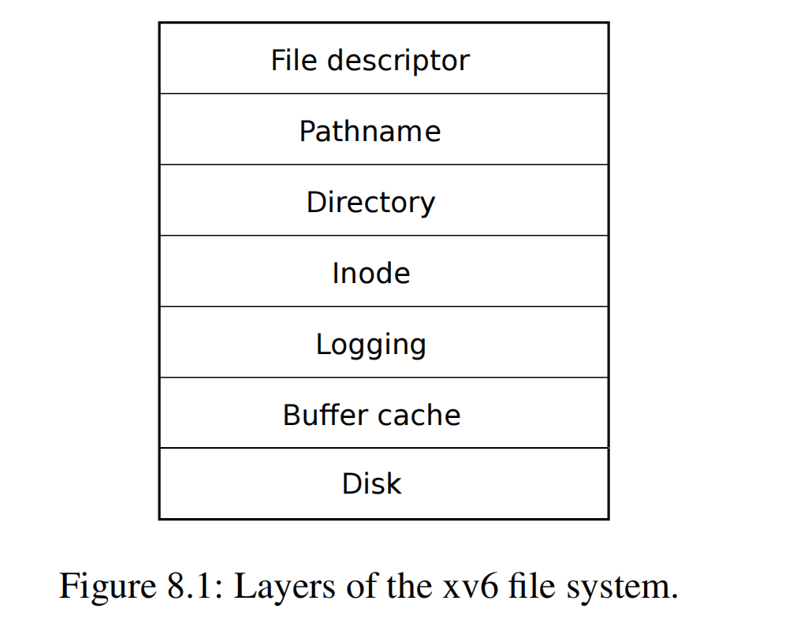
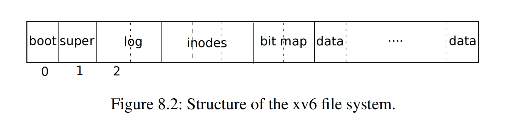
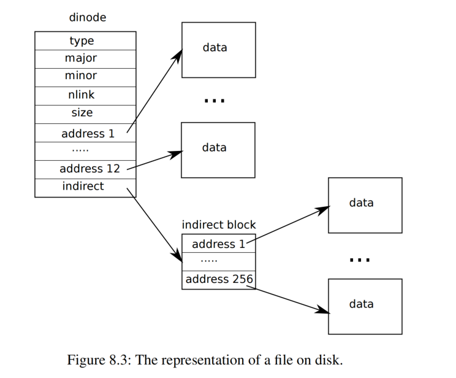

# 第 8 章 文件系统（Chapter 8 File system）

> The purpose of a file system is to organize and store data. File systems typically support sharing of data among users and applications, as well as *persistence* so that data is still available after a reboot.

文件系统（file system）的目的是组织和存储数据。文件系统通常支持在多个用户或者多个应用程序之间共享数据，以及支持 *持久化（persistence）*，即在系统重启后数据仍然存在。

> The xv6 file system provides Unix-like files, directories, and pathnames (see Chapter 1), and stores its data on a virtio disk for persistence. The file system addresses several challenges:
>
> - The file system needs on-disk data structures to represent the tree of named directories and files, to record the identities of the blocks that hold each file’s content, and to record which areas of the disk are free.
> - The file system must support *crash recovery*. That is, if a crash (e.g., power failure) occurs, the file system must still work correctly after a restart. The risk is that a crash might interrupt a sequence of updates and leave inconsistent on-disk data structures (e.g., a block that is both used in a file and marked free).
> - Different processes may operate on the file system at the same time, so the file-system code must coordinate to maintain invariants.
> - Accessing a disk is orders of magnitude slower than accessing memory, so the file system must maintain an in-memory cache of popular blocks.

xv6 的文件系统支持 “类 Unix（Unix-like）” 的 “文件（file）”、“目录（directory）” 和 “路径名（pathname）” 等概念（参考第 1 章），并将其数据存储在 virtio 磁盘上实现 “持久化（persistence）”。文件系统解决了以下几个难题：

- 文件系统需要将存储在磁盘上的数据以目录和文件的形式组织成树状结构，每个目录和文件都有自己的名字标识，同时这个树状的数据结构本身也需要存储在磁盘上。文件系统还需要知道磁盘上哪些 “块（block）” 保存有文件的内容（通过记录这些块的 “标识符（identity）”），以及记录磁盘上哪些区域是空闲的（没有存放数据）。
- 文件系统必须支持 *崩溃恢复（crash recovery）*。也就是说，如果发生崩溃（例如，电源故障），文件系统必须在重新启动后仍能正常工作。而实现这个功能的挑战在于突然发生的崩溃可能会打断当前对磁盘的更新操作序列，这会导致磁盘上的实际数据状态和记录数据状态的数据结构内容之间不一致（例如，一个块被某个文件使用但同时却被标记为空闲）。
- 多个进程可能同时访问文件系统，因此文件系统代码必须协调它们的操作以维持一些 “不变性（invariants）”。
- 访问磁盘的速度比访问内存慢几个数量级，因此文件系统必须利用内存缓存一些经常访问的块的内容（以提高访问速度）。

> The rest of this chapter explains how xv6 addresses these challenges.

本章的其余部分将解释 xv6 如何应对这些挑战。

## 8.1 概述（Overview）



> The xv6 file system implementation is organized in seven layers, shown in Figure 8.1. The disk layer reads and writes blocks on an virtio hard drive. The buffer cache layer caches disk blocks and synchronizes access to them, making sure that only one kernel process at a time can modify the data stored in any particular block. The logging layer allows higher layers to wrap updates to several blocks in a *transaction*, and ensures that the blocks are updated atomically in the face of crashes (i.e., all of them are updated or none). The inode layer provides individual files, each represented as an inode with a unique i-number and some blocks holding the file’s data. The directory layer implements each directory as a special kind of inode whose content is a sequence of directory entries, each of which contains a file’s name and i-number. The pathname layer provides hierarchical path names like `/usr/rtm/xv6/fs.c`, and resolves them with recursive lookup. The file descriptor layer abstracts many Unix resources (e.g., pipes, devices, files, etc.) using the file system interface, simplifying the lives of application programmers.

（译者注：原文称呼磁盘上的块为 block，称呼对应的内存中的副本为 buffer。本译文中将直接使用以示区分并不再翻译为中文。）

xv6 的文件系统实现分为七层，如图 8.1 所示。“磁盘（Disk）” 层读取和写入 virtio 硬盘上的块。“缓存（Buffer cache）” 层缓存 block 并同步对它们的访问，确保每次只有一个内核进程可以修改存储在某个特定 block 中的数据。“日志（Logging）” 层允许上层将对涉及多个 block 的更新操作封装为 *事务（transaction）*，并在遇到崩溃时能够确保更新操作的 “原子性（atomic）”（即，对所有的这些块，要么都更新，要么都不更新）。“索引结点（Inode）” 层向上提供单个文件的概念，每个文件表示为一个 “索引节点（inode）”，每个 inode 具有唯一的 “索引号（i-number）” 并记录了哪些 block 保存了该文件的内容。“目录（Directory）” 层将每个目录实现为一种特殊的 inode，其内容是一组 “目录项（directory entry）”，每个目录项包含一个文件名和它的索引号。“路径名（Pathname）” 层提供了分层的路径名，例如 `/usr/rtm/xv6/fs.c`，并通过递归查找来解析它们。“文件描述符 (File Descriptor)” 层提供文件系统接口抽象了众多 Unix 资源（例如，管道、设备、文件等），简化了面向应用的编程人员的工作。

> Disk hardware traditionally presents the data on the disk as a numbered sequence of 512-byte blocks (also called *sectors*): sector 0 is the first 512 bytes, sector 1 is the next, and so on. The block size that an operating system uses for its file system maybe different than the sector size that a disk uses, but typically the block size is a multiple of the sector size. Xv6 holds copies of blocks that it has read into memory in objects of type `struct buf` (kernel/buf.h:1). The data stored in this structure is sometimes out of sync with the disk: it might have not yet been read in from disk (the disk is working on it but hasn’t returned the sector’s content yet), or it might have been updated by software but not yet written to the disk.

传统上磁盘硬件将磁盘空间划分为 512 字节大小的块（也称为 *扇区（sector）*），并编号排序：扇区 0 是第一个 512 个字节，扇区 1 是下一个，依此类推。操作系统里的文件系统所定义的的 “块（block）” 的大小可能与磁盘定义的扇区大小不同，但通常块的大小是扇区大小的整数倍。xv6 定义了结构体类型 `struct buf` 来表示读入内存的 block 的副本。内存中此结构体中的数据可能会与磁盘上的内容不同步：譬如数据尚未从磁盘读入（磁盘正在处理但尚未返回扇区的内容），或者软件更新了内存中的数据但还没来得及写回磁盘。

> The file system must have a plan for where it stores inodes and content blocks on the disk. To do so, xv6 divides the disk into several sections, as Figure 8.2 shows. The file system does not use block 0 (it holds the boot sector). Block 1 is called the *superblock*; it contains metadata about the file system (the file system size in blocks, the number of data blocks, the number of inodes, and the number of blocks in the log). Blocks starting at 2 hold the log. After the log are the inodes, with multiple inodes per block. After those come bitmap blocks tracking which data blocks are in use. The remaining blocks are data blocks; each is either marked free in the bitmap block, or holds content for a file or directory. The superblock is filled in by a separate program, called `mkfs`, which builds an initial file system.

文件系统必须对在磁盘上如何存储 inode 和数据内容有所规划。为此，xv6 将磁盘划分为几个部分，如图 8.2 所示。文件系统不使用编号为 0 的块（它用于保存 “引导扇区（boot sector）”）。编号为 1 的块称为 *超级块（superblock）*：它包含有关文件系统的 “元数据（metadata）”（譬如文件系统的大小（以 block 为单位）、数据 block 的个数、inode 的个数以及 “日志（log）” 所占用的 block 的个数）。从编号为 2 的 block 开始保存 log。log 存放区的后面是存放 inode 的区域，由多个 block 组成，每个 block 中记录有多个 inode。再往后的 block 用于存放 “位图（bitmap）”，bitmap 用于记录哪些存放数据的 block 正在被使用。其余的 block 存放数据，每个数据 block 要么在 bitmap block 中标记为空闲，要么保存着文件或目录的内容。superblock 中的内容由一个名为 `mkfs` 的程序进行填充，该程序构建了（磁盘上的）初始的文件系统（译者注：`mkfs` 所作的工作即我们常说的磁盘格式化）。

> The rest of this chapter discusses each layer, starting with the buffer cache. Look out for situations where well-chosen abstractions at lower layers ease the design of higher ones.

本章的其余部分将从 “缓存（buffer cache）” 层开始逐个讨论每一层。注意那些在较低层上精心实现的抽象接口是如何简化了较高层的设计。



## 8.2 缓存层（Buffer cache layer）

> The buffer cache has two jobs: (1) synchronize access to disk blocks to ensure that only one copy of a block is in memory and that only one kernel thread at a time uses that copy; (2) cache popular blocks so that they don’t need to be re-read from the slow disk. The code is in `bio.c`. 

Buffer cache 有两个作用：（1）同步对磁盘上 block 的访问，以确保内存中只有一个 block 的副本，并且当前只有一个内核线程访问该副本；（2）缓存常用的 block，这样就不需要每次都从慢速的磁盘重新读取数据。相关代码见 `bio.c`。

> The main interface exported by the buffer cache consists of `bread` and `bwrite`; the former obtains a `buf` containing a copy of a block which can be read or modified in memory, and the latter writes a modified buffer to the appropriate block on the disk. A kernel thread must release a buffer by calling `brelse` when it is done with it. The buffer cache uses a per-buffer sleep-lock to ensure that only one thread at a time uses each buffer (and thus each disk block); `bread` returns a locked buffer, and `brelse` releases the lock.

Buffer cache 的主要接口包括 `bread` 和 `bwrite`；`bread` 会返回一个 `struct buf`（的指针），该结构体在内存中缓存了一个来自 block 的副本供进一步的读写，`bwrite` 将修改后的 buffer 写入磁盘上对应的 block。内核线程在使用完 buffer 后必须通过调用 `brelse` 来释放它。Buffer cache 对每个 buffer 维护一个睡眠锁（per-buffer sleep-lock）来确保每次只有一个线程使用这个 buffer（这也意味着这个 buffer 对应的 block 也受到该睡眠锁的保护）；`bread` 返回一个锁定的 buffer，而 `brelse` 负责释放该锁。

> Let’s return to the buffer cache. The buffer cache has a fixed number of buffers to hold disk blocks, which means that if the file system asks for a block that is not already in the cache, the buffer cache must recycle a buffer currently holding some other block. The buffer cache recycles the least recently used buffer for the new block. The assumption is that the least recently used buffer is the one least likely to be used again soon.

让我们回到 Buffer cache。Buffer cache 管理的 buffer（译者注：即 `struct buf`）数量是有限的，这意味着对于文件系统来说，如果当前访问的 block 尚未缓存（而管理的 buffer 恰好用完了），则 Buffer cache 将回收一些其他使用中的 buffer。Buffer cache 将回收 “最近最少使用（Least Recently Used，缩写即 LRU）” 的 buffer 来保存新的 block。这么做的前提是假设这个所谓的 “最近最少使用” 的 buffer 在概率上也是最不可能马上会被再次访问到的 buffer。

## 8.3 代码讲解：缓存（Code: Buffer cache）

> The buffer cache is a doubly-linked list of buffers. The function `binit`, called by `main` (kernel/main.c:27), initializes the list with the `NBUF` buffers in the static array `buf` (kernel/bio.c:43-52). All other access to the buffer cache refer to the linked list via `bcache.head`, not the `buf` array.

buffer cache 是一个大小为 `NBUF` 的静态数组 `buf`（译者注：即 `bcache.buf`（kernel/bio.c:28）），每个成员是一个 `struct buf` 的结构体，同时这些结构体成员又通过一个双向链表串联起来。`main` 通过调用函数 `binit` (kernel/main.c:27) 初始化该链表 (kernel/bio.c:43-52) 。所有其他对 buffer cache 的访问都通过 `bcache.head` 引用该链表，而不是直接访问 `buf` 数组。

> A buffer has two state fields associated with it. The field `valid` indicates that the buffer contains a copy of the block. The field `disk` indicates that the buffer content has been handed to the disk, which may change the buffer (e.g., write data from the disk into `data`).

每个 buffer 有两个存放状态的成员字段。字段 `valid` 用于表示该 buffer 中是否包含了 block 的副本。字段 `disk` 用于表示是否已经将 buffer 提交给磁盘，注意这里的提交可能会导致 buffer 中的内容发生改变（即，将磁盘上的数据写入 `data`）（译者注：相关内容需要看 `kernel/virtio_disk.c` 中驱动和 virtio 磁盘之间的读写实现逻辑，驱动将读写请求提交给硬件后设置 `disk` 为 1 并等待磁盘处理结束，磁盘完成处理后通过中断通知驱动，驱动再将 `disk` 恢复为 0）。

> `bread` (kernel/bio.c:93) calls `bget` to get a buffer for the given sector (kernel/bio.c:97). If the buffer needs to be read from disk, `bread` calls `virtio_disk_rw` to do that before returning the buffer.

`bread` (kernel/bio.c:93) 调用 `bget` 获取指定扇区对应的 buffer (kernel/bio.c:97)。如果需要从磁盘读取数据到 buffer，`bread` 会调用 `virtio_disk_rw` 执行此操作，然后再返回 buffer。

> `bget` (kernel/bio.c:59) scans the buffer list for a buffer with the given device and sector numbers (kernel/bio.c:65-73). If there is such a buffer, `bget` acquires the sleep-lock for the buffer. `bget` then returns the locked buffer.

`bget` (kernel/bio.c:59) 扫描 buffer 链表，根据函数参数给定的设备号（`dev`）和 block 号（`blockno`）查找对应的 buffer (kernel/bio.c:65-73)。如果 buffer 已经存在，`bget` 会获取该 buffer 的睡眠锁。然后 `bget` 返回锁定的 buffer。

> If there is no cached buffer for the given sector, `bget` must make one, possibly reusing a buffer that held a different sector. It scans the buffer list a second time, looking for a buffer that is not in use (`b->refcnt = 0`); any such buffer can be used. `bget` edits the buffer metadata to record the new device and sector number and acquires its sleep-lock. Note that the assignment `b->valid = 0` ensures that `bread` will read the block data from disk rather than incorrectly using the buffer’s previous contents.

如果对于给定的扇区（即 block）还没有建立对应的 buffer，则 `bget` 必须创建一个，并可能重用那些已经保存了其他扇区内容的 buffer。它会再次扫描 buffer 链表，查找未使用的 buffer（`b->refcnt = 0`）；只要满足这个条件的 buffer 都可以直接拿来使用。`bget` 会编辑 buffer 的 “元数据（metadata）” 以记录新的设备号和扇区号，并获取其睡眠锁。请注意，`bget` 中的 `b->valid = 0` 操作确保该函数返回后 `bread` 将从磁盘重新读取 block 数据，而不是错误地使用 buffer 中先前的内容。

> It is important that there is at most one cached buffer per disk sector, to ensure that readers see writes, and because the file system uses locks on buffers for synchronization. `bget` ensures this invariant by holding the `bache.lock` `bcache.lock` continuously from the first loop’s check of whether the block is cached through the second loop’s declaration that the block is now cached (by setting `dev`, `blockno`, and `refcnt`). This causes the check for a block’s presence and (if not present) the designation of a buffer to hold the block to be atomic. 

每个磁盘扇区（即 block）最多只能对应有一个 buffer，这很重要，只有这样才能确保读取和写入内容的一致性，当然这也是因为文件系统使用了 buffer 上的锁实现了同步。`bget` 中有两个 `for` 循环，第一个循环检查 block 是否已缓存，（如果检查失败）第二个循环选择一个新的 buffer 并标记 block 已缓存（通过设置 `dev`、`blockno` 和 `refcnt`），为了保证这两个循环操作的原子性（即 invariant），进入 `bget` 后首先要做的就是尝试持有 `bcache.lock`。

> It is safe for `bget` to acquire the buffer’s sleep-lock outside of the `bcache.lock` critical section, since the non-zero `b->refcnt` prevents the buffer from being re-used for a different disk block. The sleep-lock protects reads and writes of the block’s buffered content, while the `bcache.lock` protects information about which blocks are cached.

`bget` 中会在 `bcache.lock` 保护的临界区之外尝试获取 buffer 的睡眠锁（译者注：即 `bget` 代码中的两处 `acquiresleep(&b->lock);`），这么做并没有问题，因为非零的 `b->refcnt` 会阻止该 buffer 被其他磁盘 block 重复使用。睡眠锁用于保护对 buffer 中缓存的 block 内容的读写操作，而 `bcache.lock` 用于保护将 block 和 buffer 关联起来的操作。

> If all the buffers are busy, then too many processes are simultaneously executing file system calls; `bget` panics. A more graceful response might be to sleep until a buffer became free, though there would then be a possibility of deadlock.

如果所有 buffer 都被使用了，则说明此时有太多进程在执行文件系统相关的调用；目前 `bget` 对这种情况的处理是直接让系统崩溃（panic）。当然更优雅的处理方式是将进程休眠直到出现空闲的 buffer，但这么做可能会出现死锁。

> Once `bread` has read the disk (if needed) and returned the buffer to its caller, the caller has exclusive use of the buffer and can read or write the data bytes. If the caller does modify the buffer, it must call `bwrite` to write the changed data to disk before releasing the buffer. `bwrite` (kernel/bio.c:107) calls `virtio_disk_rw` to talk to the disk hardware.

一旦 `bread` 读取了磁盘（如果需要）并将 buffer 返回给其调用者，调用者就拥有了 buffer 的独占使用权，可以读取或写入数据字节。如果调用者确实修改了 buffer，则必须调用 `bwrite` 将更改后的数据写入磁盘，然后再释放 buffer。`bwrite` (kernel/bio.c:107) 调用 `virtio_disk_rw` 完成对实际磁盘硬件的读写。

> When the caller is done with a buffer, it must call `brelse` to release it. (The name `brelse`, a shortening of b-release, is cryptic but worth learning: it originated in Unix and is used in BSD, Linux, and Solaris too.) `brelse` (kernel/bio.c:117) releases the sleep-lock and moves the buffer to the front of the linked list (kernel/bio.c:128-133). Moving the buffer causes the list to be ordered by how recently the buffers were used (meaning released): the first buffer in the list is the most recently used, and the last is the least recently used. The two loops in `bget` take advantage of this: the scan for an existing buffer must process the entire list in the worst case, but checking the most recently used buffers first (starting at `bcache.head and following `next` pointers) will reduce scan time when there is good locality of reference. The scan to pick a buffer to reuse picks the least recently used buffer by scanning backward (following `prev` pointers).

当调用者使用完 buffer后，必须调用 `brelse` 来释放它。（ `brelse` 这个名字是 b-release 的缩写，这个函数的名字理解起来有点晦涩，但仍然值得介绍一下：它起源于 Unix，同样也用于 BSD、Linux 和 Solaris 中。）`brelse` (kernel/bio.c:117) 释放睡眠锁并将 buffer 移动到链表的开头 (kernel/bio.c:128-133) 。移动 buffer 会导致链表按 buffer 的使用频率（释放的最近程度）排序：列表中第一个 buffer 是最近使用的，最后一个是最近最少使用的。`bget` 中的两个循环利用了这一点：在最坏的情况下，对现有缓冲区的扫描必须处理整个列表，但首先检查最近使用的 buffer（从 `bcache.head` 开始，沿着 `next` 指针），在引用局部性良好的情况下将减少扫描时间。选择要重用的缓冲区时，通过自后向前扫描（跟随 `prev` 指针）来选择最近最少使用的 buffer。

## 8.4 日志层（Logging layer）

> One of the most interesting problems in file system design is crash recovery. The problem arises because many file-system operations involve multiple writes to the disk, and a crash after a subset of the writes may leave the on-disk file system in an inconsistent state. For example, suppose a crash occurs during file truncation (setting the length of a file to zero and freeing its content blocks). Depending on the order of the disk writes, the crash may either leave an inode with a reference to a content block that is marked free, or it may leave an allocated but unreferenced content block.

文件系统设计中最有趣的问题之一是有关 “崩溃恢复（crash recovery）”。这个问题的出现是因为许多文件系统操作涉及对磁盘的多次写入，而一旦写入操作中途发生了崩溃，则可能导致磁盘上的文件系统处于不一致的状态。例如，假设在文件 “截断（truncation）”（将文件长度设置为零并释放保存文件内容的 block）期间发生崩溃。根据磁盘写入的顺序不同，崩溃发生后，磁盘中的 inode 可能引用了一个 block，但这个 block 在 bitmap 中却是标记为 “空闲（free）” 的，或者反过来，一个 block 在 bitmap 中标记为 “已分配（allocated）”，但是并没有 inode 引用这个 block。

> The latter is relatively benign, but an inode that refers to a freed block is likely to cause serious problems after a reboot. After reboot, the kernel might allocate that block to another file, and now we have two different files pointing unintentionally to the same block. If xv6 supported multiple users, this situation could be a security problem, since the old file’s owner would be able to read and write blocks in the new file, owned by a different user.

后者相对来说还不会导致严重的问题，但对于前者，即一个 inode 引用了已被释放的 block 这种情况，在重新启动后可能会导致严重问题。重新启动后，内核可能会将该 block 分配给另一个文件，现在我们有两个不同的文件无意中指向同一个 block。如果 xv6 支持多个用户，这种情况可能会导致一个安全问题，因为旧文件的所有者将能够访问新文件中的 block，而新文件的所有者有可能是另一个用户。

> Xv6 solves the problem of crashes during file-system operations with a simple form of logging. An xv6 system call does not directly write the on-disk file system data structures. Instead, it places a description of all the disk writes it wishes to make in a *log* on the disk. Once the system call has logged all of its writes, it writes a special *commit* record to the disk indicating that the log contains a complete operation. At that point the system call copies the writes to the on-disk file system data structures. After those writes have completed, the system call erases the log on disk.

xv6 通过实现一套简化版本的日志机制解决了文件系统操作期间的崩溃问题。（引入日志后）每一个 xv6 的系统调用不会直接改写磁盘上的文件系统数据结构。相反，它会将其希望写入磁盘的内容以日志的形式先记录在磁盘上的 log 区域。完成日志记录后系统调用会向磁盘写入一条特殊的 *提交（commit）* 记录，标识该日志包含了一组完整的操作。直到这个时候系统调才会将写入日志中的内容复制到磁盘上的文件系统数据结构中。完成复制后，系统调用将擦除磁盘上的 log 区域。

> If the system should crash and reboot, the file-system code recovers from the crash as follows, before running any processes. If the log is marked as containing a complete operation, then the recovery code copies the writes to where they belong in the on-disk file system. If the log is not marked as containing a complete operation, the recovery code ignores the log. The recovery code finishes by erasing the log.

如果系统崩溃并重新启动，则在运行任何进程之前，文件系统代码将按如下方式从崩溃中恢复。如果日志标记为包含完整操作，则负责恢复的代码会将日志中记录的内容复制到磁盘文件系统中它们应该所在的位置。如果日志没有标记为包含完整操作，则恢复代码将忽略该日志。恢复代码最后会擦除日志。

> Why does xv6’s log solve the problem of crashes during file system operations? If the crash occurs before the operation commits, then the log on disk will not be marked as complete, the recovery code will ignore it, and the state of the disk will be as if the operation had not even started. If the crash occurs after the operation commits, then recovery will replay all of the operation’s writes, perhaps repeating them if the operation had started to write them to the on-disk data structure. In either case, the log makes operations atomic with respect to crashes: after recovery, either all of the operation’s writes appear on the disk, or none of them appear.

为什么 xv6 的日志机制能够解决文件系统操作期间的崩溃问题呢？如果崩溃发生在操作提交之前，那么磁盘上的日志不会被标记为已完成，负责恢复的代码将忽略它，磁盘的状态将如同操作尚未启动一样。如果崩溃发生在操作提交之后，则负责恢复的代码将把日志中的所有写操作再重新执行一遍，如果崩溃之前操作已开始将它们写入磁盘数据结构，则这些操作相当于被执行了两遍。在任何一种情况下，日志都会确保操作在崩溃发生情况下的原子性：也就是说，一旦崩溃恢复后，操作中的写入结果要么都保存在磁盘上，要么都不保存。

## 8.5 日志设计（Log design）

> The log resides at a known fixed location, specified in the superblock. It consists of a header block followed by a sequence of updated block copies (“logged blocks”). The header block contains an array of sector numbers, one for each of the logged blocks, and the count of log blocks. The count in the header block on disk is either zero, indicating that there is no transaction in the log, or nonzero, indicating that the log contains a complete committed transaction with the indicated number of logged blocks. Xv6 writes the header block when a transaction commits, but not before, and sets the count to zero after copying the logged blocks to the file system. Thus a crash midway through a transaction will result in a count of zero in the log’s header block; a crash after a commit will result in a non-zero count.

（磁盘上的）log 位于 superblock 中指定的一个固定位置。它由一个 “头块（header block）” 和紧跟着的一组用于更新的 block 的副本（称之为 “logged block”）组成。header block 包含一个存放扇区号（译者注：这里扇区即 block，下不赘述）的数组（每个扇区号对应一个 logged block 需要更新的 block，译者注：即 `struct logheader` 的 `block` 成员）以及需要参与更新的 logged block 的个数数值（译者注：即 `struct logheader` 的 `n` 成员）。磁盘上的 header block 中的计数 n 如果值为零，表示 log 中没有事务需要更新；如果其值非零，则表示 log 包含一个完整的已提交的事务，其具体值为事务中需要更新的 logged block 的数量。只有在一个事务被实际 “提交（commit）” 时 xv6 才会将内存中的 header block（即全局变量 `log.lh` 写入磁盘中的 header block，在此之前并不会写入，此外，提交过程会在将 logged blocks 全部复制到文件系统实际对应的 block 后再将磁盘中的 header block 中的计数值恢复为零。因此，如果是事务中途（即提交前）发生崩溃，则磁盘中 log 的 header block 中的计数值为仍然为零（译者注：对应一个无效的事务，无需恢复）；如果是提交后发生崩溃将导致计数是一个非零值（译者注：对这种情况，记录的 logged block 内容将在系统重启后被恢复）。

> Each system call’s code indicates the start and end of the sequence of writes that must be atomic with respect to crashes. To allow concurrent execution of file-system operations by different processes, the logging system can accumulate the writes of multiple system calls into one transaction. Thus a single commit may involve the writes of multiple complete system calls. To avoid splitting a system call across transactions, the logging system only commits when no file-system system calls are underway.

考虑到崩溃随时可能发生，为了保证某些对磁盘执行写操作的原子性，系统调用代码中需要明确标注出这些写操作的开始和结束。为了允许不同进程并发执行文件系统操作，日志系统可能会将多个系统调用的写入累积到一个事务中。因此，单个提交可能涉及多个完整的系统调用的写入操作。为了避免一次系统调用中的写操作被拆散在多个事务中，日志系统会确保只有在这些被累积的文件系统调用的写操作全部执行完后才进行提交。

> The idea of committing several transactions together is known as *group commit*. Group commit reduces the number of disk operations because it amortizes the fixed cost of a commit over multiple operations. Group commit also hands the disk system more concurrent writes at the same time, perhaps allowing the disk to write them all during a single disk rotation. Xv6’s virtio driver doesn’t support this kind of batching, but xv6’s file system design allows for it.

将多个事务放在一起提交的做法称为 *组提交（group commit）*。group commit 可以减少操作磁盘的次数，因为每次提交的成本相对固定，有利于分摊多次操作的开销。group commit 也可以为磁盘系统支持更多并发写操作，譬如允许磁盘在一次磁盘旋转过程中写入所有的这些操作。虽然 xv6 的 virtio 驱动程序不支持此类批处理，但从 xv6 的文件系统设计角度来看也是可以支持的。

> Xv6 dedicates a fixed amount of space on the disk to hold the log. The total number of blocks written by the system calls in a transaction must fit in that space. This has two consequences. No single system call can be allowed to write more distinct blocks than there is space in the log. This is not a problem for most system calls, but two of them can potentially write many blocks: `write` and `unlink`. A large file write may write many data blocks and many bitmap blocks as well as an inode block; unlinking a large file might write many bitmap blocks and an inode. Xv6’s write system call breaks up large writes into multiple smaller writes that fit in the log, and `unlink` doesn’t cause problems because in practice the xv6 file system uses only one bitmap block. The other consequence of limited log space is that the logging system cannot allow a system call to start unless it is certain that the system call’s writes will fit in the space remaining in the log.

xv6 在磁盘上预留了固定的空间来保存日志。一次事务中可能包含了多次系统调用发起的写操作，其涉及的 block 总数必须不能超过这个固定空间的大小。这导致两个问题需要考虑：首先任何单个系统调用写入的 block 的个数都不能超过 log 空间的大小。这对于大多数系统调用来说都不是问题，但有两个例外：`write` 和 `unlink`。一个针对大文件的 `write` 可能涉及多个数据 block 和多个 bitmap block 以及一个 inode block；`unlink` 大文件可能会写入许多 bitmap block 和一个 inode block。为此，xv6 的 `write` 系统调用实现中将大的写入分解为适合 log 的多个较小的写入，而 xv6 中的 `unlink` 实际上并不会导致此类问题，因为 xv6 文件系统只使用了一个 bitmap block。由于 log 空间有限，需要考虑的另一个问题是，除非确定 log 中剩余的空间足够系统调用的写入，否则日志系统不会允许发起新的系统调用的写操作。

## 8.6 代码讲解：日志（Code: logging）

> A typical use of the log in a system call looks like this:

在一个系统调用中典型的日志使用例子如下所示：

```c
begin_op();
...
bp = bread(...);
bp->data[...] = ...;
log_write(bp);
...
end_op();
```

> `begin_op` (kernel/log.c:127) waits until the logging system is not currently committing, and until there is enough unreserved log space to hold the writes from this call. `log.outstanding` counts the number of system calls that have reserved log space; the total reserved space is `log.outstanding` times `MAXOPBLOCKS`. Incrementing `log.outstanding` both reserves space and prevents a commit from occurring during this system call. The code conservatively assumes that each system call might write up to `MAXOPBLOCKS` distinct blocks.

`begin_op` (kernel/log.c:127) 只有当如下条件都满足时才会继续，否则会将调用它的任务进入睡眠并等待，条件之一是日志系统当前不处于提交过程中，还有一个前提条件就是有足够的未被占用的 log 空间来保存此调用的写入。`log.outstanding` 记录了当前有多少个系统调用申请使用 log 空间；预留的 block 的个数为 `log.outstanding` 乘以 `MAXOPBLOCKS`。对 `log.outstanding` 加 1 的操作不仅起到预留空间的作用，也防止在此系统调用期间发生提交（译者注：参考 `end_op` 的代码，只有当 `log.outstanding` 为 0 时才会允许提交）。代码保守地假设每次系统调用最多可以写入 `MAXOPBLOCKS` 个不同的 block。

> `log_write` (kernel/log.c:215) acts as a proxy for `bwrite`. It records the block’s sector number in memory, reserving it a slot in the log on disk, and pins the buffer in the block cache to prevent the block cache from evicting it. The block must stay in the cache until committed: until then, the cached copy is the only record of the modification; it cannot be written to its place on disk until after commit; and other reads in the same transaction must see the modifications. `log_write` notices when a block is written multiple times during a single transaction, and allocates that block the same slot in the log. This optimization is often called *absorption*. It is common that, for example, the disk block containing inodes of several files is written several times within a transaction. By absorbing several disk writes into one, the file system can save log space and can achieve better performance because only one copy of the disk block must be written to disk.

`log_write` (kernel/log.c:215) 是 `bwrite` 的支持日志的平替版本。它只会将需要写入的 block 的扇区号记录在内存中，为这个 block 在磁盘上的 log 区中预定一个位置，并调用 `bpin` 将（block 对应的）缓存锁定在 buffer cache 中，以阻止其被回收掉。在最终 commit 之前，block 必须一直留在 cache 中：在最终提交之前，cache 中的这个 block 的唯一副本保留了针对该 block 的所有修改；该 buffer 只有在提交后才会被写入磁盘上对应的 block 的位置；（基于该 cache 的 buffer）同一个事务中的其他读取操作都能看到最新的修改内容。考虑到在单个事务中会针对同一个 block 实现多次写入，`log_write` 会在日志中为该 block 分配相同的槽位。这种优化通常称为 *合并（absorption）*。例如，储存了多个文件 inode 的 block 在一次事务中被多次写入是很常见的情况。通过将多个针对磁盘的写入操作合并到同一个 log 块中，文件系统可以节省日志空间并优化性能，因为最终只有一个 block 的副本被写入磁盘。

> `end_op` (kernel/log.c:147) first decrements the count of outstanding system calls. If the count is now zero, it commits the current transaction by calling `commit()`. There are four stages in this process. `write_log()` (kernel/log.c:179) copies each block modified in the transaction from the buffer cache to its slot in the log on disk. `write_head()` (kernel/log.c:103) writes the header block to disk: this is the commit point, and a crash after the write will result in recovery replaying the transaction’s writes from the log. `install_trans` (kernel/log.c:69) reads each block from the log and writes it to the proper place in the file system. Finally `end_op` writes the log header with a count of zero; this has to happen before the next transaction starts writing logged blocks, so that a crash doesn’t result in recovery using one transaction’s header with the subsequent transaction’s logged blocks.

`end_op` (kernel/log.c:147) 首先减少当前正在写日志的系统调用的计数。如果计数现在为零，则通过调用 `commit()` 提交当前事务。`commit()` 这个过程分为四个阶段。`write_log()`（kernel/log.c:178）将事务中修改的每个 block 从 buffer cache 复制到磁盘上预留的日志槽位中。`write_head()`（kernel/log.c:102）将 header block 写入磁盘：这是 “提交的关键节点（commit point）”，此后系统发生崩溃将导致在日志恢复处理中对事务进行重写。`install_trans`（kernel/log.c:69）从 log 区中读取每个 block 并将其写入文件系统中它应该所在的位置。最后，`end_op` 将 header block 中的计数更新为零；我们需要确保在下一个事务开始写入 logged block 之前完成这项工作，从而避免在崩溃恢复中出现 header block 是当前事务的，而 logged block 却是后续事务的这种错误情况发生。

> `recover_from_log` (kernel/log.c:117) is called from `initlog` (kernel/log.c:55), which is called from `fsinit` (kernel/fs.c:42) during boot before the first user process runs (kernel/proc.c:535). It reads the log header, and mimics the actions of `end_op` if the header indicates that the log contains a committed transaction.

`initlog` (kernel/log.c:55) 会调用 `recover_from_log` (kernel/log.c:117)，而 `initlog` 是在系统启动过程中，在第一个用户进程 (kernel/proc.c:535) 运行之前，由 `fsinit` (kernel/fs.c:42) 调用的。它会读取日志头，如果日志头指示日志包含已提交的事务，则模拟 `end_op` 的操作。

> An example use of the log occurs in `filewrite` (kernel/file.c:135). The transaction looks like this:

有关日志的一个使用示例可以参考 `filewrite` 的实现 (kernel/file.c:135)。其中实现的一个事务如下所示：

```c
begin_op();
ilock(f->ip);
r = writei(f->ip, ...);
iunlock(f->ip);
end_op();
```

> This code is wrapped in a loop that breaks up large writes into individual transactions of just a few sectors at a time, to avoid overflowing the log. The call to `writei` writes many blocks as part of this transaction: the file’s inode, one or more bitmap blocks, and some data blocks.

这段代码被封装在一个循环中，该循环将涉及大量数据的写入操作分解成每次只写入几个扇区的独立事务，以避免日志溢出。对 `writei` 的调用会在一个事务中对多个 block 进行写入，这些 block 涉及：文件的 inode、一个或多个 bitmap block 以及一些数据 block。

## 8.7 代码讲解：块分配器（Code: Block allocator）

> File and directory content is stored in disk blocks, which must be allocated from a free pool. Xv6’s block allocator maintains a free bitmap on disk, with one bit per block. A zero bit indicates that the corresponding block is free; a one bit indicates that it is in use. The program `mkfs` sets the bits corresponding to the boot sector, superblock, log blocks, inode blocks, and bitmap blocks.

文件和目录的内容存储在磁盘 block 中，这些 block 通过统一的资源池机制进行分配和管理。xv6 的 “块分配器（block allocator）” 在磁盘上维护一个记录 block 使用状态的 bitmap，每个 block 对应 bitmap 中的一个 bit 位。如果这个 bit 位的值是 0 则表示相应的 block 可用；如果这个 bit 位的值是 1 则表示对应的 block 已被使用。程序 `mkfs` 负责设置与引导扇区、superblock、log、inode 和 bitmap 所占用的 block 对应的比特位。

> The block allocator provides two functions: `balloc` allocates a new disk block, and `bfree` frees a block. `balloc` The loop in `balloc` at (kernel/fs.c:72) considers every block, starting at block 0 up to `sb.size`, the number of blocks in the file system. It looks for a block whose bitmap bit is zero, indicating that it is free. If `balloc` finds such a block, it updates the bitmap and returns the block. For efficiency, the loop is split into two pieces. The outer loop reads each block of bitmap bits. The inner loop checks all Bits-Per-Block (`BPB`) bits in a single bitmap block. The race that might occur if two processes try to allocate a block at the same time is prevented by the fact that the buffer cache only lets one process use any one bitmap block at a time.

块分配器提供两个函数接口：`balloc` 用于分配一个新的磁盘 block，`bfree` 用于释放一个 block。`balloc` (kernel/fs.c:72) 中有一个循环遍历每个 block，从 0 开始直到 `sb.size`（文件系统中支持的 block 的最大个数），在 bitmap 中寻找对应的 bit 位的值为零的 block（即空闲的 block）。如果 `balloc` 找到这样的 block，则更新 bitmap 并返回该 block 的下标。为了提高效率，循环被分成两部分。外层循环遍历每个存放 bitmap bit 的 block（译者注：由于 xv6 的文件系统支持的 block 数量有限，实际上访问的 bp 都是同一份 buffer cache。而且外层循环实际上也只会运行一次，因为除非 block 耗尽，总会在内层循环中找到空闲的 block）。内层循环检查单个位图 block 中的所有 bit 位 (Bits-Per-Block，简称 `BPB`)。由于 buffer cache 一次只允许一个进程访问一个 bitmap block，这也避免了两个进程同时尝试分配一个 block 时可能发生的竞争。

> `bfree` (kernel/fs.c:92) finds the right bitmap block and clears the right bit. Again the exclusive use implied by `bread` and `brelse` avoids the need for explicit locking.

`bfree` (kernel/fs.c:92) 找到正确的 bitmap 所在 block 并清除对应的位。同样，由于 `bread` 和 `brelse` 中隐含的独占使用，所以在 `bfree` 中我们同样没有为操作显示上锁。

> As with much of the code described in the remainder of this chapter, `balloc` and `bfree` must be called inside a transaction.

与本章其余部分描述的大部分代码一样，对 `balloc` 和 `bfree` 的调用必须包括在一个事务中。

## 8.8 索引节点层（Inode layer）

> The term *inode* can have one of two related meanings. It might refer to the on-disk data structure containing a file’s size and list of data block numbers. Or “inode” might refer to an in-memory inode, which contains a copy of the on-disk inode as well as extra information needed within the kernel.

术语 *索引节点（inode）* 有两种含义。一种是指磁盘上记录文件大小和一组数据 block 编号的数据结构（译者注：即下文将介绍的 `struct dinode`）。另一种是指内存中的一个数据结构（译者注：即下文将介绍的 `struct inode`），它包含了磁盘上的 inode 的副本以及一些内核所需的额外信息。

> The on-disk inodes are packed into a contiguous area of disk called the inode blocks. Every inode is the same size, so it is easy, given a number n, to find the nth inode on the disk. In fact, this number n, called the inode number or i-number, is how inodes are identified in the implementation.

磁盘上的 inode 占据了磁盘上的一个连续的区域，由多个含有 inode 信息的 block 组成。每个 inode 的大小相同，因此，给定一个数字 n，很容易找到磁盘上的第 n 个 inode。实际上，在实现中我们正是利用这个数字 n（称为 inode number 或 i-number）来标识 inode。

> The on-disk inode is defined by a `struct dinode` (kernel/fs.h:32). The `type` field distinguishes between files, directories, and special files (devices). A type of zero indicates that an on-disk inode is free. The `nlink` field counts the number of directory entries that refer to this inode, in order to recognize when the on-disk inode and its data blocks should be freed. The `size` field records the number of bytes of content in the file. The `addrs` array records the block numbers of the disk blocks holding the file’s content.

磁盘上的 inode 对应结构体 `struct dinode` (kernel/fs.h:32) 。其 `type` 字段用于区分这个 inode 是文件、目录还是特殊文件（设备）。如果 `type` 值为零则表示磁盘上的这个 inode 未被使用。`nlink` 字段用于统计有多少个 “目录项（directory entry）” 会引用此 inode，以便识别何时应释放磁盘上的 inode 及其数据块。`size` 字段记录文件实际的大小（单位是字节）。`addrs` 数组记录所有保存该文件内容的 block 的编号。

> The kernel keeps the set of active inodes in memory in a table called `itable`; `struct inode` (kernel/file.h:17) is the in-memory copy of a `struct dinode` on disk. The kernel stores an inode in memory only if there are C pointers referring to that inode. The `ref` field counts the number of C pointers referring to the in-memory inode, and the kernel discards the inode from memory if the reference count drops to zero. The `iget` and `iput` functions acquire and release pointers to an inode, modifying the reference count. Pointers to an inode can come from file descriptors, current working directories, and transient kernel code such as `exec`.

内核将当前所有活跃的 inode 保存在内存中一个名为 `itable` 的表中；`struct inode`（kernel/file.h:17）是磁盘上 `struct dinode` 在内存中的副本。只有当有 C 语言指针引用该 inode 时，内核才会将该 inode 存储在内存中。`ref` 字段统计内存中 inode 的引用数量，如果引用计数降至零，内核会从内存中丢弃该 inode。`iget` 和 `iput` 函数用于获取和释放指向 inode 的指针，从而修改引用计数。对 inode 的访问（一般通过指针）可能来自文件描述符、当前工作目录以及诸如 `exec` 之类的内核代码。

译者注：注意原文提到 inode 时可能根据上下文的不同会有不同的含义。譬如，当上下文指的是磁盘中的 inode 时，对应的是 `struct dinode`；当上下文指的是内存中的 inode 时，对应的是 `itable` 的表中 `struct inode` 项。涉及指针访问的 inode 时不加特殊说明指的当然是内存中的 `struct inode`。如果没有特别的上下文限定，inode 更多表达的是文件系统中索引节点的概念，此时会更倾向于指的是磁盘中的 inode。

> There are four lock or lock-like mechanisms in xv6’s inode code. `itable.lock` protects the invariant that an inode is present in the inode table at most once, and the invariant that an in-memory inode’s `ref` field counts the number of in-memory pointers to the inode. Each in-memory inode has a `lock` field containing a sleep-lock, which ensures exclusive access to the inode’s fields (such as file length) as well as to the inode’s file or directory content blocks. An inode’s `ref`, if it is greater than zero, causes the system to maintain the inode in the table, and not re-use the table entry for a different inode. Finally, each inode contains a `nlink` field (on disk and copied in memory if in memory) that counts the number of directory entries that refer to a file; xv6 won’t free an inode if its link count is greater than zero.

xv6 的 inode 相关处理代码中使用了四种锁或类似锁的机制。`itable.lock` 确保每个磁盘上的 inode 在 inode 表中只会有一个副本，此外该锁也保护了对内存中 inode 的 `ref` 字段的更新动作（该字段用于计数指向该 inode 的指针个数）。每个 `struct inode` 都有一个 `lock` 字段，这是一把睡眠锁，用于确保对 `struct inode` 中成员字段（例如 `size`）以及存放 inode 的文件或目录内容的 block 的独占访问。当 `struct inode` 的 `ref` 大于零时，则系统确保不会将 inode 表的该项回收并重复用于其他的 inode。最后，每个 inode 都包含一个 `nlink` 字段（磁盘上的 `struct dinode` 和内存中的 `struct inode` 都有这个字段，`struct inode` 的值复制自 `struct dinode`），该字段用于计数引用某个文件的 directory entry 的数量；只要该值大于零，则 xv6 不会释放该 inode。

> A `struct inode` pointer returned by `iget()` is guaranteed to be valid until the corresponding call to `iput()`; the inode won’t be deleted, and the memory referred to by the pointer won’t be re-used for a different inode. `iget()` provides non-exclusive access to an inode, so that there can be many pointers to the same inode. Many parts of the file-system code depend on this behavior of `iget()`, both to hold long-term references to inodes (as open files and current directories) and to prevent races while avoiding deadlock in code that manipulates multiple inodes (such as pathname lookup).

内核保证 `iget()` 返回的 `struct inode` 指针在调用对应 `iput()` 之前一直有效；即该 inode 不会被删除，并且该指针指向的内存不会被其他 inode 重复使用。`iget()` 提供对 inode 的非独占访问，因此可以有多个指针指向同一个 inode。文件系统代码的许多部分都依赖于 `iget()` 的这种行为，既可以保存对 inode 的长期引用（例如打开的文件和当前目录），也可以防止争用，同时避免在操作多个 inode 的代码（例如路径名查找）中出现死锁。

> The `struct inode` that `iget` returns may not have any useful content. In order to ensure it holds a copy of the on-disk inode, code must call `ilock`. This locks the inode (so that no other process can `ilock` it) and reads the inode from the disk, if it has not already been read. `iunlock` releases the lock on the inode. Separating acquisition of inode pointers from locking helps avoid deadlock in some situations, for example during directory lookup. Multiple processes can hold a C pointer to an inode returned by `iget`, but only one process can lock the inode at a time.

`iget` 返回 `struct inode` 时可能还没有将磁盘上对应的 inode 的内容读入缓存。为了确保它已经加载了这部分内容，代码必须继续调用 `ilock`。这会锁定 inode（以便其他进程无法 `ilock` 它），并从磁盘读取该 inode（如果尚未读取）。`iunlock` 会释放对 inode 的锁定。将 inode 指针的获取与锁定分离有助于避免在某些情况下（例如在目录查找期间）发生死锁。多个进程可以持有指向 `iget` 返回的 inode 的 C 指针，但一次只能有一个进程可以锁定该 inode。

> The inode table only stores inodes to which kernel code or data structures hold C pointers. Its main job is synchronizing access by multiple processes. The inode table also happens to cache frequently-used inodes, but caching is secondary; if an inode is used frequently, the buffer cache will probably keep it in memory. Code that modifies an in-memory inode writes it to disk with `iupdate`.

inode 表（即 `itable`）仅存储内核代码或数据结构中 C 指针指向的 inode。它的主要作用是同步多个进程的访问。inode 表也会缓存常用的 inode，但这里缓存的作用是次要的；如果某个 inode 被频繁使用，buffer cache 也可能会将其保留在内存中。如果代码修改了内存中的 inode 还需要使用 `iupdate` 将其同步回磁盘中。

## 8.9 代码讲解：索引节点（Code: Inodes）

> To allocate a new inode (for example, when creating a file), xv6 calls `ialloc` (kernel/fs.c:199). `ialloc` is similar to `balloc`: it loops over the inode structures on the disk, one block at a time, looking for one that is marked free. When it finds one, it claims it by writing the new `type` to the disk and then returns an entry from the inode table with the tail call to `iget` (kernel/fs.c:213). The correct operation of `ialloc` depends on the fact that only one process at a time can be holding a reference to `bp`: `ialloc` can be sure that some other process does not simultaneously see that the inode is available and try to claim it.

为了分配新的 inode（例如，创建文件时），xv6 会调用 `ialloc` (kernel/fs.c:199)。`ialloc` 类似于 `balloc`，该函数会在磁盘上存放 inode 的 block 中进行遍历，寻找标记为空闲的项。找到后，它会更新其 `type` 字段为非零值（表示占用），最后以尾调用的方式通过 `iget` (kernel/fs.c:213) 返回 inode 表中的项。`ialloc` 正确工作的前提取决于同一时间只有一个进程可以持有对 `bp` 的引用：`ialloc` 可以确保其他进程不会同时发现该 inode 可用并尝试占用它。

> `iget` (kernel/fs.c:247) looks through the inode table for an active entry (`ip->ref > 0`) with the desired device and inode number. If it finds one, it returns a new reference to that inode (kernel/fs.c:256-260). As `iget` scans, it records the position of the first empty slot (kernel/fs.c:261-262), which it uses if it needs to allocate a table entry.

`iget` (kernel/fs.c:247) 在 inode 表中查找有效的 (`ip->ref > 0`) 的项，同时将该项的设备号与 inode 编号和给定的入参值进行匹配。如果找到，它会递增该 inode 的 `ref` 值并返回其指针。在扫描过程中 `iget` 会记录第一个可用项的位置 (kernel/fs.c:261-262) ，以便需要在 inode 表中分配新的项时直接定位到第一个可用项的位置（避免再扫描一遍）。

> Code must lock the inode using `ilock` before reading or writing its metadata or content. `ilock` (kernel/fs.c:293) uses a sleep-lock for this purpose. Once `ilock` has exclusive access to the inode, it reads the inode from disk (more likely, the buffer cache) if needed. The function `iunlock` (kernel/fs.c:321) releases the sleep-lock, which may cause any processes sleeping to be woken up.

在读取或写入 inode 的 “元数据（metadata）” 或文件内容之前，代码必须使用 `ilock` 锁定 inode。`ilock` (kernel/fs.c:293) 使用睡眠锁来实现此目的。一旦 `ilock` 获得 inode 的独占访问权限，它会根据需要从磁盘（更可能是 buffer cache）读取 inode。函数 `iunlock` (kernel/fs.c:321) 会释放睡眠锁，这可能会导致其他处于休眠状态的进程被唤醒。

> `iput` (kernel/fs.c:337) releases a C pointer to an inode by decrementing the reference count (kernel/fs.c:360). If this is the last reference, the inode’s slot in the inode table is now free and can be re-used for a different inode.

`iput` (kernel/fs.c:337) 通过减少引用计数 (kernel/fs.c:360) 释放指向某个 inode 的 C 指针。如果这是最后一处引用，则此时我们可以释放该 inode 在 inode 表中的槽位，并将其重新用于其他 inode。

> If `iput` sees that there are no C pointer references to an inode and that the inode has no links to it (occurs in no directory), then the inode and its data blocks must be freed. `iput` calls `itrunc` to truncate the file to zero bytes, freeing the data blocks; sets the inode type to 0 (unallocated); and writes the inode to disk (kernel/fs.c:342).

如果 `iput` 发现不再有 C 指针引用某个 inode，并且该 inode 没有被任何链接所引用（换句话说，在任何目录下我们都找不到该文件），此时我们必须释放该 inode 及其相关联的数据 block。`iput` 调用 `itrunc` 将文件长度 “截断（truncate）” 为零，这会释放占用的数据 block（译者注：仅仅修改 bitmap，并不会清理实际 block 上的内容）；然后将 inode 类型设置为 0（表示未分配）；最后将内存中 inode 的修改回写入磁盘（kernel/fs.c:342）。

> The locking protocol in `iput` in the case in which it frees the inode deserves a closer look. One danger is that a concurrent thread might be waiting in `ilock` to use this inode (e.g., to read a file or list a directory), and won’t be prepared to find that the inode is no longer allocated. This can’t happen because there is no way for a system call to get a pointer to an in-memory inode if it has no links to it and `ip->ref` is one. That one reference is the reference owned by the thread calling `iput`. The other main danger is that a concurrent call to `ialloc` might choose the same inode that `iput` is freeing. This can happen only after the `iupdate` writes the disk so that the inode has type zero. This race is benign; the allocating thread will politely wait to acquire the inode’s sleep-lock before reading or writing the inode, at which point `iput` is done with it.

在 `iput` 函数中涉及释放 inode 的处理过程中的锁机制设计值得仔细研究一下。一个需要考虑的风险是，另一个并发线程可能正在 `ilock` 中等待使用此 inode（例如，读取文件或列出目录），如果当它醒来后发现该 inode 已经被释放掉肯定是不行的。这种情况实际上并不会发生，因为当一个系统调用得到指向该 inode 的指针时，该 inode 的 `nlink` 的值不可能为 0 而且其 `ref` 也不可能为 1。该引用是调用 `iput` 的线程所拥有的引用。另一个主要风险是，对 `ialloc` 的并发调用可能会选择 `iput` 正在释放的同一个 inode。这种情况只有在 `iupdate` 写入磁盘后，即 inode 的 `type` 为零时才会发生。这种竞争不会导致什么问题；调用 `ialloc` 的线程会礼貌地等待获取 inode 的睡眠锁，然后再读取或写入 inode，此时 `iput` 已完成对它的处理。

> `iput()` can write to the disk. This means that any system call that uses the file system may write to the disk, because the system call may be the last one having a reference to the file. Even calls like `read()` that appear to be read-only, may end up calling `iput()`. This, in turn, means that even read-only system calls must be wrapped in transactions if they use the file system.

`iput()` 涉及对磁盘的写入操作。这意味着任何使用文件系统的系统调用都会涉及对磁盘的写入操作，因为该系统调用可能是最后一个引用该文件的调用。即使像 `read()` 这样看似只读的调用，最终也可能调用 `iput()`。反过来，这意味着即使是只读的系统调用，如果使用文件系统，也必须封装在事务中。

> There is a challenging interaction between `iput()` and crashes. `iput()` doesn’t truncate a file immediately when the link count for the file drops to zero, because some process might still hold a reference to the inode in memory: a process might still be reading and writing to the file, because it successfully opened it. But, if a crash happens before the last process closes the file descriptor for the file, then the file will be marked allocated on disk but no directory entry will point to it.

针对系统崩溃场景，`iput()` 的处理逻辑中存在一个棘手的问题。当文件的链接计数降至零时，`iput()` 不会立即清除文件的内容（truncate），因为某些进程可能仍在内存中持有对 inode 的引用：进程可能仍在准备读取和写入该文件，因为它已成功打开该文件。但是，如果崩溃发生在最后一个进程关闭文件的文件描述符之前，那么该文件将在磁盘上被标记为已分配，但没有 directory entry 指向它。

> File systems handle this case in one of two ways. The simple solution is that on recovery, after reboot, the file system scans the whole file system for files that are marked allocated, but have no directory entry pointing to them. If any such file exists, then it can free those files.

文件系统有两种方法来处理这种情况。一种简单的解决方案是，在系统恢复时，也就是重启后，文件系统会扫描整个文件系统，查找那些标记为 “已分配” 但没有 directory entry 指向的文件。如果存在这样的文件，就可以释放它们。

> The second solution doesn’t require scanning the file system. In this solution, the file system records on disk (e.g., in the super block) the inode inumber of a file whose link count drops to zero but whose reference count isn’t zero. If the file system removes the file when its reference count reaches 0, then it updates the on-disk list by removing that inode from the list. On recovery, the file system frees any file in the list.

第二种解决方案不需要扫描文件系统。在该解决方案中，文件系统会在磁盘上（例如，在 superblock 中）记录链接计数降至零但引用计数不为零的文件的 inode 编号。如果文件系统在引用计数达到 0 时删除该文件，则会通过从列表中删除该 inode 来更新磁盘上的列表。恢复后，文件系统将释放列表中所有的文件。

> Xv6 implements neither solution, which means that inodes may be marked allocated on disk, even though they are not in use anymore. This means that over time xv6 runs the risk that it may run out of disk space.

上述的两种方案 xv6 都没有实现，这意味着即使 inode 不再使用，它​​们也可能被标记为已分配。所以随着时间的推移，xv6 可能会面临耗尽磁盘空间的风险。

## 8.10 代码讲解：索引节点的内容（Code: Inode content）



> The on-disk inode structure, `struct dinode`, contains a size and an array of block numbers (see Figure 8.3). The inode data is found in the blocks listed in the `dinode`’s `addrs` array. The first `NDIRECT` blocks of data are listed in the first `NDIRECT` entries in the array; these blocks are called *direct* blocks. The next `NINDIRECT` blocks of data are listed not in the inode but in a data block called the *indirect block*. The last entry in the `addrs` array gives the address of the indirect block. Thus the first 12 kB (`NDIRECT x BSIZE`) bytes of a file can be loaded from blocks listed in the inode, while the next `256` kB (`NINDIRECT x BSIZE`) bytes can only be loaded after consulting the indirect block. This is a good on-disk representation but a complex one for clients. The function `bmap` manages the representation so that higher-level routines, such as `readi` and `writei`, which we will see shortly, do not need to manage this complexity. `bmap` returns the disk block number of the `bn`’th data block for the inode `ip`. If `ip` does not have such a block yet, `bmap` allocates one.

磁盘上的 inode 结构体 `struct dinode` 包含一个 `size` 字段和一个存放 block 编号的数组（参见图 8.3）。inode 的数据存放于 `dinode` 的 `addrs` 数组中列出的 block 中。数组的前 `NDIRECT`（译者注：常量值 12，定义在 kernel/fs.h:27）项对应 `NDIRECT` 个数据 block，这些 block 称为 *直接块（direct block）*。还有 `NINDIRECT`（译者注：常量值 256，定义在 kernel/fs.h:28）个数据 block 的编号没有直接存放在 `addrs` 数组中，而是存放在一个称为 *间接块（indirect block）* 的数据 block 中。`addrs` 数组中的最后一项给出了 indirect block 的编号。因此，文件的前 12 kB（`NDIRECT x BSIZE`）字节可以从 inode 中列出的 block 加载，而接下来的 `256` kB（`NINDIRECT x BSIZE`）字节只能在查阅 indirect block 后才能加载。这是一种优化设计，但对于使用者来说比较复杂。函数 `bmap` 封装了对 inode 中数据块的管理（译者注：即对 `inode` 的 `addrs` 数组的访问），这样更高级别的函数（例如我们稍后会看到的 `readi` 和 `writei`）就无需考虑这种复杂性了。`bmap` 返回 `ip` 的第 `bn` 个数据块的 block 编号。如果 `ip` 还没有这样的 block，`bmap` 就会分配一个。

> The function `bmap` (kernel/fs.c:383) begins by picking off the easy case: the first `NDIRECT` blocks are listed in the inode itself (kernel/fs.c:388-396). The next `NINDIRECT` blocks are listed in the indirect block at `ip->addrs[NDIRECT]`. `bmap` reads the indirect block (kernel/fs.c:407) and then reads a block number from the right position within the block (kernel/fs.c:408). If the block number exceeds `NDIRECT+NINDIRECT`, `bmap` panics; `writei` contains the check that prevents this from happening (kernel/fs.c:513).

函数 `bmap` (kernel/fs.c:383) 首先处理相对简单的情况：即前 `NDIRECT` 个列在 inode 中的 block (kernel/fs.c:388-396)。后面的 `NINDIRECT` 个 block 列在 indirect block，即 `ip->addrs[NDIRECT]` 中。（为了获取这后面的 `NINDIRECT` 个 block）`bmap` 先读取 indirect block (kernel/fs.c:407)，然后从这个 block 中的正确位置再读取 block 编号 (kernel/fs.c:408)。如果 block 编号超过 `NDIRECT+NINDIRECT`，`bmap` 就直接 panic；`writei` 会检查这种异常，防止其发生 (kernel/fs.c:513)。

> `bmap` allocates blocks as needed. An `ip->addrs[]` or indirect entry of zero indicates that no block is allocated. As `bmap` encounters zeros, it replaces them with the numbers of fresh blocks, allocated on demand (kernel/fs.c:389-390) (kernel/fs.c:401-402).

`bmap` 会根据需要分配 block。如果 `ip->addrs[]` 或 indirect block 中的项的值为零表示未分配任何块。当 `bmap` 遇到零值时，它会将其替换为按需分配的新的 block 的编号 (kernel/fs.c:389-390) (kernel/fs.c:401-402)。

> `itrunc` frees a file’s blocks, resetting the inode’s size to zero. `itrunc` (kernel/fs.c:426) starts by freeing the direct blocks(kernel/fs.c:432-437), then the ones listed in the indirect block (kernel/fs.c:442-445), and finally the indirect block itself (kernel/fs.c:447-448).

`itrunc` 释放文件的 block，将 inode 的 `size` 重置为零。`itrunc` (kernel/fs.c:426) 首先释放 direct block (kernel/fs.c:432-437)，然后释放 indirect block (kernel/fs.c:442-445) 中列出的 block，最后释放 indirect block 本身 (kernel/fs.c:447-448)。

> `bmap` makes it easy for `readi` and `writei` to get at an inode’s data. `readi` (kernel/fs.c:472) starts by making sure that the offset and count are not beyond the end of the file. Reads that start beyond the end of the file return an error (kernel/fs.c:477-478) while reads that start at or cross the end of the file return fewer bytes than requested (kernel/fs.c:479-480). The main loop processes each block of the file, copying data from the buffer into `dst` (kernel/fs.c:482-494). `writei` (kernel/fs.c:506) is identical to `readi`, with three exceptions: writes that start at or cross the end of the file grow the file, up to the maximum file size (kernel/fs.c:513-514); the loop copies data into the buffers instead of out (kernel/fs.c:522); and if the write has extended the file, `writei` must update its size (kernel/fs.c:530-531).

通过调用 `bmap`，`readi` 和 `writei` 可以轻松获取 inode 的数据。`readi` (kernel/fs.c:472) 首先确保起始位置（`off`）和结束位置（`off + n`）不超过文件末尾。读取时起始位置超出了文件末尾将返回错误 (kernel/fs.c:477-478)，而结束位置超出文件末尾将按照文件实际长度进行读取（这将比实际请求的字节数更少）(kernel/fs.c:479-480)。主循环处理文件的每个 block，将数据从缓冲区复制到 `dst` (kernel/fs.c:482-494)。`writei` (kernel/fs.c:506) 与 `readi` 相同，但有三个例外：首先，写入的结束位置超出文件末尾会使文件增大，直到达到最大文件大小 `MAXFILE*BSIZE` (kernel/fs.c:513-514)；其次，`writei` 中的循环是将数据复制到缓冲区中去而不是把缓冲区中的数据往外复制（kernel/fs.c:522）；最后，如果写入操作扩展了文件大小，则 `writei` 必须更新其 `size`（kernel/fs.c:530-531）。

> The function `stati` (kernel/fs.c:458) copies inode metadata into the `stat` structure, which is exposed to user programs via the `stat` system call.

函数 `stati`（kernel/fs.c:458）将 inode 的 “元数据（metadata）” 复制到 `struct stat` 结构体中，用户通过 `stat` 系统调用可以访问该结构体的内容。

## 8.11 代码讲解：目录层（Code: directory layer）

> A directory is implemented internally much like a file. Its inode has type `T_DIR` and its data is a sequence of directory entries. Each entry is a `struct dirent` (kernel/fs.h:56), which contains a name and an inode number. The name is at most `DIRSIZ` (14) characters; if shorter, it is terminated by a NULL (0) byte. Directory entries with inode number zero are free.

“目录（directory）” 的内部实现与文件非常相似（译者注：即每一个 directory 也对应一个 inode）。其 inode 的 `type` 为 `T_DIR`，其数据是一组 “目录项（directory entry）”（译者注：下文也会简称为 entry）。每一个 directory entry 对应一个结构体 `struct dirent`（kernel/fs.h:56），该结构体包含一个 `name` 和一个 inode 编号（`inum`）。`name` 最多包含 `DIRSIZ`（14）个字符；如果少于 14 个字符，则以 NULL（0）字节结尾。如果 inode 编号为 0 说明该 directory entry 未被使用。

> The function `dirlookup` (kernel/fs.c:552) searches a directory for an entry with the given name. If it finds one, it returns a pointer to the corresponding inode, unlocked, and sets `*poff` to the byte offset of the entry within the directory, in case the caller wishes to edit it. If `dirlookup` finds an entry with the right name, it updates `*poff` and returns an unlocked inode obtained via `iget`. `dirlookup` is the reason that `iget` returns unlocked inodes. The caller has locked `dp`, so if the lookup was for ., an alias for the current directory, attempting to lock the inode before returning would try to re-lock dp and deadlock. (There are more complicated deadlock scenarios involving multiple processes and .., an alias for the parent directory; . is not the only problem.) The caller can unlock `dp` and then lock `ip`, ensuring that it only holds one lock at a time.

函数 `dirlookup`（kernel/fs.c:552）在 directory 中搜索具有给定名称的 entry。如果找到，它将返回该 entry 对应的 inode 的指针（此时还未锁定），并将出参 `*poff` 设置为该 entry 在 directory 中的字节偏移量，以便调用者对其进行编辑。如果 `dirlookup` 找到具有正确名称的 entry，它将给 `*poff` 赋值，并通过 `iget` 获取未锁定的 inode 的指针并返回该指针。之所以这里 `iget` 返回未锁定的 inode 的原因在于 `dirlookup` 的调用者已锁定 `dp`（即当前目录），因此如果查找的是 “.”（当前目录的别名），则在返回之前尝试锁定 inode 会导致重复锁定 dp 并导致死锁（“.” 不是唯一的问题，多进程并发情况下访问 “..”（父目录的别名）同样存在复杂的死锁风险。）。所以我们让 `dirlookup` 的调用者来负责解锁 `dp`，然后再锁定 `ip`，确保它一次只持有一个锁。

> The function `dirlink` (kernel/fs.c:580) writes a new directory entry with the given name and inode number into the directory `dp`. If the name already exists, `dirlink` returns an error (kernel/fs.c:586-590). The main loop reads directory entries looking for an unallocated entry. When it finds one, it stops the loop early (kernel/fs.c:592-597), with `off` set to the offset of the available entry. Otherwise, the loop ends with `off` set to `dp->size`. Either way, `dirlink` then adds a new entry to the directory by writing at offset `off` (kernel/fs.c:602-603).

函数 `dirlink`（kernel/fs.c:580）通过给定名字和 inode 编号将一个新的 directory entry 加入 `dp` 指向的 directory。如果该名字已存在，`dirlink` 将返回错误（kernel/fs.c:586-590）。函数中的循环会检查 directory 中的 directory entry 数组，查找尚未分配的 entry。如果找到，则会提前停止循环（kernel/fs.c:592-597），并将 `off` 设置为可用 entry 的偏移量。否则，循环结束后 `off` 会被设置为 `dp->size`。无论哪种情况，`dirlink` 都会在偏移量 `off` 处为 directory 中添加一个新的 entry（kernel/fs.c:602-603）。

## 8.12 代码讲解：路径名称（Code: Path names）

> Path name lookup involves a succession of calls to `dirlookup`, one for each path component. `namei` (kernel/fs.c:687) evaluates `path` and returns the corresponding `inode`. The function `nameiparent` is a variant: it stops before the last element, returning the inode of the parent directory and copying the final element into `name`. Both call the generalized function `namex` to do the real work.

路径名查找涉及对 `dirlookup` 的多次连续调用，路径中以 “/” 分隔的每个部分（译者注：原文中称之为 component 或者 element）都对应一次。`namei` (kernel/fs.c:687) 会解析 `path` 并返回该路径对应的 `inode`。函数 `nameiparent` 是 `namei` 的一个 “变体（variant）”：它会取出 `path` 的最后一个 element 之前的部分（即该 element 的父目录的路径）并返回父目录路径的 inode，最后一个 element 则被复制到 `name` 中返回。`namei` 和 `nameiparent` 内部都是通过调用公共函数 `namex` 来完成实际的工作。

> `namex` (kernel/fs.c:652) starts by deciding where the path evaluation begins. If the path begins with a slash, evaluation begins at the root; otherwise, the current directory (kernel/fs.c:656-659). Then it uses `skipelem` to consider each element of the path in turn (kernel/fs.c:661). Each iteration of the loop must look up `name` in the current inode `ip`. The iteration begins by locking `ip` and checking that it is a directory. If not, the lookup fails (kernel/fs.c:662-666). (Locking `ip` is necessary not because `ip->type` can change underfoot—it can’t—but because until `ilock` runs, `ip->type` is not guaranteed to have been loaded from disk.) If the call is `nameiparent` and this is the last path element, the loop stops early, as per the definition of `nameiparent`; the final path element has already been copied into `name`, so `namex` need only return the unlocked `ip` (kernel/fs.c:667-671). Finally, the loop looks for the path element using `dirlookup` and prepares for the next iteration by setting `ip = next` (kernel/fs.c:672-677). When the loop runs out of path elements, it returns `ip`.

`namex` (kernel/fs.c:652) 首先确定路径解析的开始位置。如果路径以 “/” 开头，则从根目录开始；否则，从当前目录开始 (kernel/fs.c:656-659)。然后，它使用 `skipelem` 依次考量路径的每个 element (kernel/fs.c:661)。每次循环迭代都必须在当前 inode `ip` 中查找 `name`。迭代首先锁定 `ip` 并检查它是否为目录。如果不是，则终止查找 (kernel/fs.c:662-666)。（锁定 `ip` 是必要的，不是因为 `ip->type` 可能会被更改，而是因为只有调用了 `ilock` 才能保证 `ip->type` 已被从磁盘加载。）如果本次调用 `namex` 的是 `nameiparent` 并且这是最后一个路径元素，则循环将提前停止；最后一个路径元素此时已复制到 `name` 中，因此 `namex` 只需返回未锁定的 `ip` (kernel/fs.c:667-671)。最后，循环中使用 `dirlookup` 查找路径 element，并通过设置 `ip = next` (kernel/fs.c:672-677) 为下一次迭代做准备。当循环处理完路径中所有的 element 时，它将返回 `ip`。

> The procedure `namex` may take a long time to complete: it could involve several disk operations to read inodes and directory blocks for the directories traversed in the pathname (if they are not in the buffer cache). Xv6 is carefully designed so that if an invocation of `namex` by one kernel thread is blocked on a disk I/O, another kernel thread looking up a different pathname can proceed concurrently. `namex` locks each directory in the path separately so that lookups in different directories can proceed in parallel.

函数 `namex` 可能需要很长时间才能完成：它可能涉及多个磁盘操作，在扫描路径名的过程中对于每个目录都会读取目录对应的 inode 以及相关的 block（如果它们不在 buffer cache 中）。xv6 的设计非常精妙，即使某个内核线程对 `namex` 的调用因磁盘 I/O 而受阻，另一个查找不同路径名的内核线程仍可并发执行。`namex` 会分别锁定路径中的每个目录，以便不同目录中的查找可以并行进行。

> This concurrency introduces some challenges. For example, while one kernel thread is looking up a pathname another kernel thread may be changing the directory tree by unlinking a directory. A potential risk is that a lookup may be searching a directory that has been deleted by another kernel thread and its blocks have been re-used for another directory or file.

这种并发性带来了一些挑战。例如，当一个内核线程正在查找路径名时，另一个内核线程可能正在通过取消对目录的链接来更改目录树。一个潜在的风险是，查找的目录可能已被另一个内核线程删除，并且其磁盘 block 已被其他目录或文件重用。

> Xv6 avoids such races. For example, when executing `dirlookup` in `namex`, the lookup thread holds the lock on the directory and `dirlookup` returns an inode that was obtained using `iget`. `iget` increases the reference count of the inode. Only after receiving the inode from `dirlookup` does `namex` release the lock on the directory. Now another thread may unlink the inode from the directory but xv6 will not delete the inode yet, because the reference count of the inode is still larger than zero.

xv6 避免了此类竞争。例如，在 `namex` 中执行 `dirlookup` 时，查找线程会持有目录的锁，而 `dirlookup` 会返回一个使用 `iget` 获取的 inode。`iget` 会增加该 inode 的引用计数。只有在 `dirlookup` 接收到该 inode 后，`namex` 才会释放目录的锁。此时，另一个线程可能会取消该 inode 与目录的链接，但 xv6 不会删除该 inode，因为该 inode 的引用计数仍然大于零。

> Another risk is deadlock. For example, `next` points to the same inode as `ip` when looking up ".". Locking `next` before releasing the lock on `ip` would result in a deadlock. To avoid this deadlock, `namex` unlocks the directory before obtaining a lock on `next`. Here again we see why the separation between `iget` and `ilock` is important.

另一个风险是死锁。例如，在查找 “.” 时，`next` 指向与 `ip` 相同的 inode。在释放 `ip` 的锁之前锁定 `next` 会导致死锁。为了避免这种死锁，`namex` 会在获取 `next` 的锁之前解锁目录。这里我们再次看到了 `iget` 和 `ilock` 分离的重要性。

## 8.13 文件描述符层（File descriptor layer）

> A cool aspect of the Unix interface is that most resources in Unix are represented as files, including devices such as the console, pipes, and of course, real files. The file descriptor layer is the layer that achieves this uniformity.

Unix 接口的一个很酷的设计是，Unix 中的大多数资源都以文件的形式表示，包括控制台、管道等设备，当然还有实际的文件。文件描述符层实现了这种统一性。

> Xv6 gives each process its own table of open files, or file descriptors, as we saw in Chapter 1. Each open file is represented by a `struct file` (kernel/file.h:1), which is a wrapper around either an inode or a pipe, plus an I/O offset. Each call to `open` creates a new open file (a new `struct file`): if multiple processes open the same file independently, the different instances will have different I/O offsets. On the other hand, a single open file (the same `struct file`) can appear multiple times in one process’s file table and also in the file tables of multiple processes. This would happen if one process used `open` to open the file and then created aliases using `dup` or shared it with a child using `fork`. A reference count tracks the number of references to a particular open file. A file can be open for reading or writing or both. The `readable` and `writable` fields track this.

正如我们在第 1 章中看到的，xv6 为每个进程维护了自身打开的文件的列表，或者叫文件描述符表。每个打开的文件都由一个 `struct file` (kernel/file.h:1) 表示，它封装了 inode、管道以及 I/O 偏移量等概念。每次调用 `open` 都会创建一个新的打开文件（一个新的 `struct file`）：如果多个进程都打开了同一个文件，则每个进程中针对该文件的的不同的文件描述符实例将具有不同的 I/O 偏移量。另一方面，单个打开的文件（对应一个 `struct file`）可以在同一个进程的文件表中出现多次，也可以在多个不同的进程的文件表中出现多次。如果一个进程使用 `open` 打开文件，然后使用 `dup` 创建别名或使用 `fork` 与子进程共享该文件，就会发生这种情况。引用计数跟踪对特定打开文件的引用数量。文件可以处于读、写或两者兼有的状态。`readable` 和 `writable` 字段用于标记这些状态。

> All the open files in the system are kept in a global file table, the `ftable`. The file table has functions to allocate a file (`filealloc`), create a duplicate reference (`filedup`), release a reference (`fileclose`), and read and write data (`fileread` and `filewrite`).

系统中所有打开的文件都保存在一个全局文件表 `ftable` 中。我们提供以下函数操作该文件表：分配文件（`filealloc`）；创建重复引用（`filedup`）；释放引用（`fileclose`）以及读数据（`fileread`）和写数据（`filewrite`）。

> The first three follow the now-familiar form. `filealloc` (kernel/file.c:30) scans the file table for an unreferenced file (`f->ref == 0`) and returns a new reference; `filedup` (kernel/file.c:48) increments the reference count; and `fileclose` (kernel/file.c:60) decrements it. When a file’s reference count reaches zero, `fileclose` releases the underlying pipe or inode, according to the type.

前三个函数遵循我们熟悉的形式。`filealloc` (kernel/file.c:30) 扫描文件表，查找未引用的文件 (`f->ref == 0`) 并返回一个新的引用；`filedup` (kernel/file.c:48) 增加引用计数；`fileclose` (kernel/file.c:60) 减少引用计数。当文件的引用计数达到零时，`fileclose` 会根据文件类型释放底层的管道或 inode。

> The functions `filestat`, `fileread,` and `filewrite` implement the `stat`, `read`, and `write` operations on files. `filestat` (kernel/file.c:88) is only allowed on inodes and calls `stati`. `fileread` and `filewrite` check that the operation is allowed by the open mode and then pass the call through to either the pipe or inode implementation. If the file represents an inode, `fileread` and `filewrite` use the I/O offset as the offset for the operation and then advance it (kernel/file.c:122-123) (kernel/file.c:153-154). Pipes have no concept of offset. Recall that the inode functions require the caller to handle locking (kernel/file.c:94-96) (kernel/file.c:121-124) (kernel/file.c:163-166). The inode locking has the convenient side effect that the read and write offsets are updated atomically, so that multiple writing to the same file simultaneously cannot overwrite each other’s data, though their writes may end up interlaced.

函数 `filestat`、`fileread` 和 `filewrite` 分别实现针对文件的系统调用 `fstat`、`read` 和 `write` 操作（译者注：实际并不存在 `stat` 系统调用，而应该是 `fstat`, 原文这里可能是笔误）。`filestat` (kernel/file.c:88) 仅允许在 inode 上使用并调用 `stati`。`fileread` 和 `filewrite` 检查打开模式是否允许该操作，然后将调用传递给管道或 inode 的具体实现。如果文件对应的是 inode，则 `fileread` 和 `filewrite` 会根据读写的偏移量修改结构体 file 的 off 成员字段的值 (kernel/file.c:122-123) (kernel/file.c:153-154)（译者注：这里针对 `filewrite` 的代码行号原文貌似注释有误，应该是 kernel/file.c:164-165）。管道没有偏移量的概念。回忆一下，针对 inode 的操作要求调用者使用锁 (kernel/file.c:94-96) (kernel/file.c:121-124) (kernel/file.c:163-166)。针对 inode 的加锁操作带来了一个额外的好处就是确保了读写过程中对偏移量修改的原子性，因此同时对同一文件的多次写入并不会覆盖彼此的数据，尽管最终它们写入的内容可能会交错出现。

## 8.14 代码讲解：系统调用（Code: System calls）

> With the functions that the lower layers provide, the implementation of most system calls is trivial (see (kernel/sysfile.c)). There are a few calls that deserve a closer look.

借助底层提供的功能，大多数系统调用的实现都很简单（参见（kernel/sysfile.c）文件）。但有一些调用值得仔细研究。

> The functions `sys_link` and `sys_unlink` edit directories, creating or removing references to inodes. They are another good example of the power of using transactions. `sys_link` (kernel/sysfile.c:124) begins by fetching its arguments, two strings `old` and `new` (kernel/sysfile.c:129). Assuming `old` exists and is not a directory (kernel/sysfile.c:133-136), `sys_link` increments its `ip->nlink` count. Then `sys_link` calls `nameiparent` to find the parent directory and final path element of `new` (kernel/sysfile.c:149) and creates a new directory entry pointing at `old`’s inode (kernel/sysfile.c:152). The new parent directory must exist and be on the same device as the existing inode: inode numbers only have a unique meaning on a single disk. If an error like this occurs, `sys_link` must go back and decrement `ip->nlink`.

函数 `sys_link` 和 `sys_unlink` 用于编辑目录，创建或删除对 inode 的引用。它们是另一个很好的展现使用事务强大功能的例子。`sys_link`（kernel/sys file.c:124）首先获取其两个字符串参数 `old` 和 `new`（kernel/sysfile.c:129）。在确保 `old` 存在且不是目录后（kernel/sysfile.c:133-136）（译者注：这里的代码行应该是 133-143，原文应该是写错了），`sys_link` 会增加其 `ip->nlink` 计数。然后，`sys_link` 调用 `nameiparent` 来查找 `new`（kernel/sysfile.c:149）的父目录和最终路径元素，并创建一个指向 `old` inode（kernel/sysfile.c:152）的新目录条目。新的父目录必须存在，并且与现有 inode 位于同一设备上：inode 编号只在同一个磁盘设备上具备唯一性。如果以上条件不满足，`sys_link` 必须返回并减少 `ip->nlink` 的值。

> Transactions simplify the implementation because it requires updating multiple disk blocks, but we don’t have to worry about the order in which we do them. They either will all succeed or none. For example, without transactions, updating `ip->nlink` before creating a link, would put the file system temporarily in an unsafe state, and a crash in between could result in havoc. With transactions we don’t have to worry about this.

事务简化了实现，因为它需要更新多个 block，但我们不必担心执行顺序。它们要么全部成功，要么全部失败。假如没有事务机制，在创建链接之前更新了 `ip->nlink` 会使文件系统暂时处于不安全状态，在此期间崩溃可能会导致严重破坏。有了事务，我们就不必担心这个问题了。

> `sys_link` creates a new name for an existing inode. The function `create` (kernel/sysfile.c:246) creates a new name for a new inode. It is a generalization of the three file creation system calls: `open` with the `O_CREATE` flag makes a new ordinary file, `mkdir` makes a new directory, and `mkdev` makes a new device file. Like `sys_link`, `create` starts by calling `nameiparent` to get the inode of the parent directory. It then calls `dirlookup` to check whether the name already exists (kernel/sysfile.c:256). If the name does exist, `create`’s behavior depends on which system call it is being used for: `open` has different semantics from `mkdir` and `mkdev`. If `create` is being used on behalf of `open` (`type == T_FILE`) and the name that exists is itself a regular file, then open treats that as a success, so `create` does too (kernel/sysfile.c:260). Otherwise, it is an error (kernel/sysfile.c:261-262). If the name does not already exist, `create` now allocates a new inode with `ialloc` (kernel/sysfile.c:265). If the new inode is a directory, `create` initializes it with . and .. entries. Finally, now that the data is initialized properly, `create` can link it into the parent directory (kernel/sysfile.c:278). `create`, like `sys_link`, holds two inode locks simultaneously: `ip` and `dp`. There is no possibility of deadlock because the inode `ip` is freshly allocated: no other process in the system will hold `ip`’s lock and then try to lock `dp`.

`sys_link` 为一个已存在的 inode 创建新的名称。函数 `create` (kernel/sysfile.c:246) 为一个新的 inode 创建新名称。它被三个和创建文件相关的系统调用所调用：带有 `O_CREATE` 参数的 `open` 用它创建新的普通文件，`mkdir` 用它创建新的目录，`mknode` 用它创建新的设备文件（译者注：原文将 `mknod` 写成了 `mkdev`,应该是笔误，下文还有类似情况，翻译时一并改之不再说明）。与 `sys_link` 类似，`create` 首先调用 `nameiparent` 获取父目录的 inode。然后，它调用 `dirlookup` 检查该名称是否已存在 (kernel/sysfile.c:256)。如果名称已存在，`create` 的行为取决于它正在用于哪个系统调用：特别地，`open` 的语义与 `mkdir` 和 `mknod` 的语义是不同的。如果 `create` 代表 `open`（`type == T_FILE`）使用，并且存在的名称本身是一个常规文件（译者注：根据源码，设备文件也归于符合此条件），则 open 将其视为成功，`create` 将直接返回找到的 inode（kernel/sysfile.c:260）。否则，将返回 0 表示失败（kernel/sysfile.c:261-262）。如果名称尚不存在，`create` 将使用 `ialloc` 分配一个新的 inode（kernel/sysfile.c:265）。如果新的 inode 是一个目录，`create` 会为它创建 . 和 .. 条目。最后，既然已经正确地完成了初始化，`create` 可以将其加入到父目录中（kernel/sysfile.c:282）（译者注：原文行数写成了 278，应该是写错了）。`create` 与 `sys_link` 类似，会同时持有两个 inode 锁：`ip` 和 `dp`。由于 inode `ip` 是新分配的，因此不存在死锁的可能性：系统中没有其他进程会在持有 `ip` 的锁的前提下再尝试锁定 `dp`。

> Using `create`, it is easy to implement `sys_open`, `sys_mkdir`, and `sys_mknod`. `sys_open` (kernel/sysfile.c:305) is the most complex, because creating a new file is only a small part of what it can do. If `open` is passed the `O_CREATE` flag, it calls `create` (kernel/sysfile.c:320). Otherwise, it calls `namei` (kernel/sysfile.c:326). `create` returns a locked inode, but `namei` does not, so `sys_open` must lock the inode itself. This provides a convenient place to check that directories are only opened for reading, not writing. Assuming the inode was obtained one way or the other, `sys_open` allocates a file and a file descriptor (kernel/sysfile.c:344) and then fills in the file (kernel/sysfile.c:356-361). Note that no other process can access the partially initialized file since it is only in the current process’s table.

基于 `create` 可以轻松实现 `sys_open`、`sys_mkdir` 和 `sys_mknod`。`sys_open` (kernel/sysfile.c:305) 是最复杂的，因为创建新文件只是它所能做工作中的一小部分。如果 `open` 传入了 `O_CREATE` 标志，它会调用 `create` (kernel/sysfile.c:320)。否则，它会调用 `namei` (kernel/sysfile.c:326)。`create` 返回一个锁定的 inode，但 `namei` 不会，因此（针对执行 `namei` 的代码路径）`sys_open` 必须自己负责锁定 inode。（在执行 `namei` 获得文件路径对应的 inode 后）如果该 inode 的类型是目录，我们还需要检查并确保其仅用于读取而不是写入。无论 inode 是通过 `create` 还是 `namei` 获得的，`sys_open` 都会为它分配一个文件和一个文件描述符 (kernel/sysfile.c:344)，然后填充文件的结构体内容 (kernel/sysfile.c:356-361)。值得注意的是，由于这个部分初始化的文件仅位于当前进程的表中，所以我们无需担心其他进程会访问到它。

> Chapter 7 examined the implementation of pipes before we even had a file system. The function `sys_pipe` connects that implementation to the file system by providing a way to create a pipe pair. Its argument is a pointer to space for two integers, where it will record the two new file descriptors. Then it allocates the pipe and installs the file descriptors.

第 7 章在介绍文件系统之前讲解了管道的实现。函数 `sys_pipe` 通过创建一对管道文件的方法将其实现与文件系统建立关联。该系统调用的参数是一个指针，该指针指向的内存空间可以放置两个整数，它将在其中记录两个新的文件描述符。函数实现中会分配管道以及分配新的文件描述符。

## 8.15 现实世界（Real world）

> The buffer cache in a real-world operating system is significantly more complex than xv6’s, but it serves the same two purposes: caching and synchronizing access to the disk. Xv6’s buffer cache, like V6’s, uses a simple least recently used (LRU) eviction policy; there are many more complex policies that can be implemented, each good for some workloads and not as good for others. A more efficient LRU cache would eliminate the linked list, instead using a hash table for lookups and a heap for LRU evictions. Modern buffer caches are typically integrated with the virtual memory system to support memory-mapped files.

实际操作系统中的 buffer cache 比 xv6 的复杂得多，但它有两个相同的用途：缓存和同步磁盘访问。与 V6 类似，xv6 的 buffer cache 使用简单的 “最近最少使用 (LRU) ” 驱逐策略；此外，还可以实现许多更复杂的策略，每种策略都适用于某些特定的工作场景，而对其他工作场景则不那么适用。更高效的 LRU 缓存在查找时会使用哈希表而不是链表，并使用堆实现 LRU 驱逐。现代 buffer cache 通常与虚拟内存系统集成，以支持内存映射文件。

> Xv6’s logging system is inefficient. A commit cannot occur concurrently with file-system system calls. The system logs entire blocks, even if only a few bytes in a block are changed. It performs synchronous log writes, a block at a time, each of which is likely to require an entire disk rotation time. Real logging systems address all of these problems.

xv6 的日志系统效率低下。提交操作无法与文件系统的系统调用并发执行。即使一个 block 中只有几个字节被更改，系统也会记录整个 block。日志写入实现为同步方式，每次写入一个 block，每次写入都可能需要花费完整的磁盘旋转时间。真正的日志系统解决了所有这些问题。

> Logging is not the only way to provide crash recovery. Early file systems used a scavenger during reboot (for example, the UNIX `fsck` program) to examine every file and directory and the block and inode free lists, looking for and resolving inconsistencies. Scavenging can take hours for large file systems, and there are situations where it is not possible to resolve inconsistencies in a way that causes the original system calls to be atomic. Recovery from a log is much faster and causes system calls to be atomic in the face of crashes.

日志并非解决崩溃恢复的唯一方法。早期的文件系统在重启时使用清理程序（例如，UNIX 的 `fsck` 程序）来检查每个文件、目录以及 block 和 inode 空闲列表，查找并解决不一致问题。对于大型文件系统来说，清理过程可能需要数小时，并且在某些情况下，在解决一致性问题时无法确保原先系统调用的原子性。基于日志方式实现恢复速度更快，并且在遇到崩溃时也能确保系统调用的原子性。

> Xv6 uses the same basic on-disk layout of inodes and directories as early UNIX; this scheme has been remarkably persistent over the years. BSD’s UFS/FFS and Linux’s ext2/ext3 use essentially the same data structures. The most inefficient part of the file system layout is the directory, which requires a linear scan over all the disk blocks during each lookup. This is reasonable when directories are only a few disk blocks, but is expensive for directories holding many files. Microsoft Windows’s NTFS, macOS’s HFS, and Solaris’s ZFS, just to name a few, implement a directory as an on-disk balanced tree of blocks. This is complicated but guarantees logarithmic-time directory lookups.

对于 inode 和目录，xv6 使用了与早期 UNIX 相同的基本磁盘布局；这种方案多年来一直非常稳定。BSD 的 UFS/FFS 和 Linux 的 ext2/ext3 也使用基本相同的数据结构。文件系统布局中最低效的部分是目录，每次查找时都需要对所有 block 进行线性扫描。当目录只占用几个 block 时，这是合理的，但对于包含许多文件的目录来说，成本很高。Microsoft Windows 的 NTFS、macOS 的 HFS 和 Solaris 的 ZFS 等针对目录的磁盘 block 采用平衡树的方式实现。虽然比较复杂，但可以保证以对数的时间复杂度实现目录查找。

> Xv6 is naive about disk failures: if a disk operation fails, xv6 panics. Whether this is reasonable depends on the hardware: if an operating systems sits atop special hardware that uses redundancy to mask disk failures, perhaps the operating system sees failures so infrequently that panicking is okay. On the other hand, operating systems using plain disks should expect failures and handle them more gracefully, so that the loss of a block in one file doesn’t affect the use of the rest of the file system.

xv6 对磁盘故障的处理比较简单：如果磁盘操作失败，xv6 会直接 panic。这种情况是否合理取决于硬件条件：如果操作系统使用特殊的硬件，并利用冗余机制来屏蔽磁盘故障，那么操作系统遇到故障的频率可能很低，因此进入 panic 是可以接受的。另一方面，使用普通磁盘的操作系统应该能够预料到故障，并更优雅地处理它们，这样即使一个文件中的某个块丢失，也不会影响文件系统其他部分的使用。

> Xv6 requires that the file system fit on one disk device and not change in size. As large databases and multimedia files drive storage requirements ever higher, operating systems are developing ways to eliminate the “one disk per file system” bottleneck. The basic approach is to combine many disks into a single logical disk. Hardware solutions such as RAID are still the most popular, but the current trend is moving toward implementing as much of this logic in software as possible. These software implementations typically allow rich functionality like growing or shrinking the logical device by adding or removing disks on the fly. Of course, a storage layer that can grow or shrink on the fly requires a file system that can do the same: the fixed-size array of inode blocks used by xv6 would not work well in such environments. Separating disk management from the file system may be the cleanest design, but the complex interface between the two has led some systems, like Sun’s ZFS, to combine them.

xv6 要求整个文件系统容纳在同一个磁盘设备上，并且大小不能改变。随着大型数据库和多媒体文件对存储需求的不断增长，操作系统正在开发各种方法来消除 “每个文件系统一个磁盘（one disk per file system）” 的限制。基本方法是将多个磁盘组合成一个逻辑磁盘。RAID 等硬件解决方案仍然是最流行的，但目前的趋势是尽可能多地在软件中实现这种逻辑。这些软件实现通常允许丰富的功能，例如通过动态添加或删除磁盘来增大或缩小逻辑设备的大小。当然，一个可以动态增大或缩小的存储层需要一个文件系统的支持：由于 xv6 使用固定大小的 block 数组存放 inode，所以是无法支持上述环境要求的。将磁盘管理与文件系统分离可能是最简洁的设计，但两者之间复杂的接口导致一些系统（例如 Sun 的 ZFS）将它们合并在一起。

> Xv6’s file system lacks many other features of modern file systems; for example, it lacks support for snapshots and incremental backup.

xv6 的文件系统缺少现代文件系统的许多其他功能；例如，它缺少对 “快照（snapshot）” 和 “增量备份（incremental backup）” 的支持。

> Modern Unix systems allow many kinds of resources to be accessed with the same system calls as on-disk storage: named pipes, network connections, remotely-accessed network file systems, and monitoring and control interfaces such as `/proc`. Instead of xv6’s `if` statements in `fileread` and `filewrite`, these systems typically give each open file a table of function pointers, one per operation, and call the function pointer to invoke that inode’s implementation of the call. Network file systems and user-level file systems provide functions that turn those calls into network RPCs and wait for the response before returning.

现代 Unix 系统支持使用和我们访问磁盘存储时所使用的系统调用相同的接口来访问多种资源：这包括了命名管道、网络连接、可远程访问的网络文件系统，以及诸如 `/proc` 之类的用于监控和控制的接口。这些系统通常为每个打开的文件提供一个函数指针表（每个操作一个），并通过调用这些函数指针来调用针对该 inode 的具体函数实现，而不是像 xv6 那样在 `fileread` 和 `filewrite` 中使用 `if` 语句。网络文件系统和用户层文件系统则将这些调用转换为网络 RPC（译者注：RPC 即 Remote Procedure Call 的缩写），这意味着针对这些文件系统，调用这些系统调用后在返回之前将不得不等待较长时间的响应。

## 8.16 练习（Exercises）

> 1. Why panic in `balloc` ? Can xv6 recover?

1. 为什么 `balloc` 会 panic？xv6 能恢复吗？

> 2. Why panic in `ialloc` ? Can xv6 recover?

2. 为什么 `ialloc` 会 panic ？xv6 能恢复吗？

> 3. Why doesn’t `filealloc` panic when it runs out of files? Why is this more common and therefore worth handling?

3. 为什么 `filealloc` 中遇到文件用完时不 panic？为什么这种情况更常见，因此值得处理？

> 4. Suppose the file corresponding to `ip` gets unlinked by another process between `sys_link` ’s calls to `iunlock(ip)` and `dirlink`. Will the link be created correctly? Why or why not?

4. 假设在 `sys_link` 调用 `iunlock(ip)` 和 `dirlink` 之间，另一个进程 unlink 了与 ip 对应的文件。链接会正确创建吗？为什么会这样？

> 5. `create` makes four function calls (one to `ialloc` and three to `dirlink`) that it requires to succeed. If any doesn’t, `create` calls `panic`. Why is this acceptable? Why can’t any of those four calls fail?

5. `create` 需要调用四个函数才能成功（一次调用 `ialloc`，三次调用 `dirlink`）。如果任何一个函数调用失败，`create` 就会引发 `panic`。为什么这是可以接受的？为什么这四个函数调用都不能失败？

> 6. `sys_chdir` calls `iunlock(ip)` before `iput(cp->cwd)`, which might try to lock `cp->cwd`, yet postponing `iunlock(ip)` until after the `iput` would not cause deadlocks. Why not?

6. `sys_chdir` 在 `iput(cp->cwd)` 之前调用 `iunlock(ip)`，这可能会尝试锁定 `cp->cwd`，但将 `iunlock(ip)` 推迟到 `iput` 之后执行不会造成死锁。为什么呢？

> 7. Implement the `lseek` system call. Supporting `lseek` will also require that you modify `filewrite` to fill holes in the file with zero if `lseek` sets off beyond `f->ip->size`.

7. 实现 `lseek` 系统调用。支持 `lseek` 还需要修改 `filewrite`，以便在 `lseek` 超出 `f->ip->size` 时用零填充文件中的空洞。

> 8. Add `O_TRUNC` and `O_APPEND` to `open`, so that `>` and `>>` operators work in the shell.

8. 为 `open` 中添加 `O_TRUNC` 和 `O_APPEND`，以便 `>` 和 `>>` 操作符在 shell 中起作用。

> 9. Modify the file system to support symbolic links.

9. 修改文件系统以支持 “符号链接（symbolic link）”。

> 10. Modify the file system to support named pipes.

10. 修改文件系统以支持 “有名管道（named pipe）”。

> 11. Modify the file and VM system to support memory-mapped files.

11. 修改文件和 VM 系统以支持 “内存映射文件（memory-mapped file）”。
